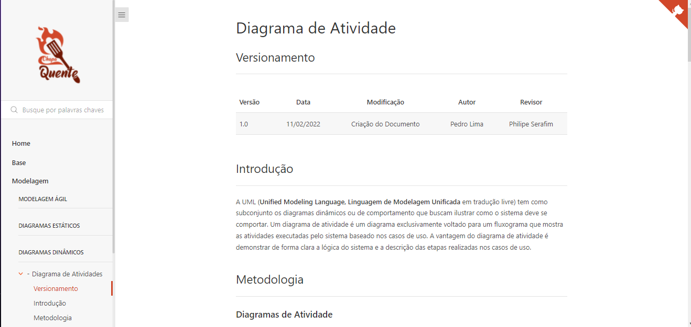
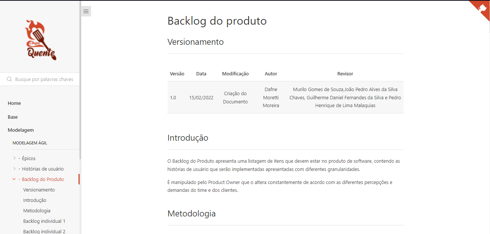
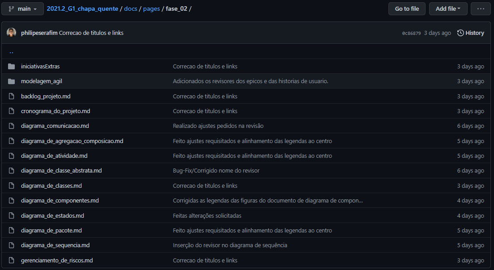
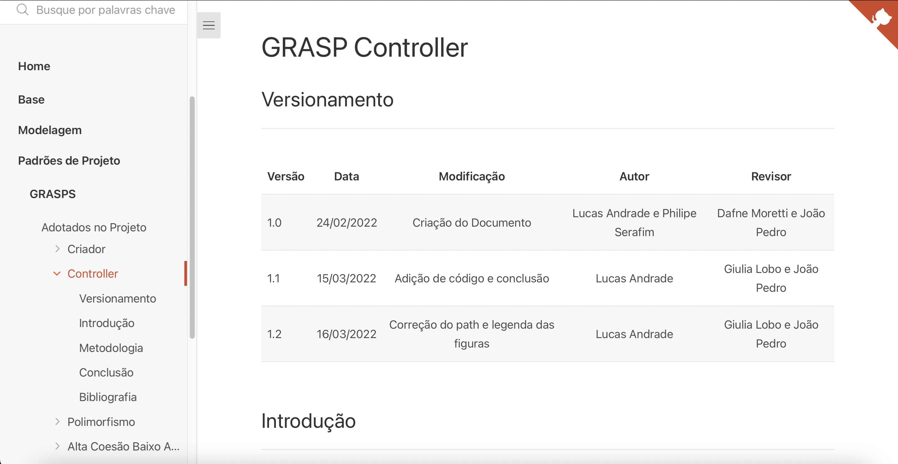
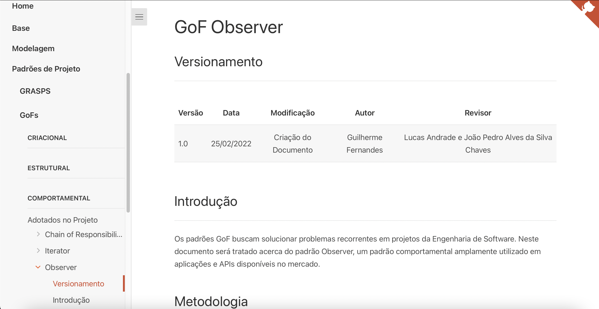
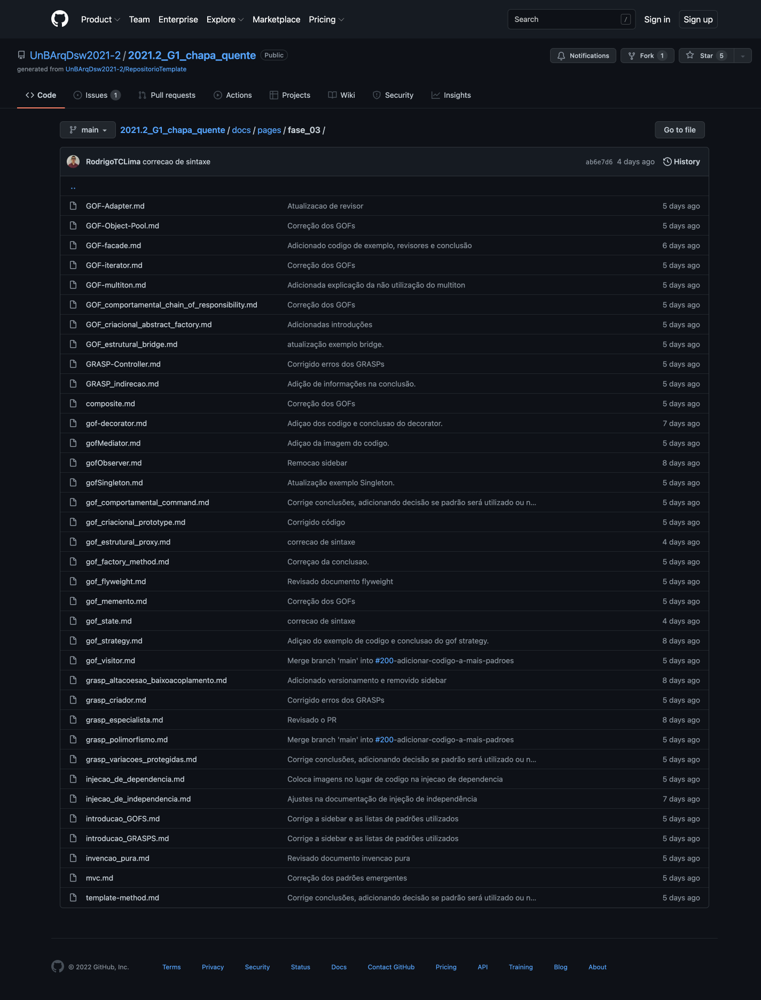

# Chapa Quente

**Código da Disciplina**: FGA0208 
**Número do Grupo**: 01 

## Alunos

| Matrícula  | Aluno                               |
| ---------- | ----------------------------------- |
| 19/0026243 | Dafne Moretti Moreira               |
| 18/0017870 | Giulia Lobo Barros                  |
| 18/0018019 | Guilherme Daniel Fernandes da Silva |
| 18/0123203 | João Pedro Alves da Silva Chaves    |
| 18/0022237 | Liverson Paulo Furtado Severo       |
| 18/0105256 | Lucas da Cunha Andrade              |
| 18/0025601 | Murilo Gomes de Souza               |
| 17/0020525 | Pedro Henrique de Lima Malaquias    |
| 16/0141842 | Philipe Rosa Serafim                |
| 18/0037242 | Rodrigo Tiago Costa Lima            |

## Sobre

O projeto Chapa Quente tem como maior intuito promover uma forma de pedir lanches de forma remota, sem que as pessoas que estão com fome tenham que sair de casa. A ideia se aplica, especialmente, por conta do momento que estamos vivendo, onde a proliferação do COVID-19 é assustadora e precisamos ficar em quarentena para não sermos infectados e para não infectar outras pessoas. Logo, tendo em vista esse cenário, para um dia que não se possa cozinhar, que não se queira cozinhar ou apenas que se está com vontade de comer algo diferente o projeto Chapa Quente é a solução.

## Screenshots Primeira Entrega FOCO: DSW(Base)

<figcaption>Figura 1 - Screenshot do artefato da Design Sprint</figcaption>

 
 

<figcaption>Figura 2 - Screenshot do artefato da Modelagem BPMN</figcaption>

 
 

<figcaption>Figura 3 - Screenshot da listagem de artefatos presentes na main até o deadline</figcaption>

## Vídeo(s) Primeira Entrega FOCO: DSW(Base)

### Projeto Não Orientado a Abordagens Específicas

Para acessar o vídeo clique em: https://www.youtube.com/embed/Ma7Rs0e9gPk

### Processos, Metodologias e Abordagens

Para acessar o vídeo clique em: https://www.youtube.com/embed/iNoo6HqQl2g

### Iniciativas Extras

Para acessar o vídeo clique em: https://www.youtube.com/embed/nc_Ye5fgmS4

## Screenshots Segunda Entrega FOCO: DSW(Modelagem)

<figcaption>Figura 1 - Screenshot do artefato de Diagrama de Atividade</figcaption>

 
 

<figcaption>Figura 2 - Screenshot do artefato de Backlog do Produto</figcaption>

 
 

<figcaption>Figura 3 - Screenshot da listagem de artefatos da fase 02 presentes na main até o deadline</figcaption>

## Vídeo(s) Segunda Entrega FOCO: DSW(Modelagem)

### Notação UML – Diagramas Estáticos

Para acessar o vídeo clique em: https://www.youtube.com/watch?v=yHI60JMtKXY

### Notação UML – Diagramas Dinâmicos

Para acessar o vídeo clique em: https://www.youtube.com/watch?v=Js3eh_BaNWQ

### Modelagem Ágil

Para acessar o vídeo clique em: https://www.youtube.com/watch?v=-Vj9ovAmh-E

### Iniciativas Extras de Modelagem

Para acessar o vídeo clique em: https://www.youtube.com/watch?v=o538S_RTook

## Screenshots Terceira Entrega FOCO: DSW(Padrões de Projeto)

<figcaption>Figura 1 - Screenshot do artefato do GRASP Controller </figcaption>

 
 

<figcaption>Figura 2 - Screenshot do artefato do GoF Observer</figcaption>

 
 

<figcaption>Figura 3 - Screenshot da listagem de artefatos da fase 03 presentes na main até o deadline</figcaption>

## Vídeo(s) Terceira Entrega FOCO: DSW(Padrões de Projeto)

### Padrões de Projeto GRASPs

Para acessar o vídeo clique em: https://youtu.be/yfhGegRRLo4

### Padrões de Projeto GoFs

Para acessar o vídeo clique em: https://youtu.be/Ju05GWgud-c

### Padrões de Projeto Extras

Para acessar o vídeo clique em: https://youtu.be/zwXeIcn6q_k

## Vídeo(s) Quarta Entrega : Arquitetura de Software & Reutilização

### Documento de Arquitetura (DAS)

Para acessar o vídeo clique em: https://youtu.be/YDT5bpaYZmg

### Reutilização de Software

Para acessar o vídeo clique em: https://youtu.be/V-nq4Y_rz_8

## Screenshots Quarta Entrega (FINAL) : Arquitetura & Reutilização de Software & PROJETO FINAL

### Frontend no deploy, disponível: https://arq-daploy.herokuapp.com/

### Backend no deploy, disponível: https://chapa-quente-backend.herokuapp.com/

### Documentos entregues

## Descritivo dos Principais Aspectos Técnicos

**Principal(is) Metodologia(s) Adotada(s)**: XP, Kanban e Scrum 
**Principais Linguagens Utilizadas e/ou Pretendidas**: JavaScript e Markdown 
**Principais Tecnologias Utilizadas e/ou Pretendidas**: ReactJS, ExpressJS e MongoDB 
**Principal(is) Estilo(s) Arquitetural(is) Adotado(s)**: a definir 

## O Projeto está rodando?

(X) SIM
( ) NÃO

<!-- Se SIM, insira um manual (ou um script) para auxiliar ainda mais os interessados em consultar o projeto. -->

Para executar é necessário utilizar o comando `npm i docsify-cli -g` para instalar o Docsify e então utilizar o comando `docsify serve docs` na pasta raiz do projeto. Com isso será possível acessar a wiki através do localhost indicado no terminal.

<!-- ## Informações Complementares

Quaisquer outras informações sobre seu projeto podem ser descritas nessa seção. -->
