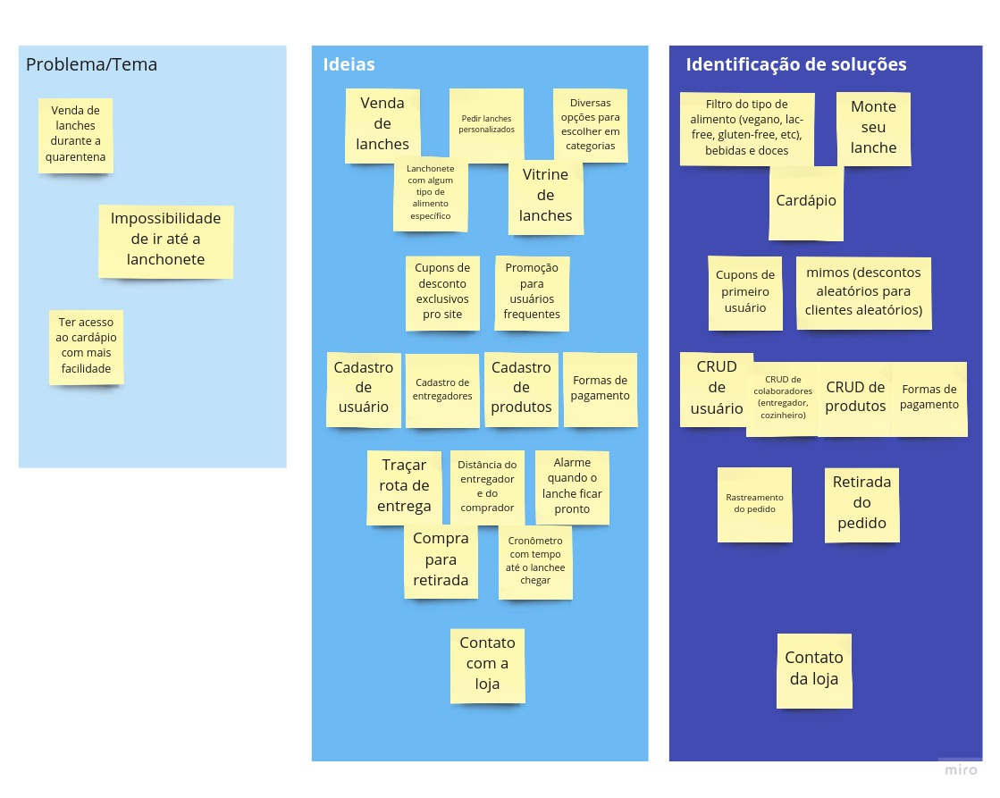

# Brainstorming

## Versionamento

| Versão | Data       | Modificação          | Autor                        |Revisor|
| ------ | :--------: | :------------------: | :--------------------------: | :---: |
| 1.0    | 02/02/2022 | Criação do Documento | Lucas Andrade |  |
| 1.1    | 03/02/2022 | Ajustes no texto e mudança de imagem | Lucas Andrade | | 

## Introdução

O Brainstorm consiste em uma técnica realizada em equipe, que visa explorar e melhorar a visão que os membros do grupo possuem sobre o projeto, e os desafios que possam ocorrer.

O ambiente proporcionado pelo Brainstorming incentiva que os participantes exponham as suas opiniões e visões sobre o projeto. É analisado o que deve ser priorizado, focando em funcionalidades chaves que possam diferenciar a solução proposta das demais disponíveis. Também é uma importante ferramenta para criar uma base do que será o escopo da aplicação.  

## Metodologia

Utilizando a plataforma de colaboração [Miro](https://miro.com/), foram levantadas, em grupo, vários pontos e aspectos do projeto considerado relevantes. Separamos em três grupos as ideias levantadas: **problema/tema, ideias e a identificação de soluções.** Posteriormente foi feita a organização e remoção de ideias similares, chegando ao seguinte resultado:

## Requisitos levantados

Com o Brainstorm foi possivel levantar alguns requisitos iniciais:

| ID | Nome |
| -- | -- |
| RF1 | O usuário deve conseguir se cadastrar na plataforma |
| RF2 | O usuário deve poder ver o cardápio de lanches |
| RF3 | O usuário deve conseguir pesquisar o lanche por característica |
| RF4 | O usuário deve conseguir realizar pedido |
| RF5 | O usuário deve conseguir efetuar pagamento |
| RF6 | O cozinheiro deve conseguir avisar quando o lanche estiver pronto |
| RF7 | O funcionário deve conseguir cadastrar lanches do cardápio  |
| RF8 | O funcionário deve conseguir atualizar lanches do cardápio  |
| RF9 | O funcionário deve conseguir remover lanches do cardápio   |
| RF10 | O entregador deve conseguir compartilhar a sua localização com o cliente |
| RF11 | O usuário deve receber um código de confirmação de pedido |
| RF12 | O usuário deve poder rastrear o pedido |
| RF13 | O usuário deve poder utilizar cupons de desconto |
| RF14 | O usuário deve ter acesso a opções para retirada no local |
| RF15 | O usuário deve ter acesso a diversas opções de escolha |
| RF16 | O usuário deve ter uma estimativa para entrega do pedido |
| RF17 | O usuário deve ter um meio de contato com a loja |

## Bibliografia

JUNQUEIRA BARBOSA, Simone Diniz. Interação Humano-Computador. 1. ed. [S. l.]: Elsevier, 2010.