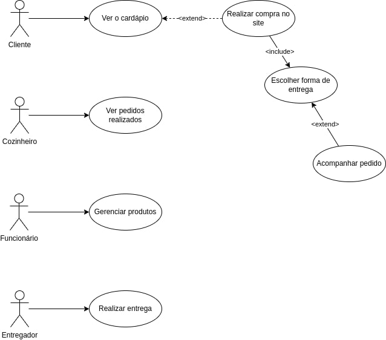

# Casos de Uso

## Versionamento

| Versão |    Data    |     Modificação      |               Autor               |   Revisor   |
| ------ | :--------: | :------------------: | :-------------------------------: | :---------: |
| 1.0    | 02/02/2022 | Criação do Documento | Guilherme Fernanes e Rodrigo Lima | Pedro Limas |

## Introdução

O diagrama de casos de uso é elaborado em UML e tem como objetivo elucidar sobre como se dá a interação entre os atores e o sistema. Dessa forma, o diagrama de casos de uso é utilizado para evidenciar a interação entre esses atores e o sistema de forma sucinta. Sendo assim, ele é ideal nos seguintes casos:
- Representar a interação usuários-sistema
- Identificar funções e como cada papel interage com elas
- Identificar fatores internos e externos

O diagrama consiste em 4 objetos, sendo eles:
- Ator: qualquer entidade que desempenha um papel (pessoa, organização, etc).
- Caso de uso: representa uma função ou ação dentro do sistema.
- Sistema: usado para definir o objetivo do caso de uso, sendo seu uso opcional.
- Pacote: elemento opcional utilizado para agrupar casos de uso.

## Objetivo

O objetivo desse documento é apresentar os casos de uso do Tá na Chapa. Sendo assim, o diagrama será composto por atores, associações e casos de uso com o objetivo de esclarecer o fluxo a ser tomado pelos atores do sistema ao usar a aplicação. Os casos de uso também serão especificados, com o objetivo de detalhá-los e complementar o diagrama. 

## Diagrama de Casos de Uso

## Casos de Uso

| ID   | Nome do Caso de Uso                                                     |
| ---- | ----------------------------------------------------------------------- |
| UC01 | [Ver cardápio](./../../pages/fase_01/casos_de_uso/uc01.md)              |
| UC02 | [Realizar compra no site](./../../pages/fase_01/casos_de_uso/uc02.md)   |
| UC03 | [Ver pedidos realizados](./../../pages/fase_01/casos_de_uso/uc03.md)    |
| UC04 | [Gerenciar os produtos](./../../pages/fase_01/casos_de_uso/uc04.md)     |
| UC05 | [Escolher forma de entrega](./../../pages/fase_01/casos_de_uso/uc05.md) |
| UC06 | [Acompanhar pedido](./../../pages/fase_01/casos_de_uso/uc06.md)         |
| UC07 | [Realizar entrega](./../../pages/fase_01/casos_de_uso/uc07.md)          |

## Bibliografia

Diagrama de caso de uso UML: O que é, como fazer e exemplos. Disponível em: https://www.lucidchart.com/pages/pt/diagrama-de-caso-de-uso-uml. Acessado em 03 de fevereiro de 2022.

Tutorial do diagrama de caso de uso. Disponível em: https://creately.com/blog/pt/diagrama/tutorial-de-diagrama-de-caso-de-uso/#Importancia. Acessado em 02 de fevereiro de 2022.

Diagrama de Caso de Uso. Disponível em: https://unbarqdsw2021-1.github.io/2021.1_G01_Animalesco_docs/#/pages/diagrama-de-caso-de-uso. Acessado em 02 de fevereiro de 2022.
