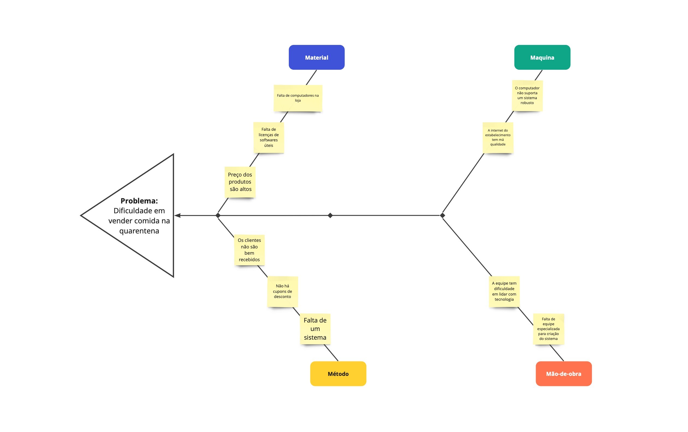

# Diagrama de Causa-Efeito

## Versionamento

| Versão | Data       | Modificação             | Autores                                       | Revisor      |
| ------ | ---------- | ----------------------- | --------------------------------------------- | ------------ |
| 1.0    | 02/02/2022 | Criação do Documento    | Guilherme Fernandes, Rodrigo Lima e Pedro Lima| Giulia Lobo  |
| 1.1    | 03/02/2022 | Alteração na formatação | Guilherme Fernandes, Rodrigo Lima e Pedro Lima| Giulia Lobo  |

## Introdução

O diagrama de causa-efeito (ou diagrama espinha de peixe) tem como objetivo organizar o raciocinio em torno da discussão de um problema, sendo útil para a descoberta dos fatores resultantes numa situação indesejada. Ele apresenta uma estrutura parecida com a espinha de um peixe, auxiliando a equipe a entrar as causas do problema. No escopo do nosso projeto, utilizaremos esse método para identificar as possíveis causas do problema-chave do nosso projeto. Dessa forma, será possível avaliar as causas dos problemas para que seja possível implementar soluções levando-as em consideração.

## Metodologia

O método utilizado para a construção será o método 6M, visto que é um método popularmente utilizado em conjunto com o diagrama. O 6M consiste na divisão das causas do problema em: mão-de-obra, máquinas, materiais, método, meio ambiente e medição. Dentro do escopo do projeto, optamos por utilizar 4 dos 6M, sendo eles: material, mão-de-obra, máquina e método.
- Material: engloba as causas que envolvem materiais utilizados no processo que origina o problema.
- Mão-de-obra: engloba as causas que envolvem indivíduos presentes no problema.
- Máquina: envolve quaisquer causas originadas por recursos tecnológicos. 
- Método: envolve quaisquer causas originadas por processos, procedimentos e métodos.

## Resultado

A partir da criaão do diagrama, foi possível chegar às seguintes conclusões em relação a cada categoria:

- Material: a falta de material tecnológico e o preço alto dos produtos disponíveis na loja foram fatores impactantes para a diminuição das vendas no periodo da quarentena. Dessa forma, é necessário o investimento em recursos como computadores, tablets, etc para que os funcionários disponham de maior apoio tecnológico. Além disso, é necessário rever os preços aplicados aos produtos e pensar em formas de atrair os clientes.

- Mão-de-obra: foi possível constatar que a dificuldade da equipe em lidar com tecnologia e que a falta de uma equipe especializada para criação de um sistema foram fatores impactantes para a ocorrência do problema. Sendo assim, é necessário que haja a contratação de pessoas especializadas para que haja a criação do sistema. Além disso, a equipe deve passar por treinamento para ser capaz de lidar com o sistema que será implantado.

- Máquina: parte da causa do problema foi a falta de um computador que suportasse um sistema robusto e a má qualidade da internet no estabelecimento. Dessa forma, é preciso que seja investido em máquinas mais atuais e que o estabelecimento conte com internet de qualidade para a recepção dos pedidos no menor tempo possível. 

- Método: a falta de um atendimento de qualidade, de cupons de desconto e de um sistema corroboram para o problema análisado. Assim, a empresa deve investir em treinamento e na criação de um sistema para que os clientes possam comprar e receber o produto em casa, dando mais segurança a eles no periodo de pandemia. Além disso, é necessário que o sistema a ser criado disponha de uma política de descontos para os clientes, atraindo-os para que se tornem compradores fiéis.

## Referências

Diagrama de Causa-Efeito. Disponível em: https://ferramentasdaqualidade.org/diagrama-de-ishikawa/. Acessado em 02 de fevereiro de 2022.

Diagrama de Ishikawa, Causa e Efeito ou Espinha de Peixe. Disponível em: https://www.citisystems.com.br/diagrama-de-ishikawa/. Acessado em 01 de fevereiro de 2022.

