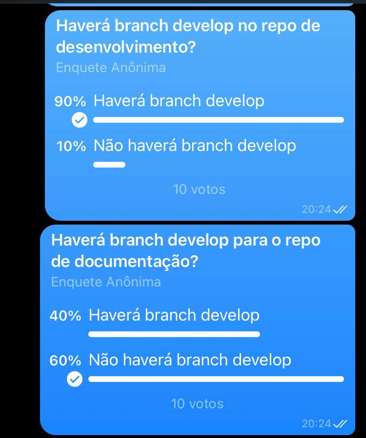

# Política de repositório

## Versionamento

| Versão | Data       | Modificação          | Autor                        |Revisor|
| ------ | :--------: | :------------------: | :--------------------------: | :---: |
| 1.0    | 02/02/2022 | Criação do Documento |  Dafne Moretti Moreira | João Pedro Alves da Silva Chaves e Philipe Serafim |

## Introdução

Neste documento estão especificados os padrões a serem seguidos pelos contribuintes do projeto. Sendo assim, pode-se observar uma política de branches, commits, issues e pull requests. 

## Metodologia

A metodologia utilizada pela equipe para definição dos padrões foi a elaboração de [enquetes]() na ferramenta de comunicação Telegram, análise dos resultados finais e discussão de ideias em reunião com os membros.

#### Enquetes

 </br> Figura 1 - Enquete 1. Fonte: Autoria própria

 </br> Figura 2 - Enquetes 2 e 3. Fonte: Autoria própria

 </br> Figura 3 - Enquete 4. Fonte: Autoria própria

## 1. Política de Branches

### 1.1 Repositórios de desenvolvimento

Para os repositórios de desenvolvimento, há a branch **main** (branch principal), que estará em produção e possui a versão estável do software.

```
main
```


Além desta, existe também  **develop**, que constará o software com suas atualizações mais recentes.

```
develop
```

Para o desenvolvimento de novas funcionalidades e resolução de bugs, tanto a branch main quanto a branch develop devem receber Pull Requests (PRs). 

### Novas branches

**Branches feature**

Para a criação de branches referentes a novas funcionalidades no repositório de desenvolvimento, o formato a ser utilizado é:

```
feature/#numero_da_issue-/nome_da_branch
```

**Branches bugfix**

As branches bugfix devem ser criadas a partir da branch main e sua nomenclatura segue a seguinte estrutura:

```
bugfix/#numero_da_issue-nome_da_branch
```

**Branches Doc**

As branches doc devem ser criadas a partir da branch main e sua nomenclatura segue a seguinte estrutura:

```
doc/#numero_da_issue-nome_da_branch
```

### 1.2 Repositórios de documentação

Para os repositórios de documentação, haverá a branch main e é a partir dela que as novas branches devem ser criadas.

```
main
```

- Novas branches

Para a criação de novas branches, o padrão abaixo é considerado:

```
#numero_da_issue-nome_do_documento
```

## 2. Política de Commits

Durante o desenvolvimento, os commits devem ser

* Com pequenos trechos de código
* Constantes
* Com mensagens descritivas e claras

Além disso, a linguagem a ser utilizada nos commits é português brasileiro e o tempo verbal deve ser o particípio. 

```
git commit -m "Adicionada a função X

Co-authored-by: autor1 <xxxx@email.com>"
```

## 3. Política de Issues

Para padronizar as issues criadas no repositório, foram criados dois templates conforme descrito abaixo

***Template para issue de documentação***

```
#numero_da_issue-nome_do_documento
```

***Template para issues de desenvolvimento***

As issues de desenvolvimento devem conter:

- Título
- Descrição 
- Critérios de aceitação

```
## Descrição
Eu, como [tipo de usuário], gostaria de [fazer alguma coisa] a fim de [alcancçar um objetivo].

## Critérios de Aceitação
- Deverá mostrar o cardápio...
- Deverá escolher por categoria...
```

## 4. Política de Pull Request (PR) 

Os Pull Requests devem conter:

- Um Assignee responsável pelo PR;
- Uma issue associada;
- Labels significativas;
- Um Reviewer responsável pela revisão do PR;
- Um título conciso e descritivo;
- Uma descrição, seguindo o template do repositório, que deve incluir uma descrição completa do que foi feito e a issue relacionada.
- Os PRs serão aceitos após a revisão de um membro que não participou da construção da funcionalidade.

***Template***

O Pull Request possui o seguinte template:

```
**Issue:** closes #X (sendo #x o link para a issue x)

## Descrição
Descrição do que foi feito no PR

## Tarefas
* Tarefa feita 1
* Tarefa feita 2
```