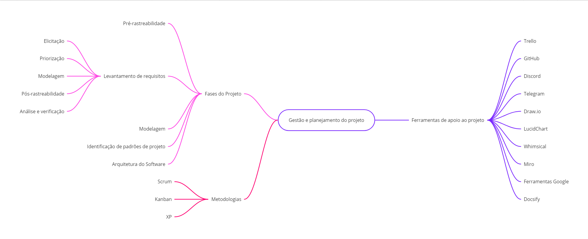

# Metodologias

## Versionamento

| Versão |    Data    |                  Modificação                   |         Autor         |      Revisor       |
| ------ | :--------: | :--------------------------------------------: | :-------------------: | :----------------: |
| 1.0    | 02/02/2022 |              Criação do Documento              | Dafne Moretti Moreira | Giulia Lobo Barros |
| 1.1    | 03/02/2022 | Adiciona descrição das metodologias utilizadas | Dafne Moretti Moreira | Giulia Lobo Barros |
| 1.2    | 17/02/2022 | Mudança nas ferramentas utilizadas             | Guilherme Fernandes   |  Liverson, Dafne, Giulia e Murilo |

## Introdução

Para a definição das melhores metodologias e ferramentas a serem utilizadas no projeto, primeiramente foi realizado um brainstorming com todos os membros da equipe. Além disso, houve a elaboração de um artefato para analisar e compreender as tecnologias cujos membros possuíam maior familiaridade visando adaptar o projeto à realidade do time.

As ferramentas utilizadas pelos colaboradores do projeto foram discutidas também em reunião, sendo verificados os pontos positivos e negativos de cada uma delas e selecionadas as que mais se adequam ao contexto do projeto Chapa Quente.

Uma vez selecionadas as ferramentas, a equipe optou por metodologia híbrida, captando alguns rituais e aspectos das diferentes metodologias descritas neste documento. Sendo assim, o documento especifica e explica os pontos adotados pelo projeto.

## Mapa mental

Este mapa mental esboça as principais metodologias e ferramentas aplicadas no projeto.

<figcaption style="text-align: center">Figura 1: Mapa mental de metologias</figcaption>

### 1. **Scrum**

Metodologia ágil bastante conhecida pelos engenheiros de software, o **Scrum** é baseado em pequenos entregáveis e ciclo de vida iterativo-incremental.

#### **Sprint**

É durante a sprint que os incrementos de software são criados, portanto, visando entregáveis pequenos e diminuição de retrabalho, a duração da **sprint** é de uma semana (começando e terminando nas sextas-feiras).

#### **Cerimônias scrum**

As cerimônias scrum garantem comunicação clara entre a equipe, identificação de riscos e dificuldades da sprint. Permitem, com isso, uma construção de integração e colaboração entre os membros.

Por essa razão, a equipe optou por realizar todas as cerimônias Scrum.

- **_Sprint Review_**
- **_Sprint Planning_**
- **_Sprint Retrospectiva_**
- **_Daily Meeting_**

#### **Papéis do scrum**

Foi definido o papel de Scrum Master para a integrante Giulia Lobo Barros e o papel de Product Owner para a integrante Dafne Moretti Moreira.

No entanto, a responsabilidade entre os membros do projeto é semelhante e todos atuam em diferentes funções.

#### **Planning Poker**

Para estimar o tempo e esforço gasto em cada tarefa, o projeto utiliza o planning poker. O planning poker é um "jogo" em que os membros pontuam as tarefas que precisam ser realizadas na sprint.

A métrica utilizada será a quantidade de horas gasta em cada tarefa e a pontuação será baseada na sequência de fibonacci.

#### **User Stories**

A fim de compreender melhor a experiência que o usuário tem ao utilizar o sistema, são feitas **User Stories** representando os requisitos elicitados.

### 2. **Kanban**

Com o objetivo de facilitar a visualização do trabalho da equipe, foi criado um quadro Kanban com as colunas: para fazer, fazendo, revisar, concluído, bloqueado, cancelado.

- **_Para fazer_**

Abarca as tarefas que ainda não foram feitas.

- **_Fazendo_**

Possui as tarefas que estão sendo realizadas na sprint.

- **_Revisar_**

Contém as tarefas que precisam ser revisadas.

- **_Concluído_**

É possível visualizar nessa coluna, as tarefas concluídas da sprint.

- **_Bloqueado_**

Tarefas que estão momentaneamente paradas devido a impedimentos.

- **_Cancelado_**

Tarefas que a equipe percebeu não fazer sentido para o escopo do projeto.

### 3. **XP**

- **_Pair Programming_**

Pesquisas realizadas anteriormente mostraram que os desenvolvedores percebem que a utilização de programação em pares reduz o número de bugs, dissemina conhecimento sobre o código e colabora na produção de um código de melhor qualidade. Uma vez que isso foi observado, decidiu-se utilizar o **pair programming** durante o projeto.

## Ferramentas utilizadas

|                                  Ícone                                   |     Nome     |                                       Descrição                                        |
| :----------------------------------------------------------------------: | :----------: | :------------------------------------------------------------------------------------: |
|    |  Whimsical   |                           Criação de documentos e modelagem.                           |
|     |   Telegram   |                Comunicações pontuais e rápidas entre membros da equipe.                |
|       |    Github    |                             Versionamento e documentação.                              |
|  | Google Drive | Armazenamento de dados, compartilhamento de documentos e sincronização de informações. |
|      |   Discord    |                                Reuniões e pareamentos.                                 |
|       |    Jira    |                                     Quadro Kanban                                      |
|       |   Draw.io    |                        Construção de Rich Pictures e modelagens                        |
|         |     Miro     |                           Construção do brainstorming e 5w2h                           |
|   |  LucidChart  |                          Construção de modelagens e diagramas                          |
|   |  FunRetrospectives  |                          Ferramenta para realizar as retrospectivas.                 |
|   |  Notion  |                          Ferramenta para criação de notas.                 |
|   |  Figma  |                          Ferramenta para criação de protótipos de interface. |
|   |  Daily Bot  |                          Ferramenta para execução das dailys (integrada ao Discord) |

## Conclusão

A opção da equipe por utilizar diferentes metodologias para construir uma híbrida e testar diversas ferramentas, permite uma experimentação maior e compreensão do que funciona melhor para o projeto e escopo deste.

## Bibliografia

BECK, K. S. K. S. J. E. A.; Manifesto for agile software development.
Disponível em: <http://agilemanifesto.org/> acesso em 3 fev. 2022.

O GUIA do Scrum. [S. l.], [21--]. Disponível em: https://scrumguides.org/docs/scrumguide/v2020/2020-Scrum-Guide-PortugueseBR.pdf. Acesso em: 3 fev. 2022.
