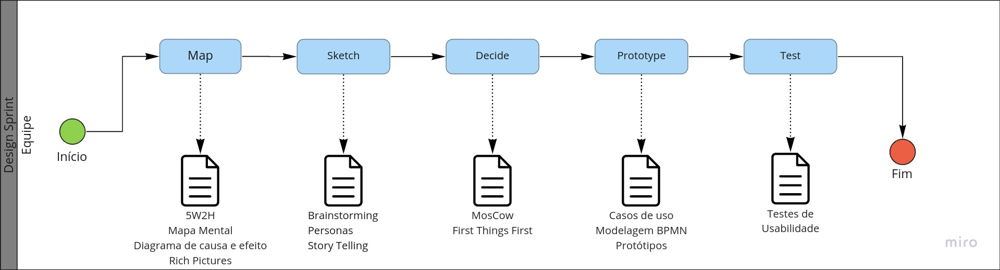

# Modelagem BPMN

## Versionamento

| Versão | Data       | Modificação          | Autor                        |Revisor|
| ------ | :--------: | :------------------: | :--------------------------: | :---: |
| 1.0    | 25/01/2022 | Criação do Documento | Philipe Serafim e Pedro Lima | Murilo Gomes |
| 1.1    | 27/01/2022 | Adição dos Diagramas de Processo Geral, Definição de Tema e Design Sprint | Murilo Gomes e Lucas Andrade | Giulia Lobo |

## Introdução

A Modelagem BPMN(Business Process Model and Notation) se trata de uma visualização de etapas de um processo através de fluxogramas. É utilizado um padrão de notação e símbolos internacional, de forma que facilita o entendimento dos processos apresentados. É uma ótima ferramenta para detalhar processos de negócios e metodologias.

## Metodologia

Para este documento, foram criados múltiplos fluxos utilizando a notação BPMN a fim de detalhar as metodologias e os processos utilizados pela equipe durante a execução do projeto. Para realizar os fluxos foi utilizada a ferramenta [Miro](http://miro.com/app/dashboard/)

### Processo Geral

### Definição de Tema

### Design Sprint

## Bibliografia

* SERRANO, Milene. AULA - Notação BPMN. Disponível em: https://aprender3.unb.br/pluginfile.php/1558830/mod_label/intro/Arquitetura%20e%20Desenho%20de%20software%20-%20Aula%20BPMN%20Exemplos%20-%20Profa.%20Milene.pdf (Acessado em 27/01/2022)