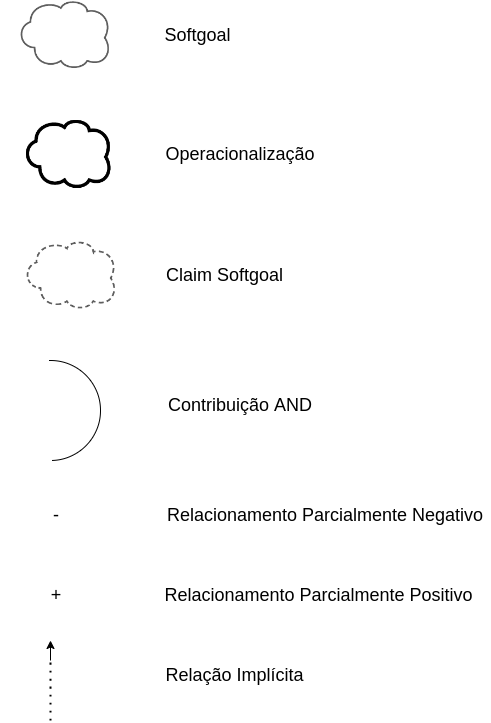
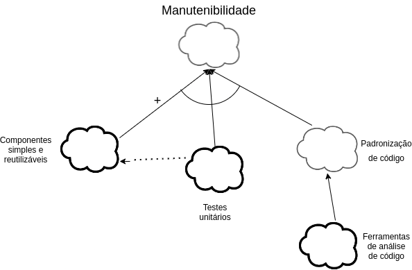
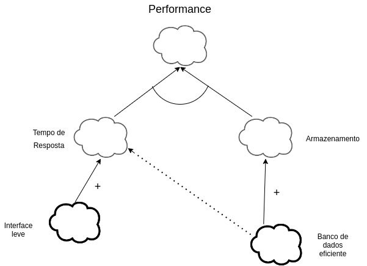

# NFR Framework

## Versionamento

| Versão | Data       | Modificação          | Autor                        |Revisor|
| ------ | :--------: | :------------------: | :--------------------------: | :---: |
| 1.0    | 08/02/2022 | Criação do Documento | João Pedro Alves da Silva Chaves | Philipe Serafim |
| 1.1    | 10/02/2022 | Adição da Introdução e imagens do NFR | João Pedro Alves da Silva Chaves | Philipe Serafim |
| 1.2    | 10/02/2022 | Mudanças nos diagramas e adição da legenda | João Pedro Alves da Silva Chaves | Philipe Serafim | 
<!-- NÃO ESQUECER DE ADICIONAR AO "/_sidebar.md" -->

## Introdução

O NFR Framework é uma técnica desenvolvida para modelagem de requisitos não funcionais, como o nome já sugere: Non Functional Requirements Framework, que traduzido significa framework de requisitos não funcionais. A abordagem utiliza SIGs(Softgoal Interdependency Graphs) que é uma representação gráfica proposta em (Chung et al. 2000) com objetivo de decompor os requisitos não funcionais em outros não funcionais com o objetivo de alcançar uma operacionalização deles.

## Metodologia

### Legenda

### NFR Geral

### NFR Manutenibilidade

#### Propagação

### NFR Performance

#### Propagação

### NFR Segurança

#### Propagação

### NFR Usabilidade

#### Propagação

## Conclusão

## Bibliografia
CHUNG, Lawrence; NIXON, Brian. Nixon, YU, Eric; MYLOPOULOS, John. "Non-Functional Requirements in Software Engineering". Springer US, 2000.

SILVA, Reinaldo Antônio da. NFR4ES: Um Catálogo de Requisitos Não-Funcionais para Sistemas Embarcados. 2019