# Rich Picture

## Versionamento
| Versão | Data       | Modificação          | Autor                        | Revisor |
| ------ | ---------- | -------------------- | ---------------------------- | ------- |
| 1.0    | 03/02/2022 | Criação do Documento | Liverson Paulo | Giulia Lobo |

## Introdução

O Rich Picture é uma metodologia da engenharia de software que busca facilitar o aprendizado de problemas complexos ou mal definidos utilizando desenhos detalhados. É uma tentativa de encapsular o problema por meio de uma representação sem barreiras.

Além disso o Rich Picture deve detalhar os elementos subjetivos, como caráter e características, pontos de vista e preconceitos, espírito e natureza humana.

Essa técnica é importante e bastante utilizada por viabilizar a vizualização da situação com mais facilidade, viabilizando um melhor levantamento dos requisitos necessários para a implementação do software

## Metodologia

Após a primeira reunião de definição de tema, foi acordado entre todos os membros do grupo que cada um faria seu próprio Rich Picture. Após a criação dos Rich Pictures, foi realizada uma votação para a escolha do Rich Picture a ser utilizado e uma reunião foi marcada para aprimorar o Rich Picture feito, chegando assim no resultado final.

## Rich Pictures

### Dafne

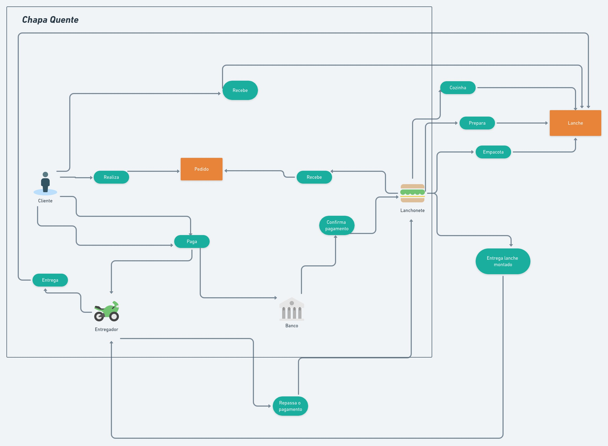

### Giulia

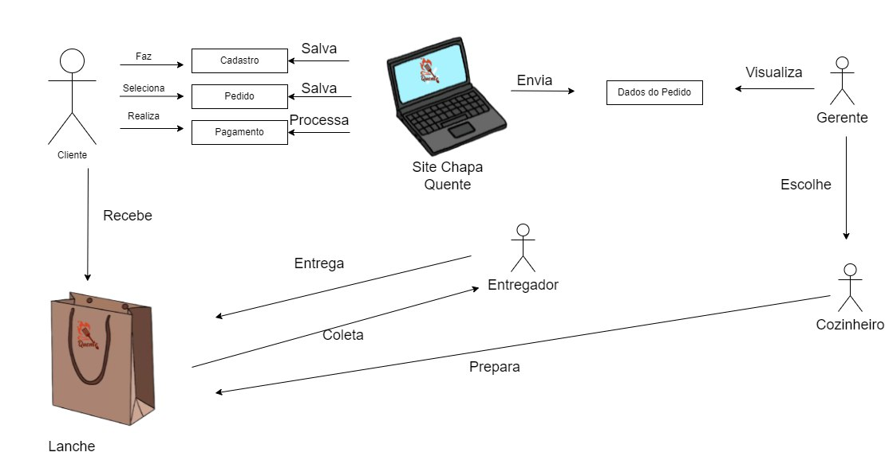

### Guilherme

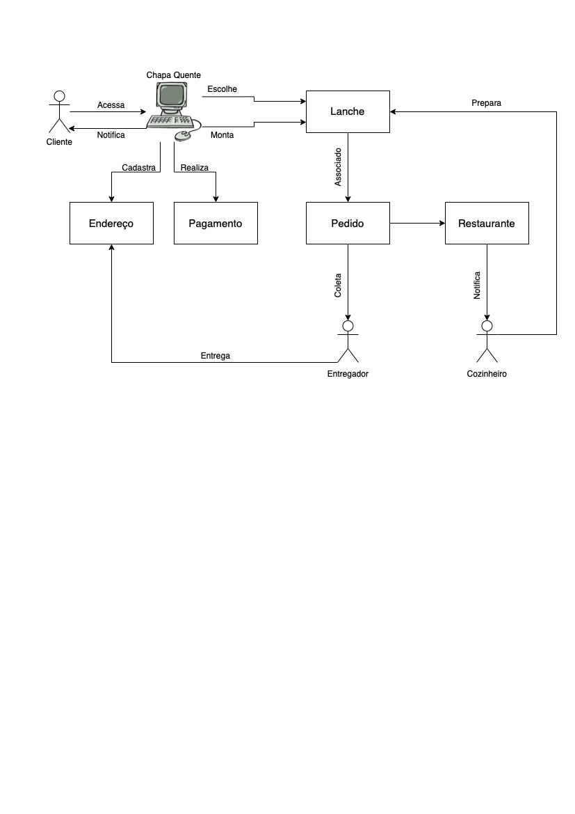

### João Pedro

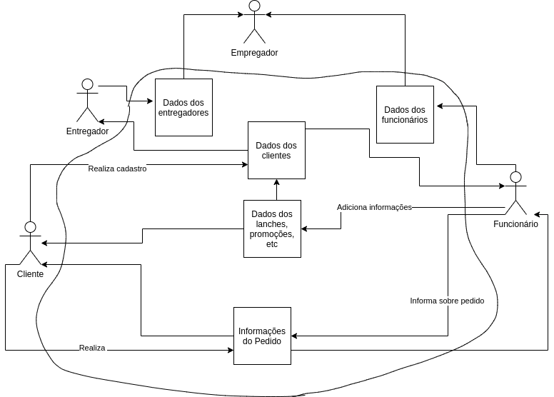

### Liverson

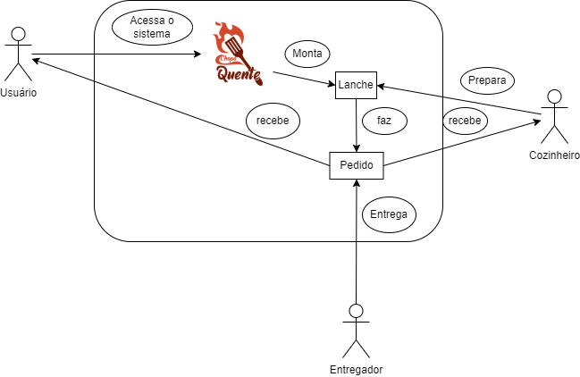

### Lucas

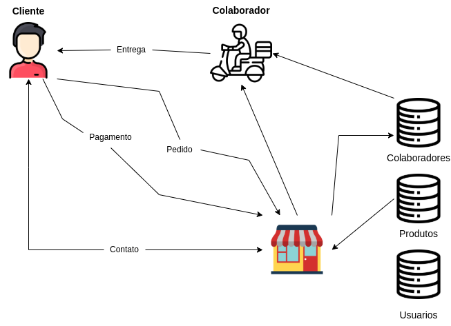

### Murilo

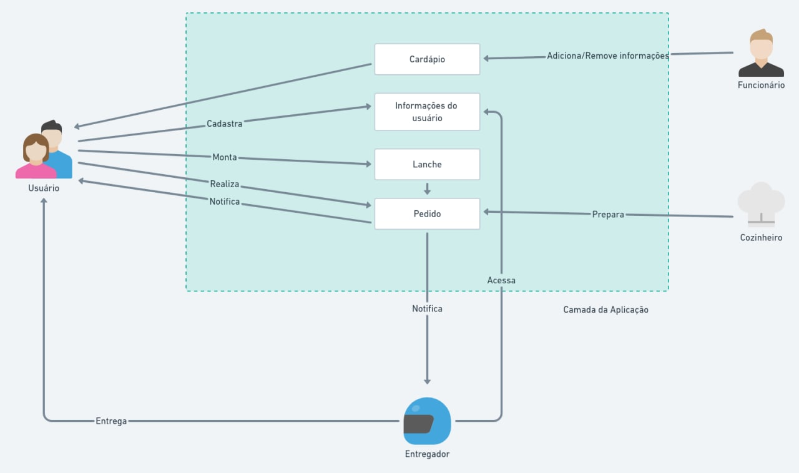

### Phelipe

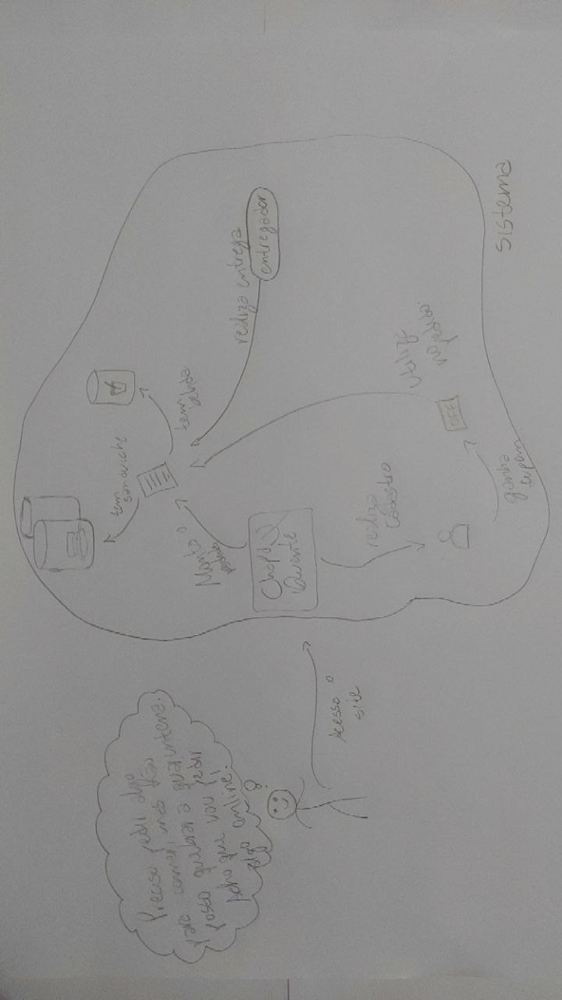

### Pedro

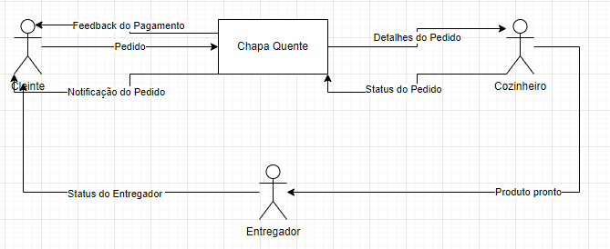

### Rodrigo

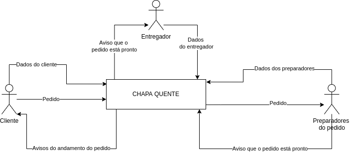

### Versão Final

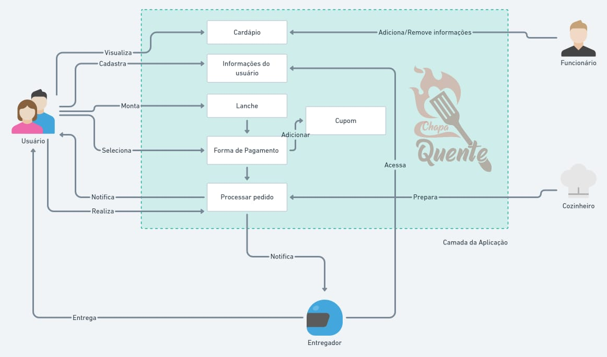

## Bibliografia

SERRANO, Milene: Arquitetura e Desenho de software - Aula- Projeto e Desenho de Software. Acessado em 02/08/2021

Systems Thinking and Practice. Disponível em http://systems.open.ac.uk/materials/T552/pages/rich/richAppendix.html. Acessado em 22/08/2021