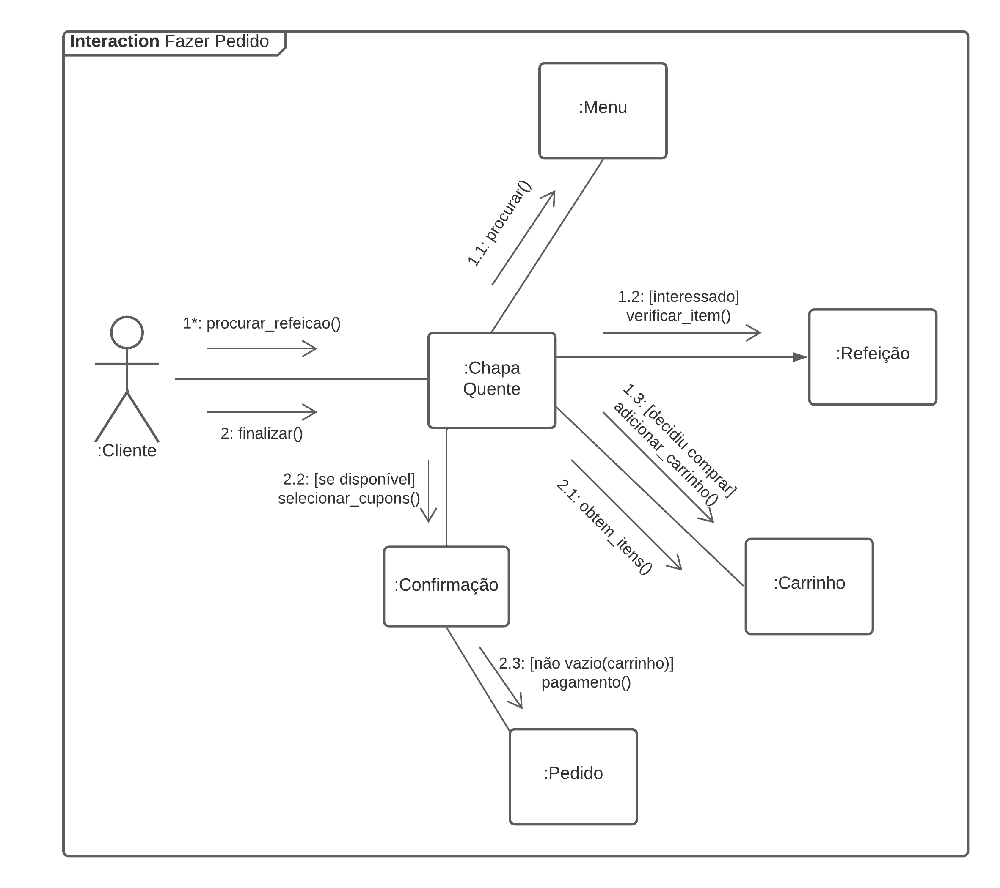
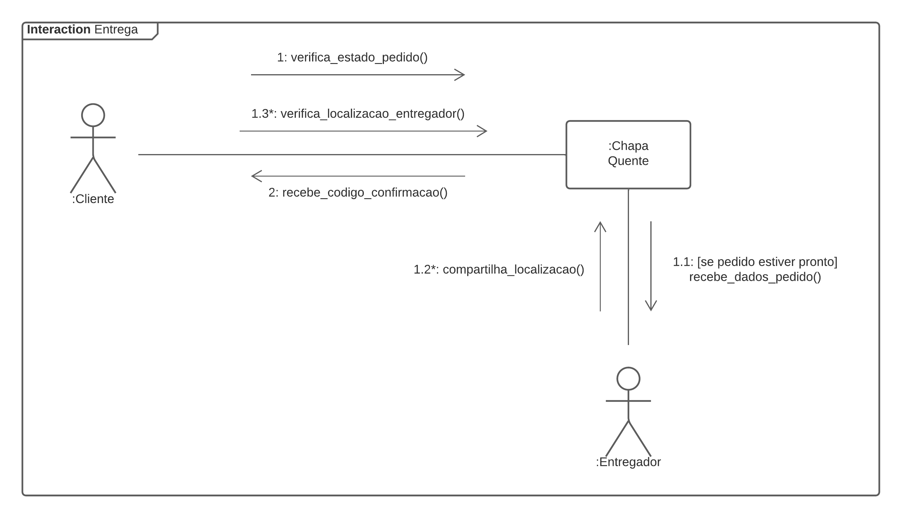

# Diagrama de Comunicação

## Versionamento

| Versão | Data       | Modificação          | Autor                        |Revisor|
| ------ | :--------: | :------------------: | :--------------------------: | :---: |
| 1.0    | 13/02/2022 | Criação do Documento | Lucas Andrade | Murilo Gomes de Souza |
| 1.1    | 16/02/2022 | Alterações no Documento | Lucas Andrade | Murilo Gomes de Souza |

## Introdução

O Diagrama de Comunicação é um tipo de diagrama UML (Unified Modeling Language) que tem o papel de mostrar e representar, de forma simples, a interação entre os objets e suas partes, além dos seus relacionamentos.

Esse diagrama se assemelha ao Diagrama de Sequência, podendo inclusive ter sua estrutura convertida para um. Em versões mais antigas do UML esse diagrama era chamado de Diagrama de Colaboração.

## Metodologia

Para a construção do Diagrama de Comunicação foi utilizado a ferramenta <a href="lucidchart.com">Lucidchart</a> entre os dias 10 e 13 de Fevereiro.

Foram construidos dois diagramas, o primeira representa a realização de pedidos na plataforma e o segundo representa a etapa de entrega do pedido.

## Diagramas de Comunicação
### Diagrama de Comunicação da Realização de Pedido

### Diagrama de Comunicação da Entrega 

## Bibliografia
* APPLYING UML and Patterns: An Introduction to Object-Oriented Analysis and Design and Iterative Development. 3. ed. [S. l.: s. n.], 2004.

* SERRANO, Milene. Modelagem - Diagrama de Comunicação. Acesso em: 10 de fevereiro de 2022.

* FAKHROUTDINOV, Kirill. UML Communication Diagrams Overview. Disponível em: https://www.uml-diagrams.org/communication-diagrams.html. Acesso em: 13 de fevereiro de 2022.