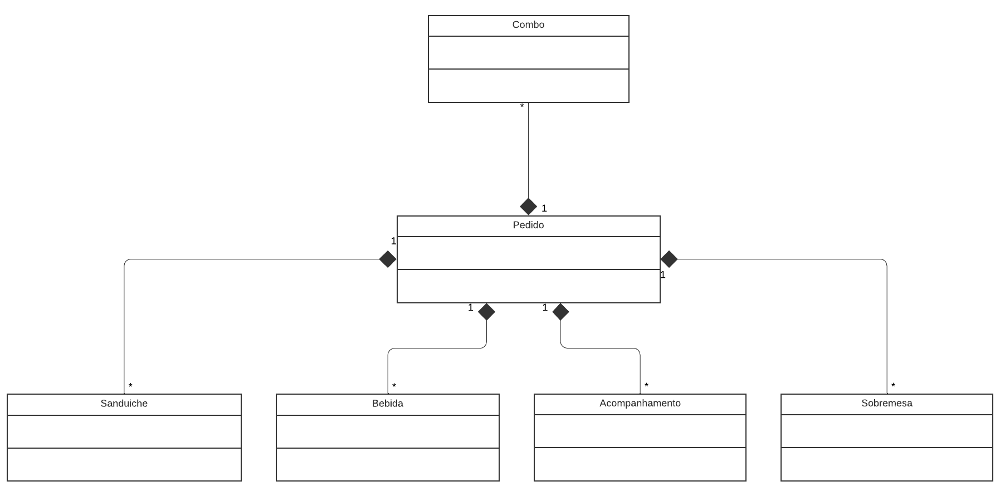
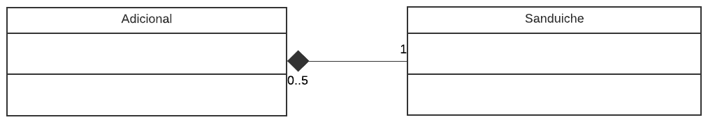

# Diagrama de Agregação e Composição

## Versionamento

| Versão |    Data    |     Modificação      |      Autor      |   Revisor    |
| ------ | :--------: | :------------------: | :-------------: | :----------: |
| 1.0    | 11/02/2022 | Criação do Documento | Philipe Serafim | Rodrigo Lima |

<!-- NÃO ESQUECER DE ADICIONAR AO "/_sidebar.md" -->

## Introdução

Dentro do escopo do projeto, as classes elicitadas podem necessitar de um complemento de outra classe, seja servindo como base ou prestando parte de uma informação crucial ao contexto daquela classe. Esse relacionamento entre classes é chamado de **Associação**. Em um diagrama UML existem vários relacionamentos que podem ser utilizados. Neste artefato serão discutidas as associações por agregação e por associação.

## Metodologia

### Diagrama de Agregação

A agregação representa uma associação em que o todo é relacionado com suas partes, indicando que uma das partes envolvidas _está contida_, _faz parte_, _está contida_, _é parte de_, entre outras. A agregação é representada por um losango aberto do lado do todo.

#### Pedido-Cupom

<figcaption>Figura 1 - Agregação Pedido-Cupom. Autor: Philipe Serafim</figcaption>

#### Combo-Produtos

<figcaption>Figura 2 - Agregação Combo-Produtos. Autor: Philipe Serafim</figcaption>

### Diagrama de Composição

A composição representa uma associação em que uma classe depende da outra para existir. A composição é representada por um losango fechado.

<figcaption>Figura 3 - Composição de Pedido. Autor: Philipe Serafim</figcaption>

<figcaption>Figura 4 - Composição de Sanduíche. Autor: Philipe Serafim</figcaption>

## Conclusão

Não é incomum a confusão criada ao se tratar destes dois tipos de associação. A diferença está contida na interpretação do contexto: se uma classe está contida em outra mas uma não depende da outra para existir, tem-se uma agregação, como acontece entre o _Combo, Sanduíche, Bebida_ e _Acompanhamento_, a junção desses três alimentos constituem um Combo, mas mesmo que o Combo deixe de existir, os alimentos ainda existirão.
Enquanto para a composição tem-se uma relação de dependência, igual acontece entre _Pedido_ e os itens a venda, se o pedido for destruído, todos os itens contidos nele deixarão de existir.

## Bibliografia

FAKHROUTDINOV, Kirill. UML Class and Object Diagrams Overview. Disponível em: https://www.uml-diagrams.org/class-diagrams-overview.html. Acesso em: 11 de fevereiro de 2022.
classes de Associação, IBM Docs. Disponível em: https://www.ibm.com/docs/pt-br/rational-soft-arch/9.5?topic=diagrams-association-classes. Acesso em: 11 de fevereiro de 2022.
SERRANO, Milene. Modelagem - Classe Concreta & Abstrata & Sobrescrita & Sobrecarga. Acesso em: 11 de fevereiro de 2022.
Wellington. Conceitos – Classes Abstratas: Programação Orientada a Objetos. Disponível em: https://www.devmedia.com.br/conceitos-classes-abstratas-programacao-orientada-a-objetos/18812 . Acesso em: 11 de fevereiro de 2022.
