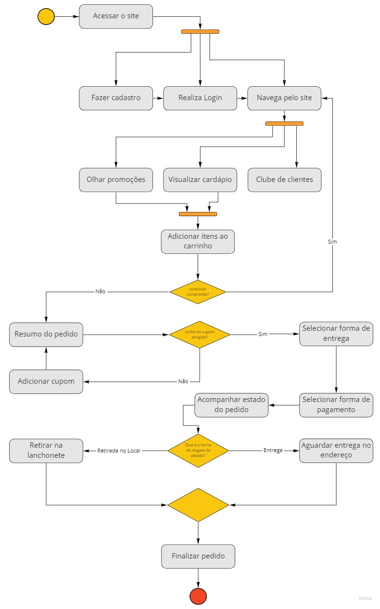
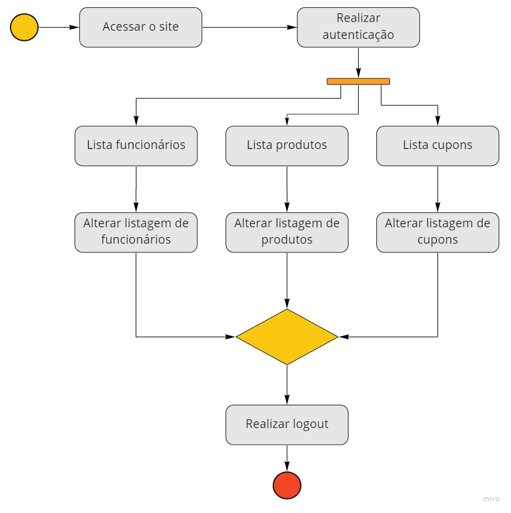
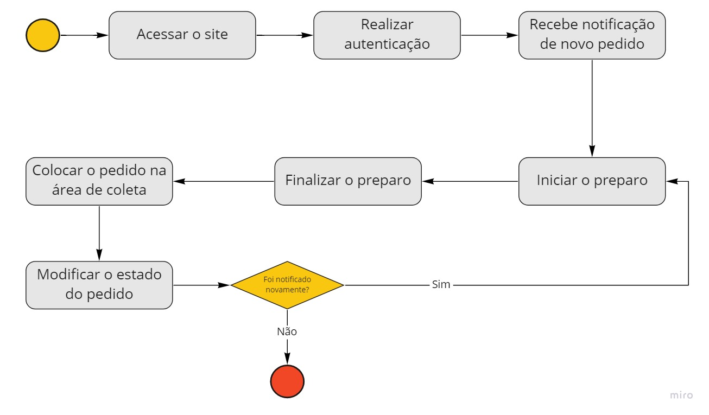
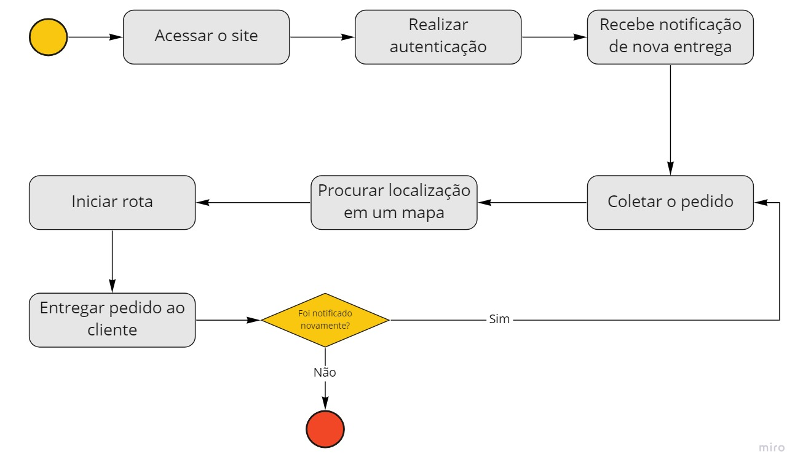

# Diagrama de Atividade

## Versionamento

| Versão |    Data    |     Modificação      |   Autor    |     Revisor     |
| ------ | :--------: | :------------------: | :--------: | :-------------: |
| 1.0    | 11/02/2022 | Criação do Documento | Pedro Lima | Philipe Serafim |

## Introdução

A UML (**Unified Modeling Language, Linguagem de Modelagem Unificada** em tradução livre) tem como subconjunto os diagramas dinâmicos ou de comportamento que buscam ilustrar como o sistema deve. Um diagrama de atividade é um diagrama exclusivamente voltado para um fluxograma que mostra as atividades executadas pelo sistema baseado nos casos de uso. A vantagem do diagrama de atividade é demonstrar de forma clara a lógica do sistema e a descrição das etapas realizadas nos casos de uso.

## Metodologia

### Diagrama de Atividade

A agregação representa uma associação em que o todo é relacionado com suas partes, indicando que uma das partes envolvidas _está contida_, _faz parte_, _está contida_, _é parte de_, entre outras. A agregação é representada por um losango aberto do lado do todo.

#### Cliente

<figcaption>Figura 1 - Atividade Cliente. Autor: Philipe Serafim, Giulia Lobo e Murilo Gomes</figcaption>

#### Administrador

<figcaption>Figura 2 - Atividade Administrador. Autor: Philipe Serafim, Giulia Lobo e Murilo Gomes</figcaption>

### Cozinheiro

<figcaption>Figura 3 - Atividade Cozinheiro. Autor: Philipe Serafim, Giulia Lobo e Murilo Gomes</figcaption>

### Entregador

<figcaption>Figura 4 - Atividade Entregador. Autor: Philipe Serafim, Giulia Lobo e Murilo Gomes</figcaption>

## Bibliografia

- O que é diagrama de atividades UML? Disponível em: <https://www.lucidchart.com/pages/pt/o-que-e-diagrama-de-atividades-uml>. Acesso em: 15 de fevereiro de 2022.
- SERRANO, Milene. Modelagem - Diagrama de Atividades. Acesso em: 11 de fevereiro de 2022.
