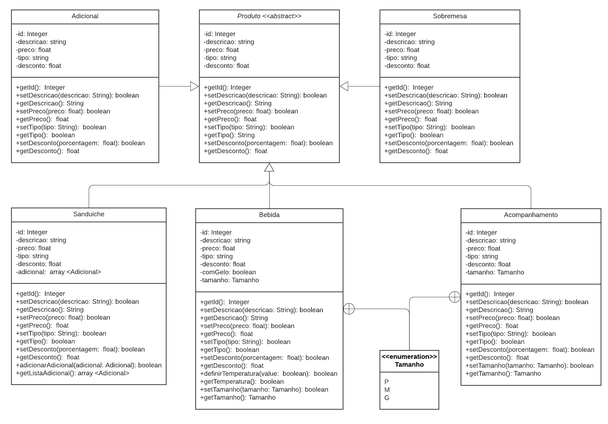

# Diagrama de Classe Abstrata

## Versionamento

| Versão | Data       | Modificação          | Autor                        |Revisor|
| ------ | :--------: | :------------------: | :--------------------------: | :---: |
| 1.0    | 11/02/2022 | Criação do Documento | Rodrigo Lima e Philipe Serafim | Pedro Lima |
| 1.1    | 13/02/2022 | Correção no nome do documento e no Diagrama de Classe Abstrata do Produto | Rodrigo Lima | Guilherme Silva |

<!-- NÃO ESQUECER DE ADICIONAR AO "/_sidebar.md" -->

## Introdução

As classes abstratas são as que não permitem realizar qualquer tipo de instância. São classes feitas especialmente para serem modelos para suas classes derivadas. As classes derivadas, via de regra, deverão sobrescrever os métodos para realizar a implementação dos mesmos.

## Metodologia
Para a criação do diagrama, foi realizada uma reunião onde foi discutida uma estrutura básica para diversas classes que herdarão as caracterisricas das classes abstratas.

## Diagrama de Classe Abstrata
### Diagrama da Classe Abstrata Pessoa

### Diagrama da Classe Abstrata Produto

## Bibliografia
* SERRANO, Milene. Modelagem - Classe Concreta & Abstrata & Sobrescrita & Sobrecarga. Acesso em: 11 de fevereiro de 2022.
* FAKHROUTDINOV, Kirill. UML Class and Object Diagrams Overview. Disṕonível em: https://www.uml-diagrams.org/class-diagrams-overview.html. Acesso em: 11 de fevereiro de 2022.
* Wellington. Conceitos – Classes Abstratas: Programação Orientada a Objetos. Disponível em: https://www.devmedia.com.br/conceitos-classes-abstratas-programacao-orientada-a-objetos/18812 . Acesso em: 11 de fevereiro de 2022.
