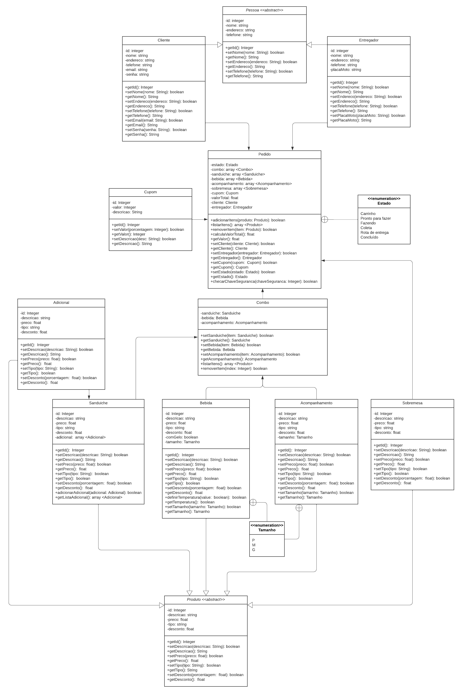

# Diagrama de Classes

## Versionamento

| Versão |    Data    |     Modificação      |      Autor      |                             Revisor                              |
| ------ | :--------: | :------------------: | :-------------: | :--------------------------------------------------------------: |
| 1.0    | 15/02/2022 | Criação do Documento | Philipe Serafim | Dafne Moretti, Giulia Lobo, Guilherme Fernandes e Liverson Paulo |
| 1.1    | 15/02/2022 | Adicionado diagrama  | Philipe Serafim | Dafne Moretti, Giulia Lobo, Guilherme Fernandes e Liverson Paulo |

<!-- NÃO ESQUECER DE ADICIONAR AO "/_sidebar.md" -->

## Introdução

Em programação, um diagrama de classes é uma representação da estrutura e relações das classes que servem de modelo para objetos. Podemos afirmar de maneira mais simples que seria um conjunto de objetos com as mesmas características, assim saberemos identificar objetos e agrupá-los, de forma a encontrar suas respectivas classes. Na Unified Modeling Language (UML) em diagrama de classe, uma classe é representada por um retângulo com três divisões, são elas: O nome da classe, seus atributos e por fim os métodos. (TYBEL, 2016).

No diagrama de classes também é possível identificar como as classes se associam.

## Metodologia

Para a criação do Diagrama de classes, foi realizado um Brainstorming com 5 pessoas para identificar as classes, métodos e associações que deveriam estar presentes no diagrama, em seguida, com auxílio do Draw.io, foi possível desenhá-lo.

### Diagrama de classes

<figcaption><a href="../../assets/images/diagrama-classes.png">Figura 1</a>: Diagrama de classes. Autores: Philipe Serafim, Rodrigo Lima, Giulia Lobo, Pedro Lima e Murilo Gomes</figcaption>

## Bibliografia

- FAKHROUTDINOV, Kirill. UML Class and Object Diagrams Overview. Disponível em: https://www.uml-diagrams.org/class-diagrams-overview.html. Acesso em: 15 de fevereiro de 2022.
- O que é um diagrama de classe UML? Disponível em: https://www.lucidchart.com/pages/pt/o-que-e-diagrama-de-classe-uml. Acesso em 15/02/2022.
- SERRANO, Milene. Modelagem - Diagrama de classes. Acesso em: 15 de fevereiro de 2022.
- TYBEL, Douglas. Orientações básicas na elaboração de um diagrama de classes. Disponível em: https://www.devmedia.com.br/orientacoes-basicas-na-elaboracao-de-um-diagrama-de-classes/37224 . Acesso em: 15 de fevereiro de 2022.
