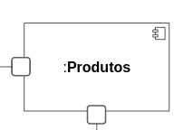
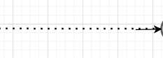
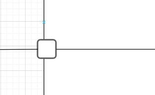
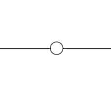
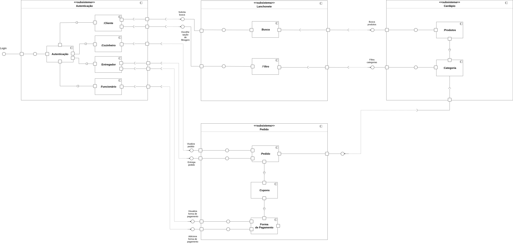
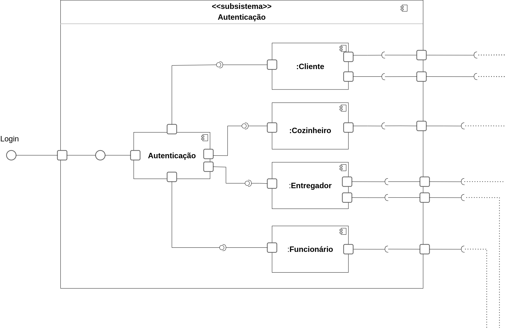
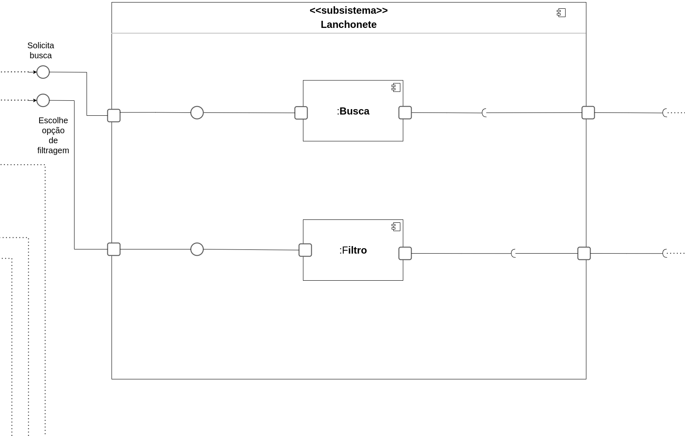
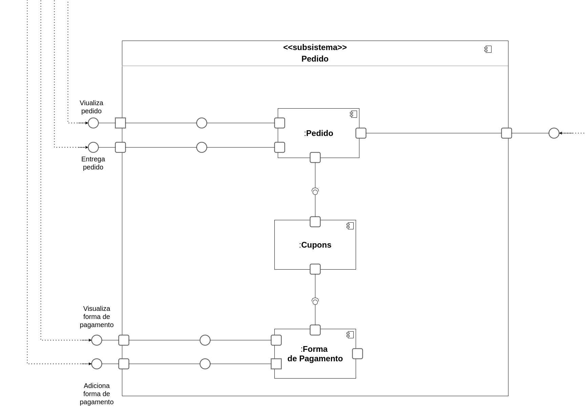
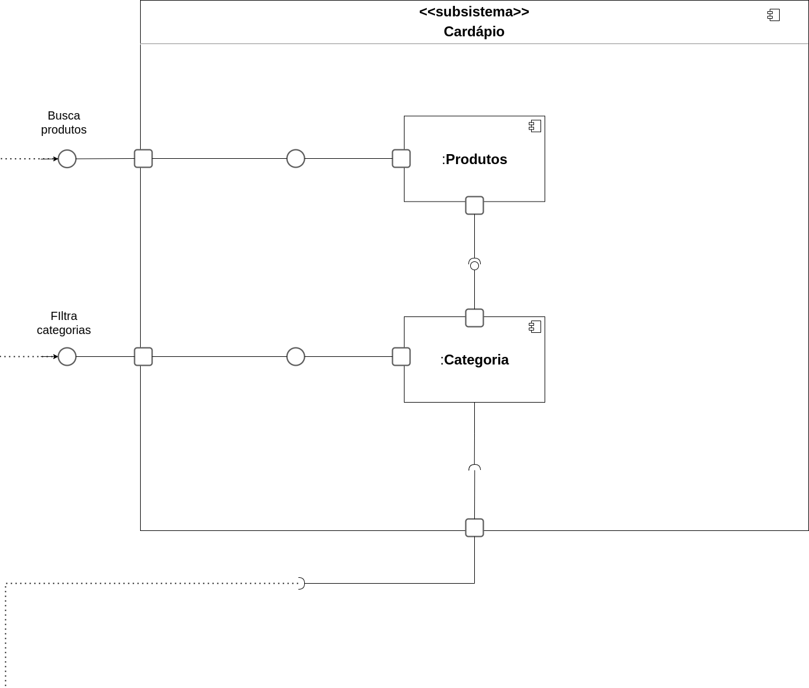

# Diagrama de Componentes

## Versionamento

| Versão |    Data    |     Modificação      | Autor | Revisor |
| ------ | :--------: | :------------------: | :---: | :-----: |
| 1.0    | 16/02/2022 | Criação do Documento | João Pedro Alves da Silva Chaves |  Guilherme Daniel Fernandes da Silva |
| 1.1    | 16/02/2022 | Adição de introdução e tabela com legenda | Dafne Moretti Moreira | Guilherme Daniel Fernandes da Silva |
| 1.2    | 17/02/2022 | Adição da metodologia e item da legenda | João Pedro Alves da Silva Chaves |Guilherme Daniel Fernandes da Silva |
| 1.3 | 17/02/2022 | Correções ortográficas nos textos solicitadas pelo revisor | João Pedro Alves da Silva Chaves | Guilherme Daniel Fernandes da Silva, Rodrigo Tiago Costa Lima, Lucas da Cunha Andrade e Pedro Lima |
| 1.4 | 17/02/2022 | Correções nas legendas das figuras | João Pedro Alves da Silva Chaves | Guilherme Daniel Fernandes da Silva, Rodrigo Tiago Costa Lima, Lucas da Cunha Andrade e Pedro Lima |
| 1.5 | 12/03/2022 | Correções nos elos das figuras, adição de fontes bibliográficas e citações | João Pedro Chaves | Giulia Lobo e Guilherme Daniel Fernandes da Silva |

## Introdução

O diagrama de componentes é um diagrama estático cuja função principal é apresentar os componentes, menor parte a ser considerada na modelagem do sistema (SIRTOLI, 2017), e suas relações com os demais subsistemas e componentes. A utilização do diagrama de componentes favorece a visualização geral do sistema, destacar a função de cada componente (SIRTOLI, 2017) e a percepção das partes que podem ser reutilizadas. 

É criado em linguagem de modelagem unificada (UML) e apresenta dependências, interfaces, portas e os próprios componentes. A ideia é que não fique um diagrama muito específico para que seja de fácil entendimento e identificação dos principais aspectos da aplicação, no entanto, existem diagramas com diferentes níveis de granularidade.

## Legenda

| Símbolo |  Nome  |  Descrição |
| ------ | ---------- | ------------ |
|    | Componente | Ilustra os componentes do sistema |
|      | Dependência | Representa a relação de dependência entre partes do sistema. |
|     | Porta |  Simboliza a comunicação entre o ambiente externo e os componentes. |
|     | Interface |  Simboliza a interface necessária para o relacionamento entre os componentes. |

<figcaption style="text-align: center">Tabela Legenda dos Componentes. Autores: João Pedro</figcaption>

## Metodologia

O desenvolvimento do diagrama de componentes foi feito com base na documentação do **Chapa Quente** e chegamos nos seguintes subsistemas: Autenticação, Lanchonete, Pedido, Cardápio. A plataforma utilizada para o desenvolvimento do diagrama foi o [draw.io](https://app.diagrams.net), pois é uma ferramenta gratuita e dispõe dos elementos necessários para a tarefa desejada.

<figcaption style="text-align: center"><a href="./assets/images/diagrama_de_componentes.png">Figura 01</a>: Diagrama de Componentes. Autores: João Pedro Alves da Silva Chaves e Dafne Moretti Moreira</figcaption>

<figcaption style="text-align: center"><a href="./assets/images/subsistema_autenticacao.png">Figura 02</a>: Subsistema Autenticação do diagrama de componentes. Autores: João Pedro Alves da Silva Chaves e Dafne Moretti Moreira</figcaption>

<figcaption style="text-align: center"><a href="./assets/images/subsistema_lanchonete.png">Figura 03</a>: Subsistema Lanchonete do diagrama de componentes. Autores: João Pedro Alves da Silva Chaves e Dafne Moretti Moreira</figcaption>

<figcaption style="text-align: center"><a href="./assets/images/subsistema_pedido.png">Figura 04</a>: Subsistema Pedido do diagrama de componentes. Autores: João Pedro Alves da Silva Chaves e Dafne Moretti Moreira</figcaption>

<figcaption style="text-align: center"><a href="./assets/images/subsistema_pedido.png">Figura 05</a>: Subsistema Cardápio do diagrama de componentes. Autores: João Pedro Alves da Silva Chaves e Dafne Moretti Moreira</figcaption>

## Bibliografia

* DIAGRAMAS de Componentes. In: Rational Software Architect Standard Edition. Disponível em: https://www.ibm.com/docs/pt-br/rsas/7.5.0?topic=services-component-diagrams. Acesso em: 16 fev. 2022.

* Lucidchart. O que é diagrama de componentes UML?. Disponível em: <https://www.lucidchart.com/pages/pt/diagrama-de-componentes-uml>. Acesso em: 16 fev. 2022.

* DIAGRAMAS Estruturais da UML: Diagramas de Componentes. [S. l.], 26 maio 2017. Disponível em: https://micreiros.com/diagramas-de-componentes/. Acesso em: 12 mar. 2022.
