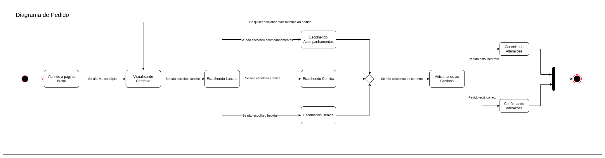

# Diagrama de Estados

## Versionamento

| Versão |    Data    |     Modificação      |   Autor    |     Revisor     |
| ------ | :--------: | :------------------: | :--------: | :-------------: |
| 1.0    | 15/02/2022 | Criação do Documento | Murilo Gomes e Liverson Paulo | Philipe Serafim e Giulia Lobo |

## Introdução

É um diagrama do tipo dinâmico, esse diagrama também é conhecido como diagrama de máquina de estados. Esse tipo de diagrama é utilizado para modelar um comportamento discreto em sistemas de transição entre estados finitos. Os principais elementos que constituem um diagrama de estados são:

* Estado inicial: Ponto inicial, onde começa a utilização do objeto;
* Evento ou Transição: Representa uma ação externa sobre um objeto;
* Estado: Representa um dos possíveis estados que um objeto pode ter;
* Ações: Processo associado à transição de estados. São representadas por "/", seguidas das ações contidas no estado. As ações são:
    * Ação de entrada: executada para chegar a algum estado;
    * Ação de atividade: é executada dentro do estado;
    * Ação de saída: executada quando se sai de um estado.
* Estado final: Ponto de saída do objeto.

## Metodologia

Os diagramas foram criados no [draw.io](https://app.diagrams.net/) entre os dias 12 e 15 de Fevereiro.
Assim sendo foram construídos três diagramas, sendo estes listados a seguir.

### Diagrama de Login

<figcaption><a href="../../assets/images/diagrama-de-estados-login.png">Figura 1</a>: Diagrama de Login. Autor: Liverson Paulo</figcaption>

### Diagrama de Cardápio

<figcaption><a href="../../assets/images/diagrama-de-estados-cardapio.png">Figura 2</a>: Diagrama de Cardápio. Autor: Murilo Gomes</figcaption>

### Diagrama de Pedido

<figcaption><a href="../../assets/images/diagrama-de-estados-pedido.png">Figura 3</a>: Diagrama de Pedido. Autores: Liverson Paulo e Murilo Gomes</figcaption>

## Bibliografia

SILVA, R. P. (2007). “UML 2 em Modelagem Orientada a Objetos”, 1ª ed., Florianópolis, SC, Brasil, Visual Books

GUDWIN, Ricardo R. Diagramas de Atividade e Diagramas de Estado. Disponível em: https://www.dca.fee.unicamp.br/~gudwin/ftp/ea976/AtEst.pdf (Acesso em 15/02/2022)

SERRANO, Milene. Arquitetura e Desenho de Software - AULA - MODELAGEM UML DINÂMICA. Disponível em: https://aprender3.unb.br/pluginfile.php/1558837/mod_label/intro/Arquitetura%20e%20Desenho%20de%20Software%20-%20Aula%20Modelagem%20UML%20Din%C3%A2mica%20-%20Profa.%20Milene.pdf (Acesso em 15/02/2022)
