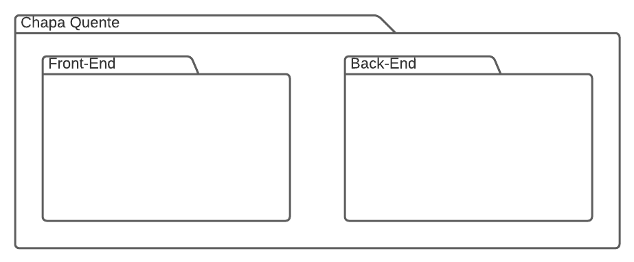
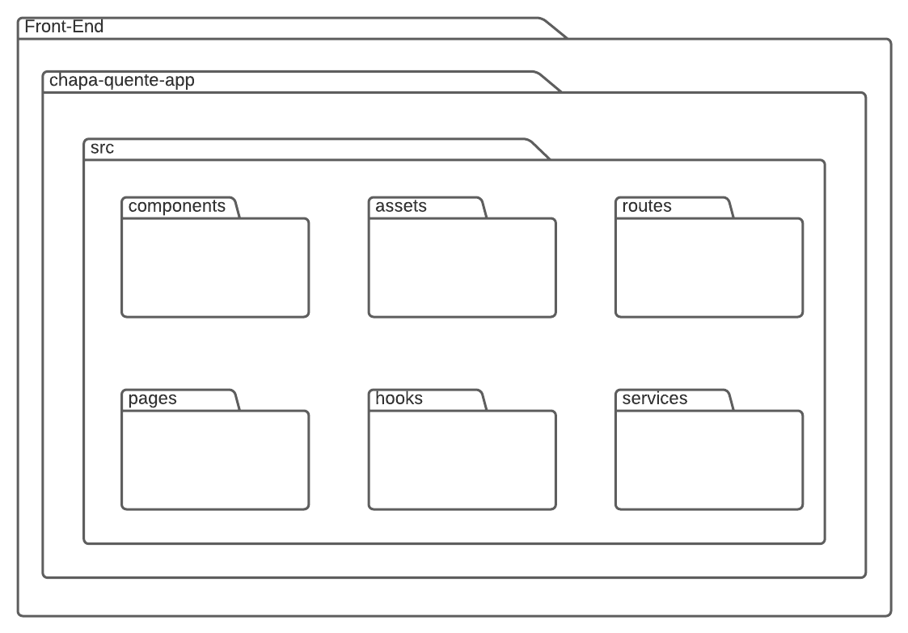
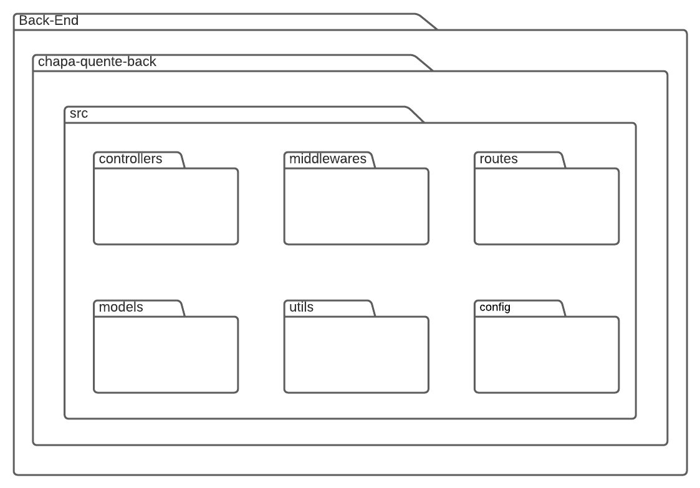

# Diagrama de Pacote

## Versionamento

| Versão |    Data    |     Modificação      |   Autor    |     Revisor     |
| ------ | :--------: | :------------------: | :--------: | :-------------: |
| 1.0    | 25/01/2022 | Criação do Documento | Pedro Lima | Philipe Serafim |

## Introdução

Diagrama de pacotes é um diagrama estrutural, estático, que tem uma aplicação com foco em organizar o sistema como se representasse uma visão em módulos descrito pela notação UML (Unified Modeling Language),

## Objetivo

O diagrama foi desenvolvido pensando nos frameworks ReactJs para a parte de front-end do sistema e NodeJs ficaria responsável pela parte de back-end do mesmo.

## Visão Geral

<figcaption style="text-align: center">Figura 1 - Diagrama Geral. Autor: Pedro Lima</figcaption>

## Diagrama Front-End

<figcaption style="text-align: center">Figura 2 - Diagrama Front End. Autor: Pedro Lima</figcaption>

## Diagrama Back-End

<figcaption style="text-align: center">Figura 3 - Diagrama Back End. Autor: Pedro Lima</figcaption>

## Bibliografia

- Tudo sobre diagramas de pacotes UML. Lucidchat. Disponível em: <https://www.lucidchart.com/pages/pt/diagrama-de-pacotes-uml> (último acesso em 11/02/2022)
