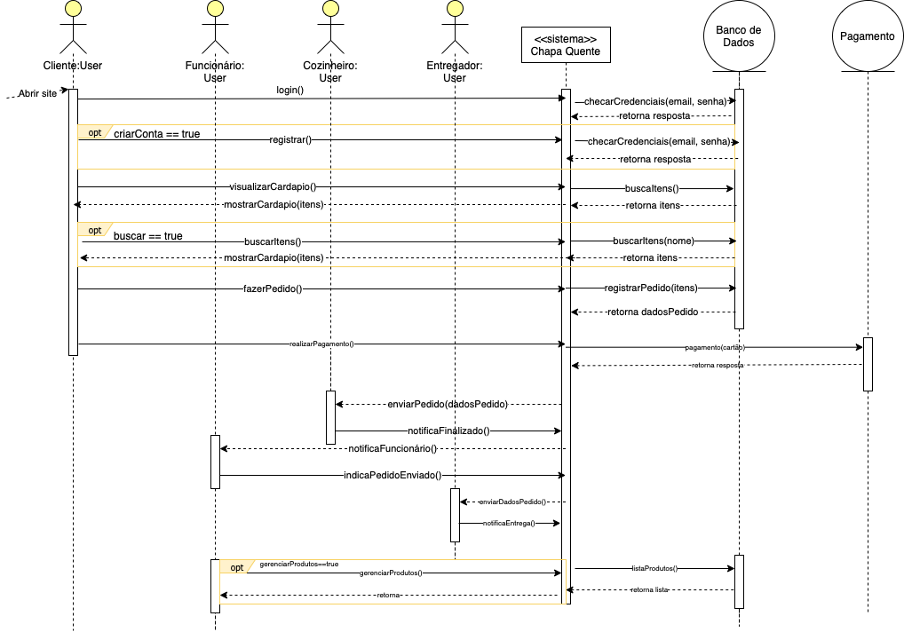

# Diagrama de Sequência

## Versionamento
| Versão |    Data    |     Modificação      |   Autor   |     Revisor     |
| ------ | :--------: | :------------------: | :--------:| :-------------: |
| 1.0    | 15/02/2022 | Criação do Documento | Guilherme Fernandes |                 |

## Introdução

O diagrama de sequência é um diagrama UML(Unified Modeling Language) que tem como objetivo representar uma sequência de processos, em específico as mensagens passadas entre objetos numa aplicação de software. 

## Objetivo

O objetivo desse diagrama é representar a sequência de mensagens trocadas entre os atores envolvidos na aplicação e o sistema. Dessa forma, é possível entender como se dá a interação entre os atores e as diferentes partes do sistema. 

## Visão geral

O diagrama foi criado de acordo com a funcionalidade de fazer pedido de comida.

## Bibliografia

- O que é um diagrama de sequência UML?. Disponível em: <https://www.lucidchart.com/pages/pt/o-que-e-diagrama-de-sequencia-uml> (último acesso em 15/02/2022)
- Tutorial do Diagrama de Sequência: Guia completo com exemplos. Disponível em: <https://creately.com/blog/pt/diagrama/tutorial-do-diagrama-de-sequencia/> (último acesso em 15/02/2022)