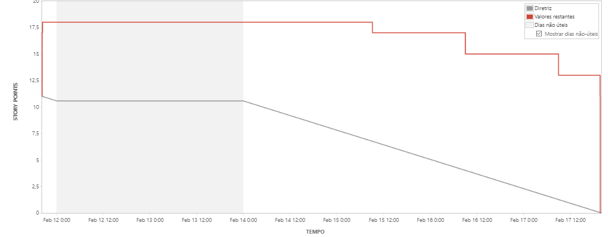

# Métricas de Sprint

## Versionamento

| Versão |    Data    |       Modificação        |       Autor        |        Revisor        |
| ------ | :--------: | :----------------------: | :----------------: | :-------------------: |
| 1.0    | 14/02/2022 |   Criação do Documento   | Liverson Paulo | Murilo Gomes de Souza |

## Introdução

As métricas são utilizadas para coletar e analisar dados relevantes para o desenvolvimento do projeto, ao mensurar os aspectos do desenvolvimento, as métricas ajudam a perceber como está a evolução da equipe ao longo das Sprints.

## Metodologia

Utilizando a plataforma Jira, foram utilizados duas ferramentas principais para a avaliação da equipe, sendo elas o Burndown e o Velocity.

## Burndown

É um gráfico utilizado para acompanhar o andamento dos projetos, levando em conta três fatores: Tempo, esforço e prazo de entrega.

O burndown é reponsável por mostrar como a equipe lida com o fluxo de tarefas em uma sprint. Avalia se o prazo foi cumprido ou houve algum atraso.

## Velocity

É utilizada para medir a capacidade de entrega da equipe, onde a velocidade de um time nunca deve ser comparada com outro. No momento da avaliação deve-se comparar somente o desempenho da equipe com as entregas que foram realizadas.

## Bibliografia

ProMove Soluções. Métricas do Scrum: Como medir resultados? Disponível em: https://promovesolucoes.com/metricas-do-scrum-como-medir-resultados/ (Acesso em 18/02/2022)