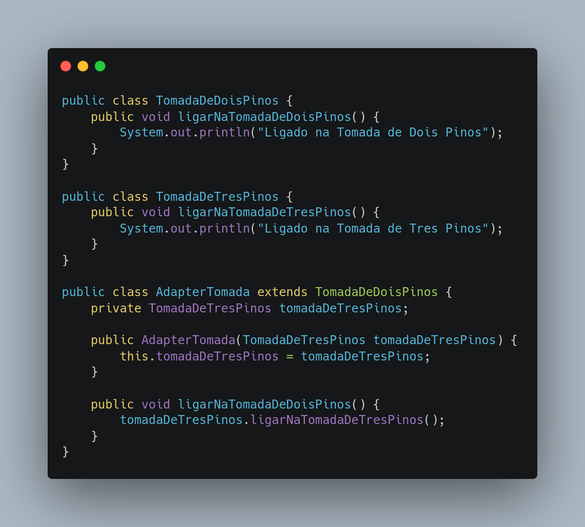

# Adapter

## Versionamento

| Versão | Data       | Modificação          | Autor                        |Revisor|
| ------ | :--------: | :------------------: | :--------------------------: | :---: |
| 1.0    | 23/02/2022 | Criação do Documento | Lucas Andrade e Philipe Serafim | Dafne Moretti |

## Introdução

O padrão de projeto Adapter é utilizado quando precisamos fazer o uso de uma certa funcionalidade, muitas vezes uma biblioteca externa, porém esta possui incompatibilidade com o formato de dados que a aplicação usa.

Neste tipo de situação, modificar a funcionalidade para aceitar o formato original pode muitas vezes se mostrar inviável: modificar o código pode trazer problemas em outras partes ou então podemos ter a situação de ser um código fechado, impossibilitando alterações.

A proposta do padrão Adapter é servir como um tradutor entre duas interfaces distintas.

### Pontos Positivos:z
- Facilita manutenção
- Emprega uma linguagem universal (padrão)
- Modularização do projeto, dividindo bem as funções

### Pontos Negativo:
- Aumenta complexidade do codigo, já que agora será necessário uma etapa extra (A -> **ADAPTER** -> B)

## Metodologia

Um bom exemplo para explicar o padrão Adapter é a ideia de uma tomada. 

Ainda não foi identificado um uso para o padrão Adapter no projeto.

## Conclusão

Utilizando o padrão Adapter podemos facilmente criar um modo de realizar a comunicação entre duas interfaces diferentes. É importante saber usar bem esse padrão para não prejudicar a evolução do software.

## Bibliografia

- ADAPTER. [S. l.]. Disponível em: https://refactoring.guru/pt-br/design-patterns/adapter. Acesso em: 23 de fevereiro de 2022.

- SERRANO, Milene. AULA - GOFS ESTRUTURAIS. Acesso em: 23 de fevereiro de 2022.

- MEDEIROS, Higor. Padrão de Projeto Adapter em Java. Disponível em: https://www.devmedia.com.br/padrao-de-projeto-adapter-em-java/26467. Acesso em: 25 de fevereiro de 2022.