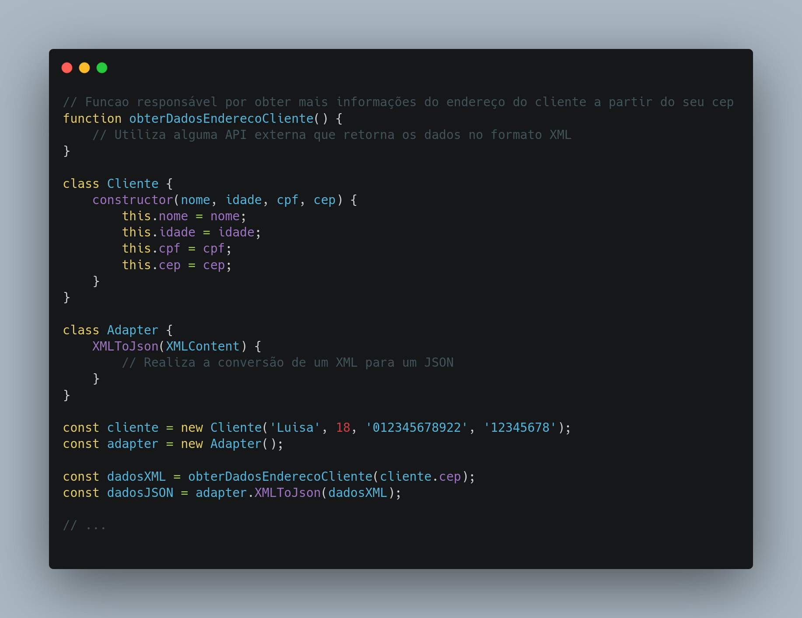

# GOF Adapter

## Versionamento

| Versão | Data       | Modificação          | Autor                        |Revisor|
| ------ | :--------: | :------------------: | :--------------------------: | :---: |
| 1.0    | 23/02/2022 | Criação do Documento | Lucas Andrade e Philipe Serafim | Dafne Moretti |
| 1.1    | 15/03/2022 | Adição de código e da conclusão | Lucas Andrade | Giulia Lobo e João Pedro |

## Introdução

O padrão de projeto Adapter é utilizado quando precisamos fazer o uso de uma certa funcionalidade, muitas vezes uma biblioteca externa, porém esta possui incompatibilidade com o formato de dados que a aplicação usa.

Neste tipo de situação, modificar a funcionalidade para aceitar o formato original pode muitas vezes se mostrar inviável: modificar o código pode trazer problemas em outras partes ou então podemos ter a situação de ser um código fechado, impossibilitando alterações.

A proposta do padrão Adapter é servir como um tradutor entre duas interfaces distintas.

### Pontos Positivos

- Facilita manutenção
- Emprega uma linguagem universal (padrão)
- Modularização do projeto, dividindo bem as funções

### Pontos Negativos

- Aumenta complexidade do codigo, já que agora será necessário uma etapa extra (A -> **ADAPTER** -> B)

## Metodologia

Um exemplo aplicabilidade do Adapter é na utilização de algum serviço de localização, externo a aplicação, que recebe dados do cliente, e retorna mais informações sobre esse dado. No exemplo temos um serviço que recebe o CEP do cliente e se propõem a informar mais dados do endereço do cliente a partir desse CEP. O problema é que esse serviço retorna os dados no formato XML, e a aplicação espera um JSON. O adapter aqui possui a função de realizar a transformação desse dado para assim poder ser utilizado na aplicação.

<figcaption style="text-align: center">Figura 1 - Exemplo de uso do padrão Adapter. Autor: Lucas Andrade</figcaption>

## Conclusão

Utilizando o padrão Adapter podemos facilmente criar um modo de realizar a comunicação entre duas interfaces diferentes, sendo importante saber bem quando utiliza-lo, evitando prejudicar a evolução do software. Ainda não foi identificado um cenário de uso para o padrão Adapter no projeto.

## Bibliografia

- ADAPTER. [S. l.]. Disponível em: <https://refactoring.guru/pt-br/design-patterns/adapter>. Acesso em: 23 de fevereiro de 2022.

- SERRANO, Milene. AULA - GOFS ESTRUTURAIS. Acesso em: 23 de fevereiro de 2022.

- MEDEIROS, Higor. Padrão de Projeto Adapter em Java. Disponível em: <https://www.devmedia.com.br/padrao-de-projeto-adapter-em-java/26467>. Acesso em: 25 de fevereiro de 2022.
