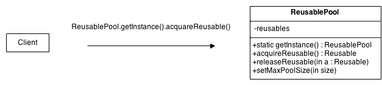

# GOF Object Pool

## Versionamento

| Versão |    Data    |         Modificação         |       Autor        |                               Revisor                                |
| ------ | :--------: | :-------------------------: | :----------------: | :------------------------------------------------------------------: |
| 1.0    | 02/03/2022 |    Criação do Documento     |   Lucas Andrade    |                        Dafne Moretti Moreira                         |
| 1.1    | 16/03/2022 | Alterações na documentação  | Giulia Lobo Barros | Dafne Moretti, Guilherme Fernandes, Rodrigo Lima e João Pedro Chaves |
| 1.2    | 16/03/2022 | Correção ortográfica e path |  Philipe Serafim   | Dafne Moretti, Guilherme Fernandes, Rodrigo Lima e João Pedro Chaves |

## Introdução

O padrão criacional **Object Pool** é usado quando estamos lidando com classes com um alto custo de inicialização. A ideia é colocar as classes instanciadas em uma "pool", e quando for necessário elas são chamadas.

Os objetos possuem o ciclo de vida de **criação**, **validação** e **destruição**.

Também é possível fazer um paralelo com a ideia de um cache.

## Metodologia

O Object Pool funciona como um local que reúne as instâncias das classes, e quando necessário, é feito uma chamada pela instância desejada. É desejado que todos os objetos instanciados estejam na mesma pool, e por isso é recomendado que a classe do pool seja uma classe Singleton.

<figcaption style="text-align: center">Figura 1 - Interação entre o cliente e a pool. Fonte: https://sourcemaking.com/</figcaption>

## Aplicação Prática

Uma forma de exemplificar o **Objetct Pool** é mostrando como ele funcionaria em um código:

<figcaption style="text-align: center">Figura 2 - Interação entre o cliente e a pool. Fonte: https://itdesigner.github.io/standards/patterns/gof-objectpool.html</figcaption>  

Conforme a imagem demonstra, primeiramente é criada uma função (classe) _Object Pool_, que representa o objeto que será reutilizado e também é criada uma função (classe) _PoolItem_ que vai reunir as instâncias da outra classe e aí vai poder chamá-la apenas quando necessário, sem ter que chamar todos os recursos originários dela. Dessa forma evitando um gasto exorbitante de memória do sistema e melhorando sua performance.

## Conclusão

O padrão Object Pool tem a capacidade de oferecer um bom ganho de performance para o projeto, porém possui casos de uso bastante específicos e são, normalmente, implementadas como singleton. A equipe não viu, até o momento, nenhum cenário de utilização do padrão Object Pool no projeto, até mesmo pela baixa complexidade dele e não deve seguir adiante com este padrão.

## Bibliografia

- Object Pool Design Pattern. [S. l.]. Disponível em: https://sourcemaking.com/design_patterns/object_pool. Acesso em: 02 de março de 2022.

- Object Pool Design Pattern. [S. l.]. Disponível em: https://www.geeksforgeeks.org/object-pool-design-pattern/. Acesso em: 02 de março de 2022.

- SHAUGHNESSY, Jerry. OBJECT POOL PATTERN. Disponível em: https://itdesigner.github.io/standards/patterns/gof-objectpool.html. Acesso em: 16/03/2022.

- HTML5 Gamer. JAVASCRIPT OBJECT POOL. Disponível em: https://blog.sklambert.com/javascript-object-pool/. Acesso em: 16/03/2022
