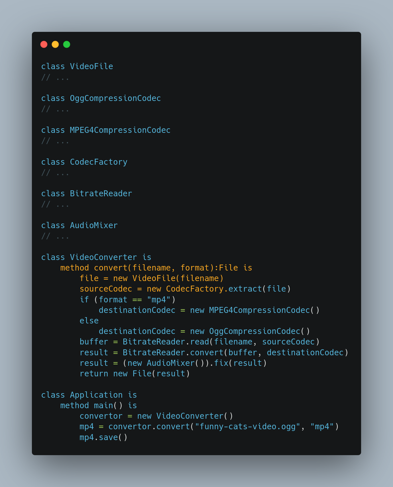

# GOF Facade

## Versionamento

| Versão | Data       | Modificação          | Autor                        |Revisor|
| ------ | :--------: | :------------------: | :--------------------------: | :---: |
| 1.0    | 02/03/2022 | Criação do Documento | Lucas Andrade | Dafne Moretti |

## Introdução

O padrão **Facade** busca facilitar o uso de uma funcionalidade que requer a operação de um conjunto de classes, tornando a utilização de tal funcionalidade algo complexo para o usuário.

A ideia é a instalação de uma nova interface, onde dentro dela é realizada todas as etapas para o resultado desejado, onde tais etapas sequer ficam a mostra dos usuários.

## Metodologia

Um exemplo seria a conversão de um video. Esse processo é extremamente complexo, requerendo várias operações para realizar a mudança de formato com sucesso. O **facade** propõem facilitar esse processo fornecendo ao usuario um meio de realizar todas as operações necessárias de uma forma direta, com a chamada de um metodo de uma unica classe: ```codificarVideo(arquivo, formato)```.


<figcaption style="text-align: center">Exemplo de uso do padrão facade na conversão de um vídeo. Fonte: https://refactoring.guru/</figcaption>

O grupo vê a utilização do padrão **facade** nas partes referentes ao cadastro, tanto de usuário quanto de items no cardapio.

## Conclusão

O padrão facade traz uma saída para funcionalidades que requerem a operação de um conjunto de classes, que devem seguir uma determinada organização, tornando tal operação bastante complexa. O objetivo é tornar a realização dessa atividade algo mais fácil para o usuário.

## Bibliografia

- Facade. [S. l.]. Disponível em: https://refactoring.guru/pt-br/design-patterns/facade. Acesso em: 02 de março de 2022.

- JAVA Design Patterns: A Hands-On Experience with Real-World Examples. 2. ed. [S. l.]: Apress, 2018.

- Facade Design Pattern. [S. l.]. Disponível em: https://sourcemaking.com/design_patterns/facade. Acesso em: 02 de março de 2022.
