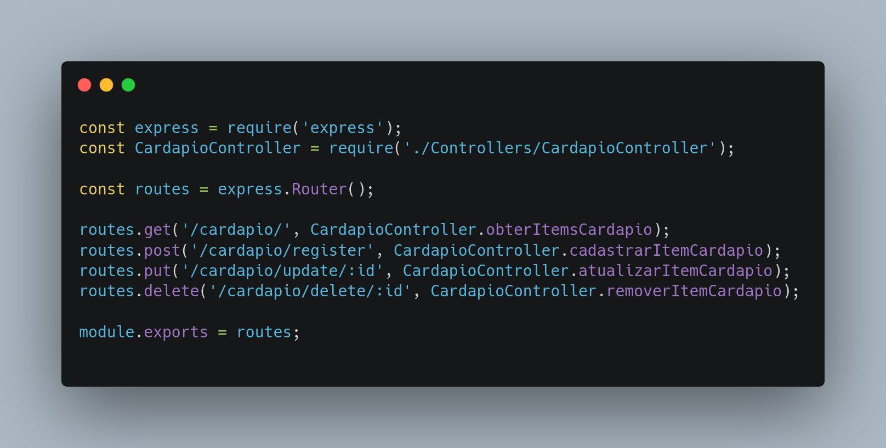

# GOF Facade

## Versionamento

| Versão | Data       | Modificação          | Autor                        |Revisor|
| ------ | :--------: | :------------------: | :--------------------------: | :---: |
| 1.0    | 02/03/2022 | Criação do Documento | Lucas Andrade | Dafne Moretti |

## Introdução

O padrão **Facade** busca facilitar o uso de uma funcionalidade que requer a operação de um conjunto de classes, tornando a utilização de tal funcionalidade algo complexo para o usuário.

A ideia é a instalação de uma nova interface, onde dentro dela é realizada todas as etapas para o resultado desejado. Tais etapas não ficam evidentes para o usuário.

## Metodologia

Um exemplo de uso do padrão Facade no projeto é nas rotas do cardápio do restaurante.

<figcaption style="text-align: center">Exemplo de uso do padrão facade no gerenciamento do menu do restaurante.</figcaption>

## Conclusão

O padrão **facade** traz uma saída para funcionalidades que requerem a operação de um conjunto de classes, que devem seguir uma determinada organização, tornando tal operação bastante complexa. Objetiva-se assim tornar a  realização dessa atividade algo mais fácil e intuitivo para o usuário. O grupo enxerga o uso do padrão **facade** nas rotas da aplicação, com relação as controllers responsáveis por coordenar a aplicação.

## Bibliografia

- Facade. [S. l.]. Disponível em: https://refactoring.guru/pt-br/design-patterns/facade. Acesso em: 02 de março de 2022.

- JAVA Design Patterns: A Hands-On Experience with Real-World Examples. 2. ed. [S. l.]: Apress, 2018.

- Facade Design Pattern. [S. l.]. Disponível em: https://sourcemaking.com/design_patterns/facade. Acesso em: 02 de março de 2022.
