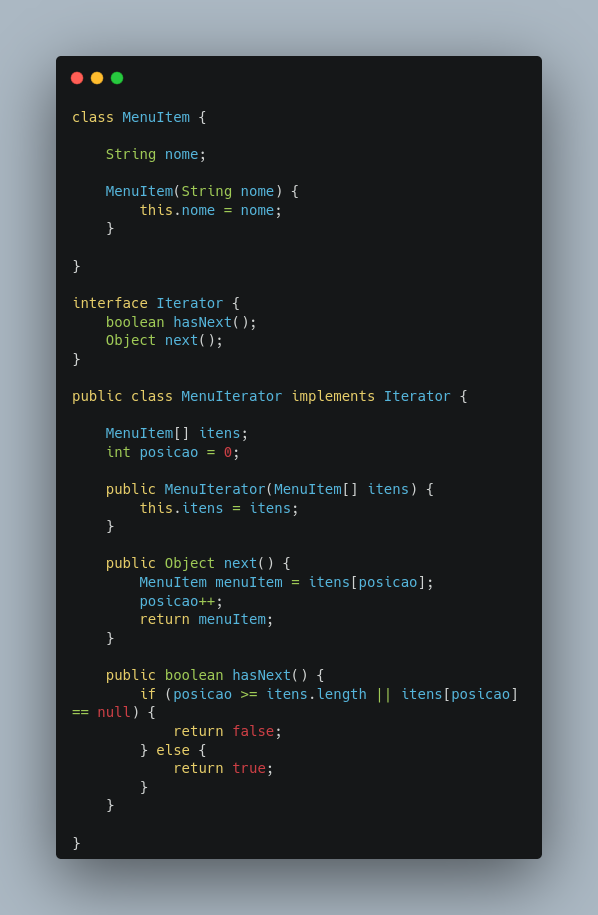

# GOF Comportamental Iterator

## Versionamento

| Versão |    Data    |     Modificação      | Autor | Revisor |
| ------ | :--------: | :------------------: | :---: | :-----: |
| 1.0    | 25/02/2022 | Criação do Documento |Philipe Serafim e Lucas Andrade| Dafne Moretti |

<!-- NÃO ESQUECER DE ADICIONAR AO "/_sidebar.md" -->

## Introdução

Por se tratar de um padrão de projeto comportamental, que visa a interação entre classes e objetos, o iterator tem o objetivo de encapsular uma iteração.

“O Padrão Iterator fornece uma maneira de acessar sequencialmente os elementos de um objeto agregado sem expor a sua representação subjacente” (SIERRA, 2009). Permitindo acessar, de forma sequencial, os elementos de objeto sem expor seu subjacente.

## Metodologia

O iterator precisa ter a implementação de sua interface de forma extremamente simples, fazendo com que ele se adapte aos objetos que irão utilizá-lo, independente da estrutura utilizada, seja ela um ArrayList, HashTable ou até mesmo um simples vetor. 

<figcaption>Figura 1 - Exemplo de Iterator em Java. (MEDEIROS, Higor):</figcaption>

## Conclusão

A praticidade do iterator está diretamente relacionada a sua possibilidade de percorrer estruturas, independente da sua forma, facilitando o acesso aos itens de forma sequencial.

## Bibliografia

SIERRA, Kathy; BATES, Bert. **Padrões de Projetos**. 2ª Edição Rio de Janeiro: Alta Books, 2009.

MEDEIROS, Higor. **Padrão de Projeto Iterator em Java**. Disponível em: https://www.devmedia.com.br/padrao-de-projeto-iterator-em-java/26733. Acesso em: 25/02/2022