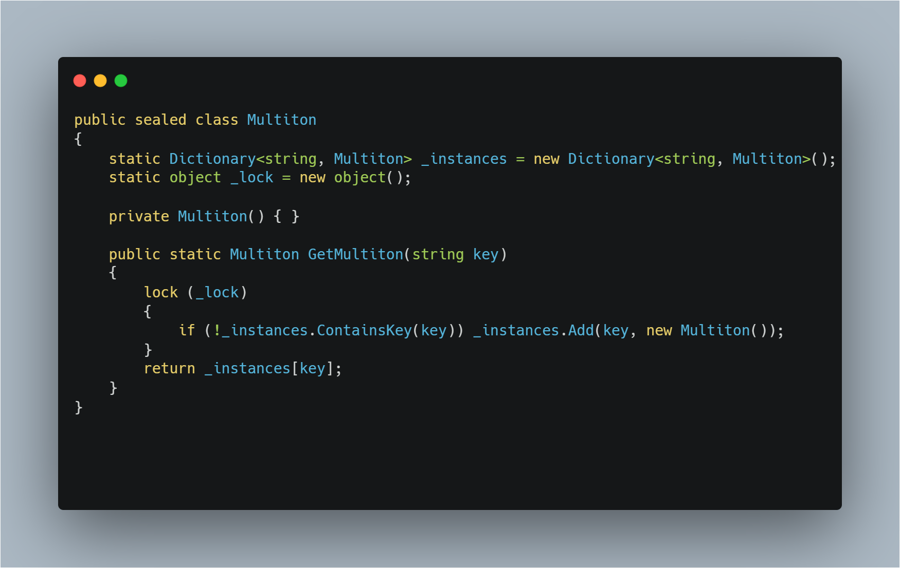

# GOF Criacional Multiton

## Versionamento

| Versão |    Data    |     Modificação      |              Autor              | Revisor |
| ------ | :--------: | :------------------: | :-----------------------------: | :-----: |
| 1.0    | 28/02/2022 | Criação do Documento | Philipe Serafim e Lucas Andrade | Dafne Moretti |

<!-- NÃO ESQUECER DE ADICIONAR AO "/_sidebar.md" -->

## Introdução

Sendo uma extensão do Singleton, o Multiton tem por objetivo instanciar um número _n_ de objetos de uma determinada classe atribuindo uma chave identificadora para cada instanciação.

## Metodologia

O construtor do Multiton deve ser privado, a fim de evitar que instanciações que não seriam criadas dentro do dicionário já estabelecido. Também deve existir um método que retorne um objeto do dicionário a partir de uma chave identificadora passada como argumento.

Figura 1 - Classe multiton. Fonte: [CARR](http://www.blackwasp.co.uk/multiton.aspx)

## Conclusão

O acesso centralizado a partir da chave informada permite com que o Multiton exerça diversos papéis em projetos distintos. Entretanto deve-se prestar atenção ao fato de que o Multiton nunca irá retornar um valor nulo, caso não exista instanciação para a chave indicada, uma nova instância será criada para a chave em questão, podendo causa um uso inesperado de memória.

A implementação do multiton deve ser bem pensada para não trazer mais prejuízos do que benefícios. Portanto, foi analisado que o padrão de projeto não será aplicado no contexto do Chapa Quente, uma vez que haveria a tendência de criação de um multiton com associação de vários singletons. Além disso, neste escopo não será utilizada uma grande quantidade de singletons, o que inviabiliza ainda mais o multiton. 

## Bibliografia

CARR, Richard. **Multiton Design Pattern**. Disponível em: http://www.blackwasp.co.uk/multiton.aspx. Acessado em: 28/02/2022.
