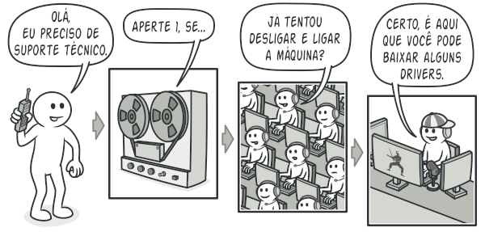
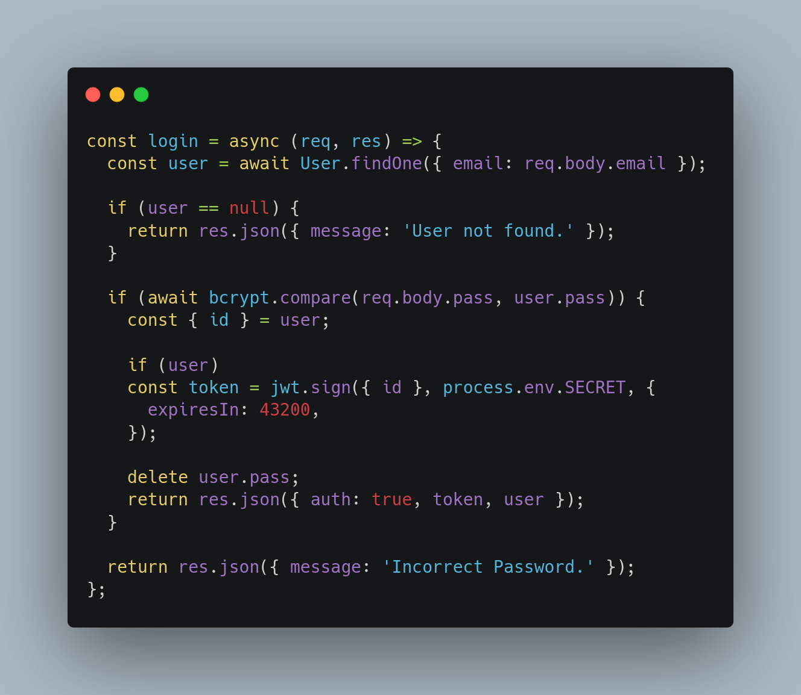
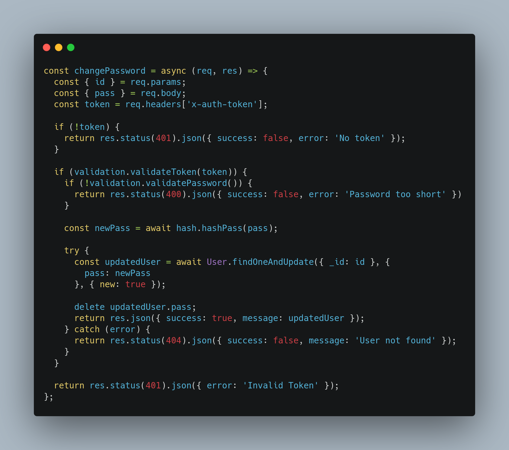

# GOF Chain of Responsibility

## Versionamento

| Versão | Data       | Modificação          | Autor                        |Revisor|
| ------ | :--------: | :------------------: | :--------------------------: | :---: |
| 1.0    | 25/02/2022 | Criação do Documento | Liverson Paulo e Lucas Andrade | Dafne Moretti e João Pedro |
| 1.1    | 11/03/2022 | Adição de código e ajustes no texto | Lucas Andrade | Giulia Lobo e Guilherme Daniel Fernandes |

## Introdução

É um padrão comportamental, cujo o propósito é evitar que hajam dependência entre um objeto receptor e um objeto solicitante. Portanto ele vai permitir que passe pedidos por uma corrente de handlers, em que ao receber um pedido, cada handler vai decidir se processa ou passa um pedido para o handler adiante na corrente.

<figcaption style="text-align: center">Exemplo do funcionamento de Chain of Responsibility associando com o mundo real. Fonte: https://refactoring.guru/pt-br/design-patterns/chain-of-responsibility</figcaption>

## Metodologia

Temos aqui dois exemplos de utilização do padrão Chain of Responsibility associado com o projeto. No primeiro temos validações para realização do login e no segundo a troca de senha de um usuário. Para esse segundo, temos a validação de **token** e **senha**. Essas validações são realizar por metodos contidos na classe validation.

<figcaption style="text-align: center">Exemplo de uso do padrão no login na aplicação. </figcaption>

<figcaption style="text-align: center">Exemplo de uso do padrão na troca de senha de um usuario. </figcaption>

## Conclusão

Esse GOF é bastante útil quando estamos tratando de verificação e validação de dados e esperamos poder realizar isso de uma forma organizada e clara, direcionando eventuais problemas com os dados recebidos. O padrão aqui oferece uma interface que cumpre essas necessidades. Vemos no nosso projeto a utilização desse padrão em momentos que precisamos fazer validações de dados em vários níveis.

## Bibliografia

Chain of responsibility. Disponível em: https://pt.wikipedia.org/wiki/Chain_of_Responsibility. Acesso 02/03/2022

Chain of Responsibility. Disponível em: https://refactoring.guru/pt-br/design-patterns/chain-of-responsibility.  Acesso em: 04/03/2022
