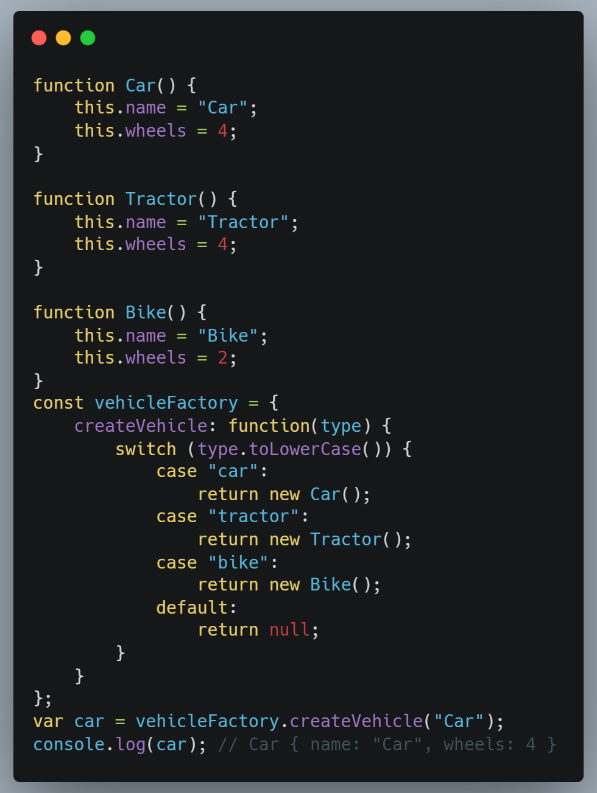

# Abstract Factory

## Versionamento

| Versão | Data       | Modificação          | Autor                        |Revisor|
| ------ | :--------: | :------------------: | :--------------------------: | :---: |
| 1.0    | 15/02/2022 | Criação do Documento |  Liverson Paulo e Giulia Lobo | Lucas Andrade e Dafne Moretti |
| 1.1    | 16/03/2022 | Alterações na documentação |  Giulia Lobo Barros | Lucas Andrade, Dafne Moretti, João Pedro Chaves, Rodrigo Lima e Guilherme Fernandes |

## Introdução 

O GoF de Abstract Factory é um GoF criacional, que é uma variação do Factory Method e que tem o propósito de ter famílias de objetos relacionados, onde não é necessário especificar suas classes concretas.

## Metodologia

Ele é utilizado quando o código precisa trabalhar com famílias de produtos relacionados, mas que não se deseja depender das classes concretas para permitir uma futura escalabilidade.

> Figura 1: Exemplo lúdico para ilustrar o Abstract Factory. Fonte: https://digitalpulsion.com/wp-content/uploads/Abstract-Factory-Design-Pattern-digitalpulsion-younes-rabdi.png

## Aplicação Prática

Para exemplificar ainda melhor esse padrão de projeto, temos a seguinte estrutura:

> Figura 2: Exemplo prático do Abstract Factory. Fonte: https://levelup.gitconnected.com/design-patterns-in-javascript-bbef243a5044

Nesse exemplo, é fácil identificar que existem três classes diferentes, sendo elas *Car*, *Tractor* e *Bike* e que essas classes, mesmo tendo características diferentes, ainda são classificadas em uma mesma classe abstrata denominada *vehicleFactory*. Dessa forma, a classe abstrata permite a escalabilidade do sistema e, ainda assim, preserva as características particulares de cada classe concreta.

## Vantagens e Desvantages

* Vantagens:
    * É possível ter certeza que os produtos que se obtém de uma fábrica são compatíveis entre si;
    * É evitado um vínculo forte entre produtos concretos e o código cliente;
    * Pode-se extrair o código de criação do produto para um lugar, fazendo o código ser de fácil manutenção;
    * Pode-se introduzir novas variantes de produtos sem quebrar o código cliente existente.
* Desvantagens:
    * O código pode tornar-se mais complicado do que deveria ser, uma vez que muitas novas interfaces e classes são introduzidas junto com o padrão.

## Conclusão

No caso do projeto Chapa quente, há duas possibilidades principais em implementar o Abstract Factory.

A primeira delas é quando se trata dos usuários, já que podem haver clientes, cozinheiros, entregadores ou administradores, totalizando 4 usuários diferentes com características em comum, assim podendo ser utilizado o Abstract Factory.

E a segunda possibilidade se dá nos produtos, já que neles, os lanches podem ser sanduíche, bebida, complemento e acompanhamento.

Considerando estes possíveis cenários, a equipe acredita que o uso deste padrão de projeto é bem útil e vai agregar bastante para uma entrega mais rica do projeto Chapa Quente.

## Bibliografia

* Abstract Factory. Disponível em: https://circle.visual-paradigm.com/abstract-factory/. Acesso em: 23/02/2022

* Design Patterns. Disponível em: https://refactoring.guru/pt-br/design-patterns/abstract-factory. Acesso em: 23/02/2022

* Abstract Factory. Disponível em: http://www.dsc.ufcg.edu.br/~jacques/cursos/map/html/pat/abstractfactory.htm. Acesso em: 23/02/2022

* Padrão de Projeto Abstract Factory. Disponível em: http://davesbalthazar.com.br/006-padrao-de-projeto-abstract-factory-padrao-gof-de-criacao-curso-de-design-patterns/. Acesso em: 23/02/2022

* Introducao aos padroes criacionais. Disponível em: https://www.devmedia.com.br/introducao-aos-padroes-criacionais-abstract-factory-factory-method-prototype-e-singleton/21249. Acesso em: 23/02/2022

* MEDIUM. DESIGN PATTERNS IN JAVASCRIPT. Disponível em: https://levelup.gitconnected.com/design-patterns-in-javascript-bbef243a5044. Acesso em: 16/03/2022
