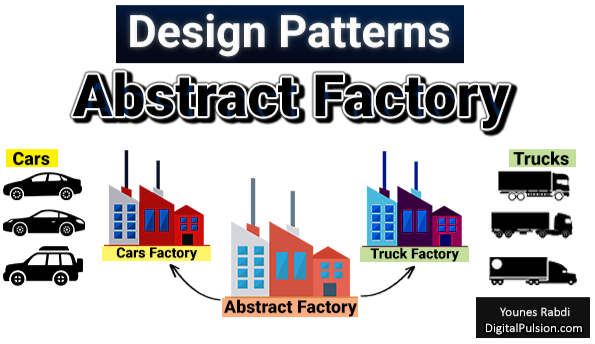

# GoF Criacional - Abstract Factory

## Versionamento

| Versão | Data       | Modificação          | Autor                        |Revisor|
| ------ | :--------: | :------------------: | :--------------------------: | :---: |
| 1.0    | 15/02/2022 | Criação do Documento |  Liverson Paulo, Giulia Lobo | A definir |

## Introdução e metodologia

O GoF de Abstract Factory é um GoF criacional que o seu propósito é ter famílias de objetos relacionados, onde não é necessário especificar suas classes concretas.

Ele é utilizado quando o código precisa trabalhar com famílias de produtos relacionados, mas que não se deseja depender das classes concretas para permitir uma futura escalabilidade.

## Conclusão

No caso do projeto Chapa quente, há duas possibilidades principais em implementar o abstract Factory.

A primeira delas é quando se trata dos usuários, já que podem haver clientes, cozinheiros, entregadores ou administradores, totalizando 4 usuários diferentes com características em comum, assim podendo ser utilizado o Abstract Factory.

A segunda possibilidade se dá nos produtos, já que neles, os lanches podem ser sanduíche, bebida, complemento e acompanhamento.

## Bibliografia

Abstract Factory. Disponível em: https://circle.visual-paradigm.com/abstract-factory/. Acesso em: 23/02/2022

Design Patterns. Disponível em: https://refactoring.guru/pt-br/design-patterns/abstract-factory. Acesso em: 23/02/2022

Abstract Factory. Disponível em: http://www.dsc.ufcg.edu.br/~jacques/cursos/map/html/pat/abstractfactory.htm. Acesso em: 23/02/2022

Padrão de Projeto Abstract Factory. Disponível em: http://davesbalthazar.com.br/006-padrao-de-projeto-abstract-factory-padrao-gof-de-criacao-curso-de-design-patterns/. Acesso em: 23/02/2022

introducao aos padroes criacionais. Disponível em: https://www.devmedia.com.br/introducao-aos-padroes-criacionais-abstract-factory-factory-method-prototype-e-singleton/21249. Acesso em: 23/02/2022
