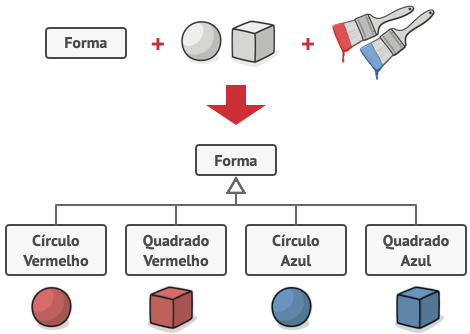
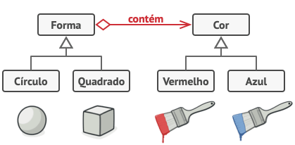

# GOF Estrutural Bridge

## Versionamento

| Versão | Data       | Modificação          | Autor                        |Revisor|
| ------ | :--------: | :------------------: | :--------------------------: | :---: |
| 1.0    | 09/02/2022 | Criação do Documento | Liverson Paulo e Giulia Lobo | Lucas Andrade e Dafne Moretti |

## Introdução e metodologia

Este padrão de projeto vai permitir que uma classe grande ou classes que estão ligadas intimamente sejam divididas em duas hierarquias separadas, sendo elas a abstração e a implementação. Elas podem ser  desenvolvidas de formas independentes umas das outras.

Ao trocar herança por composição do objeto, esse formato tenta evitar com que haja heranças que crescem de maneira exponencial.

Basicamente este método extrai uma das dimensões de uma hierarquia em uma classe separada, ao invés de ter todos os seus estados e comportamentos dentro de uma classe

### Exemplo de execução sem Bridge

### Exemplo de execução com Bridge

## Conclusão

O GOF Estrutural Bridge tem potencial para se encaixar no nosso projeto, pode ajudar em principalmente em relação aos lanches já que podem ter vários atributos diferentes dentro deles.

## Bibliografia

Bridge. Disponível em: https://refactoring.guru/pt-br/design-patterns/bridge. Acesso em: 24/02/2022