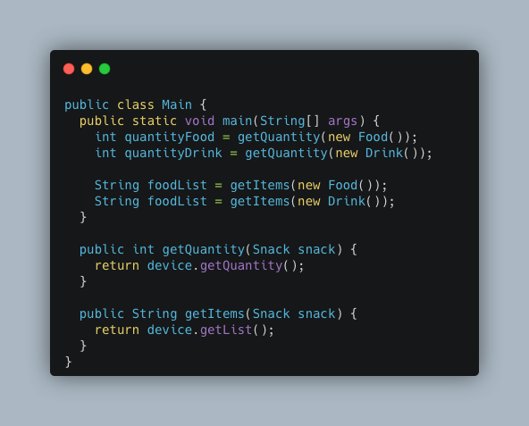

# Bridge

## Versionamento

| Versão |    Data    |               Modificação               |            Autor             |            Revisor            |
| ------ | :--------: | :-------------------------------------: | :--------------------------: | :---------------------------: |
| 1.0    | 09/03/2022 |          Criação do Documento           | Liverson Paulo e Giulia Lobo | Lucas Andrade e Dafne Moretti |
| 1.1    | 15/03/2022 |           Adição de exemplos            |     Guilherme Fernandes      | Lucas Andrade e Dafne Moretti |
| 1.2    | 16/03/2022 | Correção ortográfica e de versionamento |       Philipe Serafim        | Lucas Andrade e Dafne Moretti |

## Introdução e metodologia

Este padrão de projeto vai permitir que uma classe grande ou classes que estão ligadas intimamente sejam divididas em duas hierarquias separadas, sendo elas a abstração e a implementação. Elas podem ser desenvolvidas de formas independentes umas das outras.

Ao trocar herança por composição do objeto, esse formato tenta evitar com que haja heranças que crescem de maneira exponencial.

Basicamente este método extrai uma das dimensões de uma hierarquia em uma classe separada, ao invés de ter todos os seus estados e comportamentos dentro de uma classe

### Exemplo de execução sem Bridge

  Figura 1 - Exemplo de execução sem Bridge. Fonte: [https://refactoring.guru/pt-br/design-patterns/bridge](https://refactoring.guru/pt-br/design-patterns/bridge)

### Exemplo de execução com Bridge

  Figura 2 - Exemplo de execução com Bridge. Fonte: [https://refactoring.guru/pt-br/design-patterns/bridge](https://refactoring.guru/pt-br/design-patterns/bridge)

### Exemplo de código usando o padrão Bridge

Abaixo, temos um exemplo de implementação do padrão GoF Bridge em Java:

A interface Snack se comporta como uma interface comum para todos as comidas. Nela, temos as funções disponíveis nas comidas.

A classe Food vai ser responsável por implementar a interface Snack, apresentando as funções comuns entre os Snacks. Dessa forma, é possível passar um objeto que implemente a interface Snack para uma função, aumentando o reaproveitamento de código.

A classe Drink também implementa a interface Snack, pois é um tipo de Snack e apresenta características e funcionalidades semelhantes à Food. Todavia, ela implementa os métodos também presentes na Food de forma diferente.

Acima, temos um exemplo de utilização do padrão Bridge, onde são passadas para a chamada da função os objetos que são instâncias de classes que implementam a interface. Dessa forma, é possível utilizar os métodos presentes na interface tanto para a Food quanto para o Drink.

## Conclusão

O GOF Estrutural Bridge tem potencial para se encaixar no nosso projeto, pode ajudar em principalmente em relação aos lanches já que podem ter vários atributos diferentes dentro deles. Dessa forma, será possível aumentar aspectos relacionados à reutilização de código.

## Bibliografia

Bridge. Disponível em: https://refactoring.guru/pt-br/design-patterns/bridge. Acesso em: 24/02/2022
