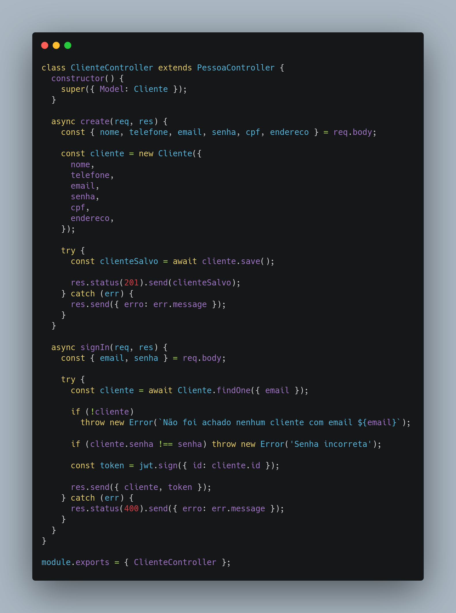

# GRASP Controller

## Versionamento

| Versão | Data       | Modificação          | Autor                        |Revisor|
| ------ | :--------: | :------------------: | :--------------------------: | :---: |
| 1.0    | 24/02/2022 | Criação do Documento | Lucas Andrade e Philipe Serafim | Dafne Moretti e João Pedro  |
| 1.1    | 15/03/2022 | Adição de código e conclusão | Lucas Andrade | Giulia Lobo e Guilherme Daniel Fernandes |

## Introdução

O padrão Controller, ou Controlador, delega a classes **não-visuais** o dever de responder, interpretar e validar as interações dos usuários, que ocorrem na camada de interface (UI), com o sistema, delegando as atribuições aos objetos. Esse padrão possui uma associação com o padrão MVC (Model, View, Controller), onde a Controller funciona como uma ponte entre as camadas Model e View

É dito que os casos de uso são separados em Controllers, dividindo as tarefas para cada classe, diminuindo as suas responsabilidades, visando assim um baixo acoplamento. É necessário cuidado, já que uma controladora com muitas responsabilidades se torna uma classe "inchada".

## Metodologia

<figcaption style="text-align: center">Interação do usuario com a UI e o papel da Controller. Autor: Lucas Andrade</figcaption>

Acima temos um exemplo da atuação desse padrão nas interações promovidas pelo usuário, e como ela funciona como uma ponte, fornecendo as funcionalidades da aplicação para serem exibidas aos usuários na UI.  

<figcaption style="text-align: center">Uso do padrão no projeto</figcaption>

Temos acima a utilização do padrão Controller no gerenciamento de clientes do projeto.

## Conclusão

Esse padrão fornece uma camada, interpretando os eventos realizados na camada de interface (UI). Uma Controller bem implementada facilita futuras manutenções no sistema. Esse padrão já tem ampla utilização no desenvolvimento web, gerenciando e coordenando os eventos iniciados na UI, acreditamos que ela possa ter uso no nosso projeto, facilitando a distribuição de classes da aplicação.

## Bibliografia

- SERRANO, Milene. AULA - GRASP_A - COMPLEMENTAR. Acesso em: 23 de fev. de 2022.
- GRASP – General Responsibility Assignment Software Patterns Explained. [S. l.], 8 abr. 2019. Disponível em: http://www.kamilgrzybek.com/design/grasp-explained/. Acesso em: 24 fev. 2022.