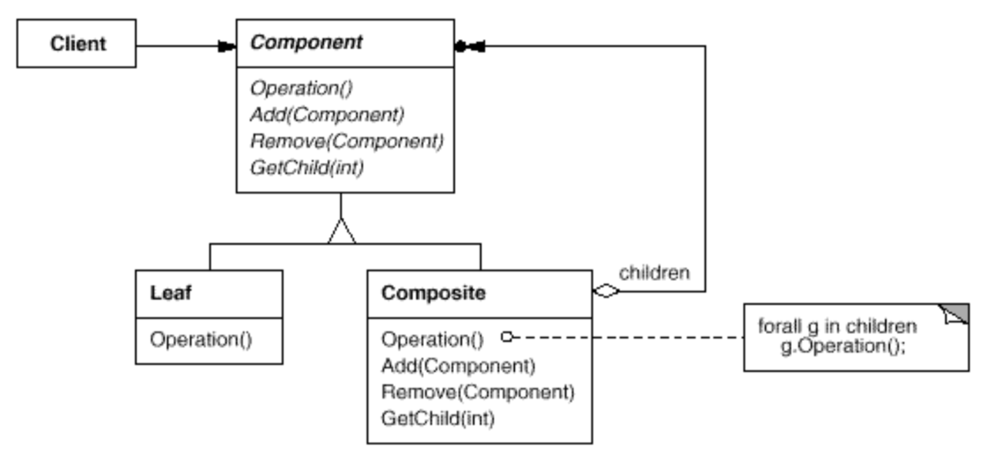

# Composite

## Versionamento

| Versão |    Data    |                  Modificação                   |         Autor         |      Revisor       |
| ------ | :--------: | :--------------------------------------------: | :-------------------: | :----------------: |
| 1.0    | 25/02/2022 |              Criação do Documento              | Murilo Gomes e Rodrigo Lima | |

## Introdução

Composite é um padrão comportamental que tem como objetivo compor objetos em estruturas de árvore a fim de representar hierarquias completas. O Composite permite que os clientes tratem objetos individuais e composições de objetos de maneira uniforme.

## Metodologia

<figcaption><a href="../../assets/images/composite.png">Figura 1:</a> Diagrama do Padrão Composite. Fonte: https://itnext.io/easy-patterns-composite-8b28aa1f158 </figcaption>

O Composite é um padrão que consiste em agrupar objetos (Leafs) de um tipo definido (Component) dentro de uma classe herdada (Composite) desse mesmo tipo, permitindo que essa classe (Composite) execute os métodos definidos pelo Component baseados na composição de Leafs contidas no Composite.

O Composite é composto por 4 tipos de classes atuantes:
		
* Component: Interface ou classe abstrata que define o tipo dos objetos a serem utilizados
* Leaf: Classe que estende de Component e tem como objetivo representar os objetos a serem utilizados na composição
* Composite: Classe que estende de Component e agrupa objetos das classes Leafs. Tem como objetivo implementar os métodos de Component para acessar e gerenciar as Leafs armazenadas.
* Client: Classe que interage com Component para gerenciar a composição a ser utilizada.

## Conclusão

O padrão composite poderá ser utilizado no projeto na estrutura de combos de produtos em que a classe Produto seria o Component, os tipos de produto (bebida, sanduíche, sobremesa) seriam as Leafs e o Combo seria o Composite, sendo possível adicionar ou remover produtos do combo e executar operações sobre os produtos contidos no mesmo.

## Bibliografia

SERRANO, Milene. Arquitetura e Desenho de Software AULA - GOFS COMPORTAMENTAIS. Disponível em: <https://aprender3.unb.br/pluginfile.php/1558847/mod_label/intro/Arquitetura%20e%20Desenho%20de%20Software%20-%20Aula%20GoFs%20Estruturais%20-%20Profa.%20Milene.pdf> (Acesso em 28/02/2022)

Source Making. Composite Design Pattern. Disponível em: <https://sourcemaking.com/design_patterns/composite> (Acesso em 28/02/2022)