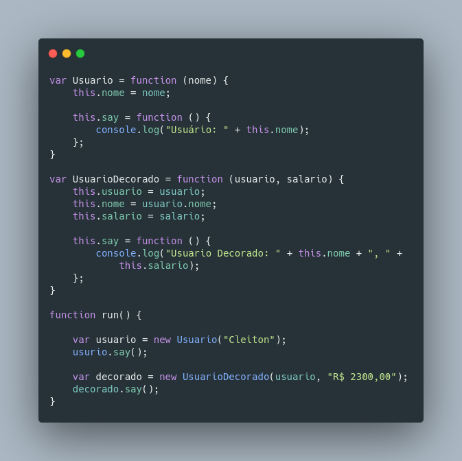

# GOF Decorator

## Versionamento

| Versão |    Data    |     Modificação      |              Autor               |    Revisor     |
| ------ | :--------: | :------------------: | :------------------------------: | :------------: |
| 1.0    | 02/03/2022 | Criação do Documento | João Pedro Chaves e Murilo Gomes | Lucas Andrade e Dafne Moretti |
| 1.1 | 13/03/2022 | Adição do código de exemplo e conclusão | João Pedro Chaves | Giulia Lobo e Guilherme Daniel Fernandes |

<!-- NÃO ESQUECER DE ADICIONAR AO "/_sidebar.md" -->

## Introdução

O GOF estrutural Decorator tem como objetivo adicionar responsabilidades ou funcionalidades a um objeto dinamicamente, utilizando composição de classes, sendo uma alternativa às heranças. Outro nome para esse padrão é Wrapper (Envoltório em português), sendo que o envoltório é um objeto que tem o mesmo conjunto de métodos que o objeto alvo e o delega todos os pedidos que recebe. O resultado pode ser alterado antes ou depois do pedido ser passado para o alvo.

## Metodologia

<figcaption><a href="../../assets/images/decorator.png">Figura 1:</a> Diagrama do Decorator. Disponível em: https://refactoring.guru/images/patterns/diagrams/decorator/structure.png </figcaption>

O padrão decorator possui essencialmente 4 elementos:

- **Componente**: Interface ou classe abstrata que servirá de base tanto para as classes que poderão ser decoradas quanto para as classes decoradoras.
- **Componente Concreto**: Implementações de Componente que poderão ser decoradas e assim receber responsabilidades extras.
- **Decorador**: Classe abstrata baseada em Componente que serve de base para todas as classes decoradoras.
- **Decorador Concreto**: Classes que herdam de Decorador e implementam as responsabilidades extras que poderão ser passadas para Componentes Concretos.

## Exemplo

<figcaption style="text-align: center"><a href="./assets/images/decorator_code.png">Figura 01</a>: Exemplo de aplicação do padrão Decorator. Autor: João Pedro Alves da Silva Chaves</figcaption>

## Conclusão

Ao analisar o contexto do nosso projeto e levando em consideração como o padrão GOF Decorator funciona e quais os seus objetivos, o padrão não é indicado para ser aplicado. O projeto não possui situações em que seja necessária esse encapsulamento proporcionado pelo Decorator.

## Bibliografia

* REFACTORING GURU, Padrões Estruturais. Disponível em https://refactoring.guru/pt-br/design-patterns/structural-patterns. Acesso em 2 de março de 2022.
* Felipe Cipriani. 2021. Descomplicando o Strategy. Disponível em https://www.softplan.com.br/blog/descomplicando-composite-e-decorator/. Acesso em 2 de março de 2022.
* CELESTINO, André. Design Patterns GoF – Decorator. [S. l.], 30 nov. 2016. Disponível em: https://www.andrecelestino.com/delphi-design-patterns-decorator/. Acesso em 2 de março 2022.
* JAVASCRIPT Decorator. Disponível em: https://www.dofactory.com/javascript/design-patterns/decorator. Acesso em: 13 mar. 2022.
