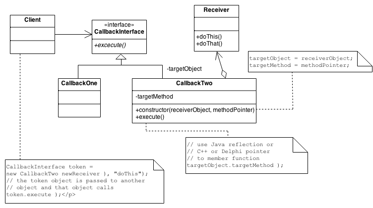
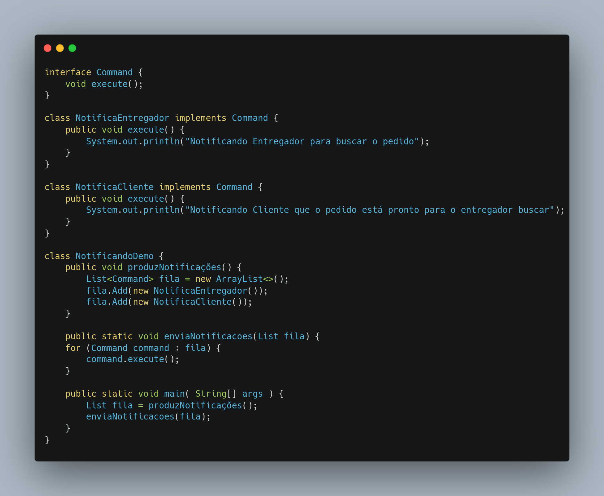

# GOF Comportamental Command

## Versionamento

| Versão |    Data    |     Modificação      | Autor | Revisor |
| ------ | :--------: | :------------------: | :---: | :-----: |
| 1.0    | 04/03/2022 | Criação do Documento | Dafne Moretti e Rodrigo Lima   | Pedro Lima e Philipe Serafim |
| 1.1    | 16/03/2022 | Adição de exemplo de código | Murilo Gomes e Philipe Serafim | Giulia Lobo e Liverson Paulo |

<!-- NÃO ESQUECER DE ADICIONAR AO "/_sidebar.md" -->

## Introdução
Muito utilizado em jogos, o padrão Command tem como definição encapsular uma solicitação como um objeto, o que lhe permite parametrizar outros objetos com diferentes solicitações, enfileirar ou registrar solicitações e implementar recursos de cancelamento de operações. Isso inclui informações como o nome do método, o objeto que o método pertence e os valores dos parâmetros do método.

A principal motivação do uso do padrão Command é que algumas vezes é necessário emitir solicitações para objetos sem nada saber sobre a operação que está sendo solicitada ou sobre seu receptor.

Como exemplos de uso do padrão temos menus e controles, que são aplicações que possuem apenas comandos (ações) para serem executados através deles.

## Metodologia
O Command desacopla o objeto que invoca a operação daquele que sabe realizá-la. Para conseguir essa separação, o programador cria uma classe base abstrata que mapeia um "receiver" (um objeto receptor) com uma ação. A classe base contém um método execute() que simplesmente chama a ação no "receiver".

Todos os clientes de objetos Command tratam cada objeto como uma "caixa preta" simplesmente invocando o método virtual execute() do objeto sempre que o cliente solicitar o "serviço" do objeto.

Uma classe Command contém algum subconjunto do seguinte: um objeto, um método a ser aplicado ao objeto e os argumentos a serem passados ​​quando o método é aplicado. O método "execute" do Command faz com que as peças se unam.

Sequências de objetos Command podem ser montadas em comandos compostos (ou macro).

Resumindo:
1. Defina uma interface Command com uma assinatura de método como execute().
2. Crie uma ou mais classes derivadas que encapsulam algum subconjunto do seguinte: um objeto "receptor", o método a ser invocado, os argumentos a serem transmitidos.
3. Instancie um objeto Command para cada solicitação de execução adiada.
4. Passe o objeto Command do criador (também conhecido como remetente) para o invocador (também conhecido como receptor).
5. O invocador decide quando chamar o execute().

<figcaption><a href="../../assets/images/gof-comportamental-command.png">Figura 1:</a> Diagrama do Padrão Command. Fonte: <a href="https://sourcemaking.com/files/v2/content/patterns/Command.png" > Source Making</a></figcaption>

## Conclusão
O padrão Command é muito interessante pela sua capacidade de encapsulamento e de gerenciar as solicitações, isso auxilia muito nos crescimento de uma aplicação compatível, além de possibilitar uma leitura de código de mais fácil entendimento e facilitar a manutenção.

<figcaption><a href="../assets/images/exemploCommand.png">Figura 1:</a> Exemplo de código usando Command. Fonte: Autoria Própria </figcaption>

Acima consta uma implementação exemplo de como o command poderia funcionar no escopo do nosso projeto, mostrando a parte de enviar notificações tanto pro entregador quanto pro cliente.

## Bibliografia

* SERRANO, Milene. Padrões de Projeto - Gofs - Comportamental. Acesso em: 04 de março de 2022.

* SOURCE MAKING - Command Design Pattern. Disponível em: https://sourcemaking.com/design_patterns/command . Acesso em: 04 de março de 2022.

* SERRA, Luiz; MATOS, Matheus - Command. Disponível em: http://www.csi.uneb.br/padroes_de_projetos/command_2.html. Acesso em: 04 de março de 2022.
