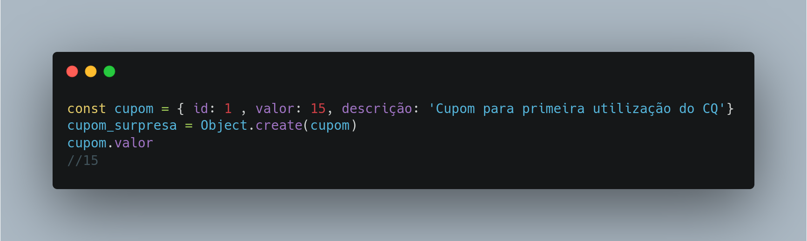

# Prototype

## Versionamento

| Versão |    Data    |     Modificação      | Autor | Revisor |
| ------ | :--------: | :------------------: | :---: | :-----: |
| 1.0    | 03/03/2022 | Criação do Documento |  Dafne Moretti Moreira   | Lucas Andrade e João Pedro Alves da Silva Chaves |

## Introdução

O GOF Criacional Prototype possibilita a cópia de objetos mantendo o código independente das classes, utilizando uma instância que específica os tipos de objetos a serem criados. 

Ao realizar a tentativa de cópia de um objeto sem utilizar este padrão pode-se analisar que será necessário saber qual é a classe do objeto, criando uma dependência com esta classe.

Além disso, é perceptível que alguns atributos ou métodos são privados e não serão visíveis fora do próprio objeto, o que resultará em um problema. O padrão Prototype atribui a responsabilidade de clonagem ao objeto que será clonado.

## Metodologia

O objeto delegará para o seu protótipo funções que ele não realiza. A imagem abaixo demonstra em diagrama como funciona o Prototype.

   Figura 1 - Diagrama que representa o funcionamento do Prototype. Fonte:[https://refactoring.guru/pt-br/design-patterns/prototype](https://refactoring.guru/pt-br/design-patterns/prototype)

1. A interface "Prototype" declara métodos para clonar os objetos
2. "ConcretePrototype" implementa estes métodos. É onde os dados do objeto são copiados para o clone
3. "Client" pode copiar qualquer objeto que segue a interface "Prototype"

## Conclusão

O Prototype será utilizado na aplicação Chapa Quente, uma vez que a principal linguagem utilizada (JavaScript, TypeScript) já é baseada em protótipos, ou seja, os objetos já estão ligados entre si.

## Aplicação - Código

A aplicação deste padrão de projeto no Chapa Quente pode ser vista na criação de novos cupons, já que serão criados muitos cupons iguais e distribuídos para diferentes tipos de usuários.
O código abaixo demonstra o **cupom_surpresa** que tem como prototype o objeto **cupom**.

   Figura 2 - Código representando o prototype. Autor: Dafne Moretti

## Bibliografia

PROTOTYPE. [S. l.], 8 mar. 2022. Disponível em: https://refactoring.guru/pt-br/design-patterns/prototype. Acesso em: 3 mar. 2022.

PROTOTYPE Teoria - Padrões de Projeto - Parte 8/45. [S. l.: s. n.], 2020. Disponível em: https://www.youtube.com/watch?v=Z-_smcjkdwM&t=216s. Acesso em: 3 mar. 2022.