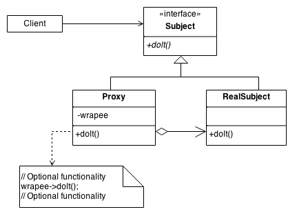

# GOF Estrutural Proxy

## Versionamento

| Versão |    Data    |     Modificação      | Autor | Revisor |
| ------ | :--------: | :------------------: | :---: | :-----: |
| 1.0    | 04/03/2022 | Criação do Documento | Dafne Moretti e Rodrigo Lima   | Lucas Andrade e Dafne Moretti |
| 1.1    | 16/03/2022 | Adição de exemplo de código |  Rodrigo Lima   |  |

<!-- NÃO ESQUECER DE ADICIONAR AO "/_sidebar.md" -->

## Introdução
O padrão Proxy baseia-se em encapsular um objeto através de um outro objeto que possui a mesma interface, de forma que o segundo objeto, conhecido como “Proxy”, controla o acesso ao primeiro, que é o objeto real.

* Um proxy virtual é um marcador de espaço para objetos "caros de criar". O objeto real só é criado quando é feita a primeira requisição ou acesso ao objeto.
* Um proxy remoto fornece um representante local para um objeto que reside em um espaço de endereço diferente.
* Um proxy de proteção controla o acesso a um objeto mestre sensível. O objeto intermediário verifica se o aquele que faz a chamada tem as permissões de acesso necessárias antes de encaminhar a requisição.
* Um proxy inteligente interpõe ações adicionais quando um objeto é acessado. Os usos típicos incluem:
     * Contando o número de referências ao objeto real para que ele possa ser liberado automaticamente quando não houver mais referências (também conhecido como ponteiro inteligente),
    * Carregando um objeto persistente na memória quando é referenciado pela primeira vez,
    * Verificar se o objeto real está bloqueado antes de ser acessado para garantir que nenhum outro objeto possa alterá-lo.


## Exemplo de Diagrama e Código
Ao definir uma interface Subject, a presença do objeto Proxy no lugar do RealSubject é transparente para o cliente.



<figcaption style="text-align: center"><a href="../../assets/images/proxy.png" >Figura 1 </a>: Exemplo de Proxy. Fonte: <a href="https://sourcemaking.com/design_patterns/proxy" > Proxy Design Pattern
 </a>. Acesso em: 04/03/2022 </figcaption>

 Um exemplo bem rudimentar feito em C# em uma aplicação do escopo seria:

 ```
interface IPessoa{

	void FazerPedido();
};

//Objeto real
public class Pessoa : IPessoa
{
	public void FazerPedido()
	{
	        Console.WriteLine("Pedido Feito!");
	}
}

// Objeto Proxy
public class PessoaProxy : IPessoa
{	
	private Pedido pedido;
	private IPessoa pessoaReal;
	
	public ProxyPedido(Pedido pedido)
	{
		this.pedido = pedido;
		this.pessoaReal = new Pessoa();
	}
	
	public void FazerPedido()
	{
		if (pedido.QtdItens < 1)
			Console.WriteLine("Desculpe, o pedido precisa ter pelo menos um item!");
		else
			this.pessoaReal.FazerPedido();
	}
	
}

public class Pedido
{
	public int QtdItens {get; set;}
	
	public Pedido(int QtdItens)
	{
		this.QtdItens = QtdItens;
	}
}

// Como usar a classe Proxy acima?
private void btnProxy_Click(object sender, EventArgs e)
{
    IPessoa pessoa = new PessoaProxy(new Pedido(0));
    pessoa.FazerPedido();

    pessoa = new PessoaProxy(new Pedido(1));
    pessoa.FazerPedido();
}
//Exemplo adaptado de "https://www.devmedia.com.br/conheca-o-pattern-proxy-gof-gang-of-four/4066"
 ```


## Conclusão
O padrão Proxy tem diversas utilidades desde melhorar o desempenho do software criando um proxy para um objeto "pesado" a melhorar a segurança usando o proxy no processo de checar se há a permissão para acesso do objeto real.

## Bibliografia

* SERRANO, Milene. Padrões de Projeto - Gofs - Estruturais. Acesso em: 04 de março de 2022.

* SOURCE MAKING - Proxy Design Pattern. Disponível em: https://sourcemaking.com/design_patterns/proxy . Acesso em: 04 de março de 2022.

* DevMedia - Conheça o Pattern Proxy - GoF (Gang of Four). Disponível em: https://www.devmedia.com.br/conheca-o-pattern-proxy-gof-gang-of-four/4066 . Acesso em: 04 de março de 2022.
