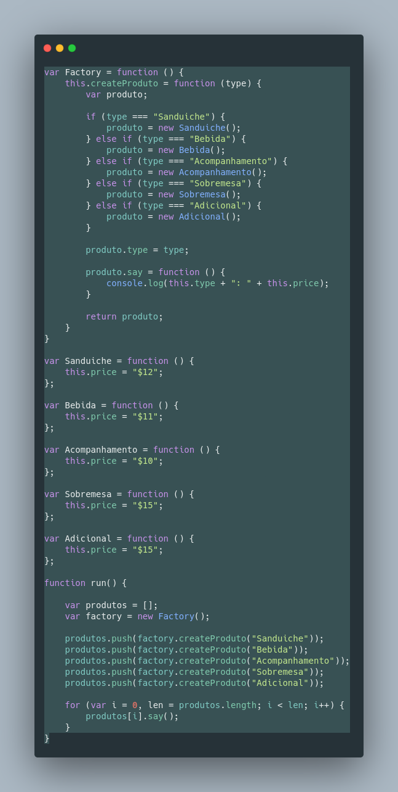

# GOF Criacional Factory Method

## Versionamento

| Versão |    Data    |     Modificação      | Autor | Revisor |
| ------ | :--------: | :------------------: | :---: | :-----: |
| 1.0 | 25/02/2022 | Criação do Documento | João Pedro Alves da Silva Chaves e Pedro Lima | Lucas Andrade e Dafne Moretti |
| 1.1 | 13/03/2022 | Adição do código do padrão | João Pedro Chaves | Giulia Lobo e Guilherme Daniel Fernandes |

## Introdução

O padrão GOF criacional factory method é um padrão que tem como objetivo melhorar o desempenho do software em situações em que uma hierarquia está sendo muito acessada e também são demandadas muitas criações de instância, principalmente se isso for um gargalo. 

## Metodologia

O factory method funciona da seguinte forma: é criada uma hierarquia espelho que será dedicada à instanciação. Geralmente a classe abstrata da hierarquia espelho é referenciada como **Creator** e tem no mínimo uma relação de dependência com a classe abstrata da hierarquia "original"(para facilitar a compreensão vamos chamar de **Product**). 
A classe **Creator** tem um método abstrato de criação referenciado geralmente como factory Method (por isso o nome do padrão), porém pode possuir outros métodos e operações. A classe concreta que herda do **Creator** é chamada **ConcreteCreator**, que por meio da sobrescrita modifica o corpo do método factory Method para atender ao objetivo que é criar a instância do **Concrete Product**(classe que herda do **Product**).

## Exemplo

<figcaption style="text-align: center"><a href="./assets/images/factory_method.png">Figura 01</a>: Exemplo de aplicação do padrão Factory Method em contexto de opções de produtos da lanchonete e seus preços. Autor: João Pedro Alves da Silva Chaves</figcaption>

## Conclusão

Ao analisar o contexto do nosso projeto e levando em consideração como o padrão GOF Factory Method funciona e os seus objetivos, o padrão pode ser aplicado no contexto da criação dos diferentes tipos de produtos e a repetição da ação.

## Bibliografia
* SERRANO, Milene. Módulo Padrões de Projeto GoF(s) Criacionais - Material em Slides.
* Higor Medreiros. 2012. Padrão de Projeto Factory Method em Java. Disponível em https://www.devmedia.com.br/padrao-de-projeto-factory-method-em-java/26348. Acesso em 25 de fevereiro de 2022.
* JAVASCRIPT Factory Method. Disponível em: https://www.dofactory.com/javascript/design-patterns/factory-method. Acesso em: 13 mar. 2022.