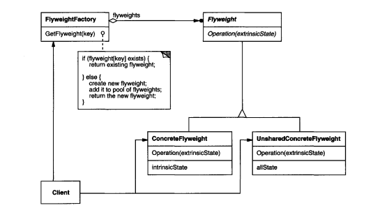

# GOF Flyweight 

## Versionamento

| Versão |    Data    |     Modificação      | Autor | Revisor |
| ------ | :--------: | :------------------: | :---: | :-----: |
| 1.0    | 25/02/2022 | Criação do Documento |  Dafne Moretti Moreira   | Lucas Andrade e João Pedro Alves da Silva Chaves |

## Introdução

O GOF Flyweight é um padrão de projeto que lida com objetos cujo objetivo, segundo GAMMA, é suportar, com eficiência, muitos objetos utilizando o conceito de compartilhamento. A ideia é que o estado intrínseco dos objetos seja compartilhado entre vários ao invés de guardar todos os dados em um objeto, visando reduzir o uso da memória RAM.

#### Problema 

Projetar objetos pode ser caro a nível de memória

#### Solução

O padrão flyweight apresenta compartilhamento de objetos para resolução deste problema

## Metodologia

Sua aplicabilidade acontece quando objetos são utilizados para construir outros objetos ou quando a aplicação utiliza um grande número de objetos.

Como pode-se utilizar o mesmo objeto em diferentes situações, é necessário garantir não há modificação em seu estado. A Figura 1 apresenta de um modo interativo como funciona o pool de objetos imutáveis.

   Figura 1 - Iustração do pool de objetos imutáveis. Fonte: [https://www.inf.ufpr.br/andrey/ci163/Design_Patterns.pdf](https://www.inf.ufpr.br/andrey/ci163/Design_Patterns.pdf)

Os participantes do flyweight são:

1. Flyweight: declara interface onde haverá manipulação dos estados extrínsecos.
2. ConcreteFlyweight: Armazena estados intrínsecos e implementa a interface.
3. UnsharedConcreteFlyweight: é onde o compartilhamento é habilitado
4. FlyweightFactory: possui função criação e manipulação dos objetos
5. Client: armazena estados extrínsecos 

O diagrama abaixo apresenta estes participantes

   Figura 2 - Diagrama de objetos ilustrando flyweight. Fonte: Erich Gamma ... [and others]. Design Patterns : Elements of Reusable Object-Oriented Software. Reading, Mass. :Addison-Wesley, 1995.

## Conclusão

Após o estudo e percepção do que seria o padrão de projeto flyweight, percebeu-se que é possível utilizá-lo no projeto Chapa Quente, uma vez que haverá muitos objetos iguais na aplicação, sendo esses muitos sanduíches, por exemplo, ou muitas bebidas. 

Outro exemplo onde poderá ser utilizado o flyweight é para os endereços das pessoas cadastradas no sistema, algumas partes do endereço serão compartilhadas entre vários objetos, haverá separação entre estado intrínseco (parte que não muda do endereço) e estado extrínseco (parte que muda do endereço).

## Aplicação - Código

Uma vez que foi percebida a possibilidade de utilização deste padrão no contexto de entregas, que está incluso no objetivo da aplicação chapa quente, pode-se perceber um método construtor que inicializa o estado intrínseco que não poderá mudar e também uma função entregar, que apresenta o estado extrínseco do objeto.

   Figura 3 - Exemplo de código utilizando flyweight. Autor: Dafne Moretti

## Bibliografia

Erich Gamma ... [and others]. Design Patterns : Elements of Reusable Object-Oriented Software. Reading, Mass. :Addison-Wesley, 1995.

FLYWEIGHT Teoria - Padrões de Projeto - Parte 25/45. [S. l.: s. n.], 2020. Disponível em: https://www.youtube.com/watch?v=WPQa64bdQbk. Acesso em: 25 fev. 2022.

ROCHA, Helder. Padrões de Design com aplicações em Java. 2005. Apresentação do Power Point. Disponível em: https://www.inf.ufpr.br/andrey/ci163/Design_Patterns.pdf. Acesso em: 25 fev. 2022.

JOHNSON, Thienne. Padrões de Projeto de Software Orientado a Objetos. 2005. Apresentação do Power Point. Disponível em: http://www.usp.br/thienne/coo/material/aula17-introducaoPP.pdf. Acesso em: 25 fev. 2022.
