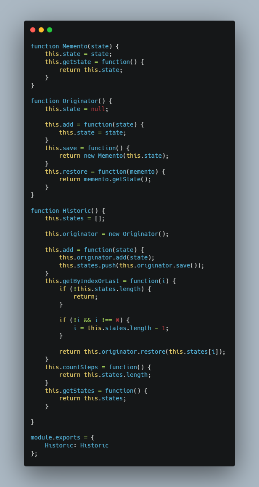
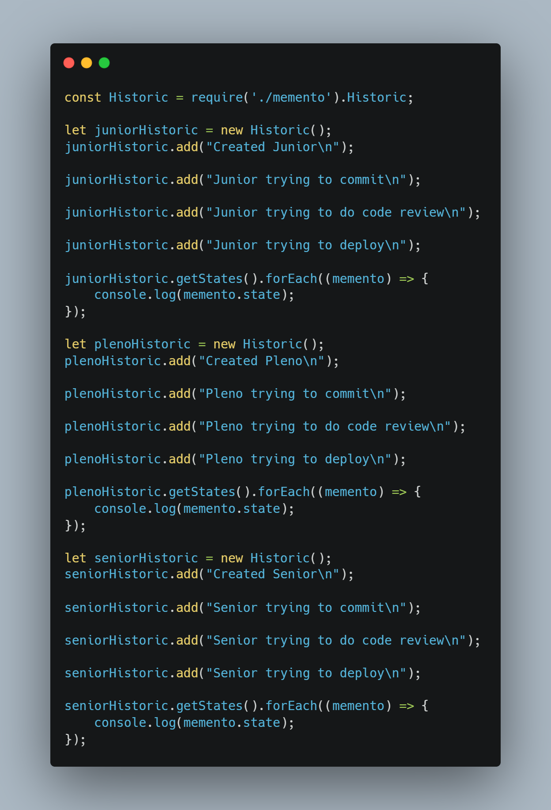

# Comportamental Memento

## Versionamento

| Versão |    Data    |     Modificação      | Autor | Revisor |
| ------ | :--------: | :------------------: | :---: | :-----: |
| 1.0    | 03/03/2022 | Criação do Documento |  Giulia Lobo Barros e Guilherme Fernandes  | Lucas Andrade, João Pedro Alves da Silva Chaves, Dafne Moretti e Rodrigo Lima |

## Introdução
O GoF Memento é um GoF comportamental que tem o objetivo de restaurar o estado anterior de um objeto que foi salvo em algum tipo de armazenamento e faz isso sem revelar os detalhes da sua implementação.

É utilizado, especialmente, como uma forma de permitir que o usuário desfaça qualquer operação realizada no texto, padrão muito comum nos sistemas atuais.

A seguir um exemplo ilustrativo para demonstrar o que foi explicado anteriormente:

## Metodologia

Quando pensamos nesse tipo de aplicação surgem diversos problemas que podemos enfrentar, como, por exemplo:
- Objetos com atributos privados;
- Caso não sejam privados, ainda assim teria-se que percorrer todos os atributos daquele objeto até chegar na informação desejada;
- Além disso, nem sempre os dados pertencentes ao objeto são os necessários para executar tal ação.

Pensando em todos esses pontos, o Memento é um ótimo padrão de projetos pois ele delega a criação de retratos (*snapchots*) do estado para o próprio dono do estado, um objeto conhecido como "originador". Ao invés de outros objetos tentarem copiar o estado do editor “a partir do lado de fora”, a própria classe do editor pode fazer o retrato já que tem acesso total a seu próprio estado.

Ele sugere armazenar a cópia do estado de um objeto em um objeto especial chamado "memento". Os conteúdos de um memento não são acessíveis para qualquer outro objeto exceto aquele que o produziu e, por esse motivo, os dados da implementação não são revelados. Outros objetos podem se comunicar com mementos usando uma interface limitada que pode permitir a recuperação dos metadados do retrato (data de criação, nome a operação efetuada, etc.), mas não ao estado do objeto original contido no retrato, como é mostrado na figura abaixo:

> Figura 1: Diagramação do funcionamento do memento. Autor: https://refactoring.guru/pt-br/design-patterns/memento

## Aplicação Prática

A seguir, é possível ver um exemplo que complementa a explicação dada acima:

> Figura 2: Declaração de funções - Padrão Memento. Autor: https://programadev.com.br/js-design-patterns/#Memento

> Figura 3: Implementação - Padrão Memento. Autor: https://programadev.com.br/js-design-patterns/#Memento

Como se observa na primeira imagem, inicialmente são criadas as funções do código, sendo elas: O **Memento**, que é o retrato, a fotografia do objeto em um determinado exato momento, o objeto em questão, que é o **Originador**, que salva e recupera os mementos e a classe conhecida como **Cuidadora** que, nesse caso, leva o nome de *Historic* e mantém os registros salvos.

Após essa declaração de funções, passamos para a segunda imagem que demonstra a implementação de cada uma dessas funções de forma a colaborarem juntas para executar o que se espera.

## Vantagens e Desvantagens

* Vantagens
    - Preserva o encapsulamento:
        - O método Memento pode ajudar a produzir o estado do objeto sem quebrar o encapsulamento do código do cliente.
    - Simplifica o código:
        - É possível simplificar o código do autor, deixando o responsável manter o histórico do estado do autor.
    - É melhor usar a serialização para obter a implementação do padrão memento que seja mais genérico do que o padrão Memento, onde cada objeto precisa ter sua própria implementação de classe Memento.
* Desvantagens
    - O aplicativo pode consumir muita RAM se os clientes criarem mementos com muita frequência;
    - Os responsáveis ​​devem acompanhar o ciclo de vida do remetente para poder destruir mementos obsoletos;
    - A maioria das linguagens de programação dinâmicas, como PHP, Python e JavaScript, não pode garantir que o estado no memento permaneça intacto;
    - Não é fácil excluir o objeto memento porque o cuidador precisa rastrear o ciclo de vida do originador para obter o resultado;
    - Pode ser uma solução cara, dependendo do tamanho e do número de estados salvos.

## Conclusão

Além desse padrão de projeto ser super comum em todas as aplicações dos dias atuais, ele é muito útil para que o usuário possa retomar alguns tipos de decisões.

No caso da aplicação Chapa Quente este pode ser um padrão muito útil, pois o usuário tem a chance tomar alguma decisão e depois se arrepender, especialmente com relação a um pedido de lanche.

No entanto, como visto acima, este padrão de projeto possui certas desvantagens que não se encaixam no escopo do projeto e podem atrapalhar em entregas mais relevantes para um Mínimo Produto Viável. Portanto, em consenso, o grupo decidiu não utilizá-lo e poderá reavaliá-lo futuramente.

## Bibliografia

* REFACTORING GURU. MEMENTO. Disponível em: https://refactoring.guru/pt-br/design-patterns/memento Acesso em: 03/03/2022
* MEDIUM. DESIGN PATTERNS — PARTE 2 — OS PADRÕES DO GOF. Disponível em: https://medium.com/xp-inc/desing-patterns-parte-2-2a61878846d Acesso em: 03/03/2022
* PROGRAMA DEV. PADRÕES DE PROJETO COM JAVASCRIPT. Disponível em: https://programadev.com.br/js-design-patterns/#Memento Acesso em: 03/03/2022
* SOUZA, Vítor. CURSO - PADRÕES DE PROJETO MÓDULO 4: PADRÕES DE COMPORTAMENTO. Disponível em: http://www.inf.ufes.br/~vitorsouza/archive/2020/wp-content/uploads/java-br-curso-padroesdeprojeto-slides04.pdf Acesso em: 03/03/2022
* TEIXEIRA, Manoel; PINHEIRO, Tiago. PADRÃO DE PROJETO MEMENTO. Disponível em: https://slideplayer.com.br/slide/344536/ Acesso em: 03/03/2022
* ACERVO LIMA. MÉTODO MEMENTO - PYTHON DESIGN PATTERNS. Disponível em: https://acervolima.com/metodo-memento-python-design-patterns/ Acesso em: 03/03/2022