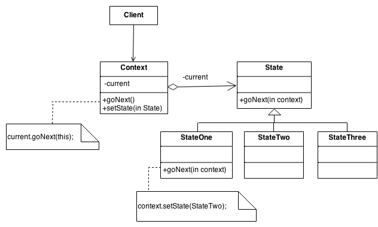

# GOF Comportamental State

## Versionamento

| Versão |    Data    |     Modificação      | Autor | Revisor |
| ------ | :--------: | :------------------: | :---: | :-----: |
| 1.0    | 25/02/2022 | Criação do Documento | Murilo Gomes e Rodrigo Lima | Lucas Andrade, Dafne Moretti e João Pedro Alves da Silva Chaves |
| 1.1    | 16/03/2022 | Adição de exemplo    | Rodrigo Lima |    |

<!-- NÃO ESQUECER DE ADICIONAR AO "/_sidebar.md" -->

## Introdução
O State é um padrão comportamental GOF utilizado para denominar situações em que o comportamento de um objeto monolítico é uma função de seu estado e deve mudar seu comportamento em tempo de execução dependendo desse estado.

## Metodologia
A sua implementação se assemelha muito com o padrão Strategy. Em que:
 - Existe uma classe “context” que representa o contexto da aplicação
 - Existe uma classe abstrata base de Estados
 - Existem classes concretas derivadas da classe base de Estados, a fim de representar os possíveis estados do objeto
 - Os comportamentos específicos de cada estado são definidos dentro das classe derivadas
 - É mantida uma referência para o estado atual do contexto
 - Para mudar o estado, basta alterar a referência para outro estado (classe derivada)



<figcaption style="text-align: center"><a href="../../assets/images/state.png" >Figura 1 </a>: Exemplo de State. Fonte: <a href="https://sourcemaking.com/design_patterns/state" > State Design Pattern
 </a>. Acesso em: 25/02/2022 </figcaption>

Exemplo de state em Java retirado desse [link](https://edirlei.com/aulas/poo/POO_Aula_12_GOF_State_Strategy_2015.html):


```
public interface State  
{
	public void doAction(Context context);  
}

```

```
public class OpenState implements State  
{
	public void doAction(Context context)  
	{
		System.out.println("Abrindo a loja");  
		context.setState(this);  
	}
	
	public String toString()  
	{
		return "Loja aberta";  
	}
}

```

```
public class CloseState implements State  
{
	public void doAction(Context context)  
	{
		System.out.println("Fechando a loja");  
		context.setState(this);  
	}
	public String toString()  
	{
		return "Loja Fechada";  
	}
}

```

```
public class Context  
{
	private State state;  

	public Context()  
	{
		state = null;  
	}
	public void setState(State state)  
	{
		this.state = state;  
	}
	public State getState()  
	{
		return state;  
	}
}

```


```
public static void main(String[] args)  
{
	Context context = new Context();  

	OpenState opneState = new OpenState();  
	startState.doAction(context);  

	System.out.println(context.getState().toString());  

	CloseState closeState = new CloseState();  
	closeState.doAction(context);  

	System.out.println(context.getState().toString());  
}

```

## Conclusão
Analisando o padrão State, temos que ele provavelmente será utilizado para gerenciar os estados da classe Pedido no projeto Chapa Quente.

## Bibliografia
* SOURCE MAKING - State Design Pattern. Disponível em: https://sourcemaking.com/design_patterns/state . Acesso em: 25 de fevereiro de 2022.

* LIMA, Edirlei - Análise e Projeto Orientados  por Objetos. Disponível em: https://edirlei.com/aulas/poo/POO_Aula_12_GOF_State_Strategy_2015.html. Acesso em: 16 de março de 2022.
