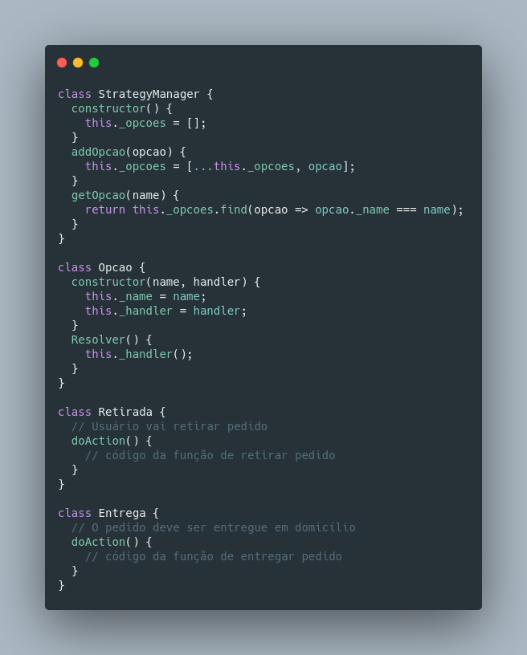

# GOF Comportamental Strategy

## Versionamento

| Versão |    Data    |     Modificação      | Autor | Revisor |
| ------ | :--------: | :------------------: | :---: | :-----: |
| 1.0 | 25/02/2022 | Criação do Documento | João Pedro Alves da Silva Chaves e Pedro Lima | Lucas Andrade e Dafne Moretti |
| 1.1 | 13/03/2022 | Adição do exemplo de aplicação e conclusão | João Pedro Chaves | Giulia Lobo e Guilherme Daniel Fernandes | 

## Introdução

O padrão GOF Comportamental Strategy é um padrão para situações em que é feita ao menos uma escolha durante a própria execução do código, onde é necessária uma relação de no mínimo agregação entre as classes envolvidas. 

Pode ser uma relação de composição, ou até mesmo uma associação simples, porém nesse caso é necessário a especificação de que é uma adaptação do padrão. Para esse padrão a hierarquia é de suma importância, podendo acontecer com classes abstratas ou interfaces, sendo relações de herança ou realização.

## Metodologia

Geralmente, é um padrão aplicado em situações complexas em que é preciso dividir a estratégia de solução em níveis, sendo o primeiro nível chamado de **Estratégia** e o segundo nível sendo composto pelas **Estratégias Concretas**, para isso são aplicados conceitos de polimorfismo e encapsulamento. Do ponto de vista da execução, as **Estratégias Concretas** são as variações ou opções a serem escolhidas para o objetivo do usuário, sendo a escolha feita durante a própria execução. 
A aplicação do padrão Strategy facilita a manutenção do código, inclusive a adição de novas funcionalidades se aplicado de forma coerente.

## Exemplo

<figcaption style="text-align: center"><a href="./assets/images/strategy.png">Figura 01</a>: Exemplo de aplicação do padrão Strategy em contexto de escolha de modo de entrega do pedido. Autor: João Pedro Alves da Silva Chaves</figcaption>

## Conclusão

Ao analisar o contexto do nosso projeto e levando em consideração como o padrão GOF Strategy funciona e quais os seus objetivos, o padrão pode ser aplicado apenas na parte de escolha da opção de como será feita a entrega ou retirada do pedido. A aplicação do padrão facilitaria a manutenção do código.

## Bibliografia
* SERRANO, Milene. Módulo Padrões de Projeto GoF(s) Comportamentais - Material em Slides.
* Felipe Cipriani. 2021. Descomplicando o Strategy. Disponível em https://www.softplan.com.br/blog/descomplicando-o-strategy/. Acesso em 25 de fevereiro de 2022.
* CABALLERO, Carlos. Design Patterns: Using the Strategy Pattern in JavaScript. [S. l.], 24 set. 2019. Disponível em: https://betterprogramming.pub/design-patterns-using-the-strategy-pattern-in-javascript-3c12af58fd8a. Acesso em: 13 mar. 2022.