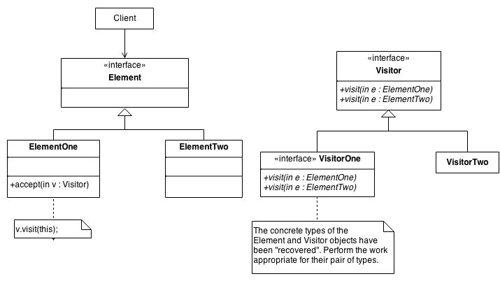

# GOF Comportamental Visitor

## Versionamento

| Versão |    Data    |     Modificação      |            Autor            |            Revisor            |
| ------ | :--------: | :------------------: | :-------------------------: | :---------------------------: |
| 1.0    | 25/02/2022 | Criação do Documento | Murilo Gomes e Rodrigo Lima | Lucas Andrade e Dafne Moretti |
| 1.1    | 16/03/2022 |   Correção do path   |       Philipe Serafim       | Lucas Andrade e Dafne Moretti |

<!-- NÃO ESQUECER DE ADICIONAR AO "/_sidebar.md" -->

## Introdução

O Visitor é um padrão comportamental GOF que tem como objetivo executar e adicionar diferentes operações em objetos de tipos similares, sem ter que alterá-los.

## Metodologia

Para a implementação é preciso:

- Existir uma classe abstrata ou interface Visitante.
- Existir uma classe abstrata ou interface Elemento.
- Cada classe advinda de Visitante deve executar uma operação específica para cada classe baseada em Elemento.
- Cada classe baseada em Elemento terá um método para aceitar um Visitante, em que dentro desse método o Visitante executa a sua operação baseada na classe concreta que o aceita.

<figcaption style="text-align: center"><a href="./assets/images/visitor.png" >Figura 1 </a>: Exemplo de Visitor. Fonte: <a href="https://sourcemaking.com/design_patterns/visitor" > Visitor Design Pattern</a>. Acesso em: 25/02/2022 </figcaption>

## Conclusão

Analisando as características do Visitor, percebemos que, a princípio, não é um padrão que se encaixe no projeto Chapa Quente.

## Bibliografia

- SOURCE MAKING - Visitor Design Pattern. Disponível em: https://sourcemaking.com/design_patterns/visitor . Acesso em: 25 de fevereiro de 2022.
