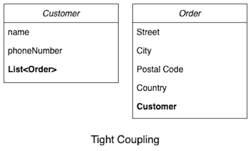
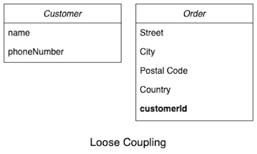
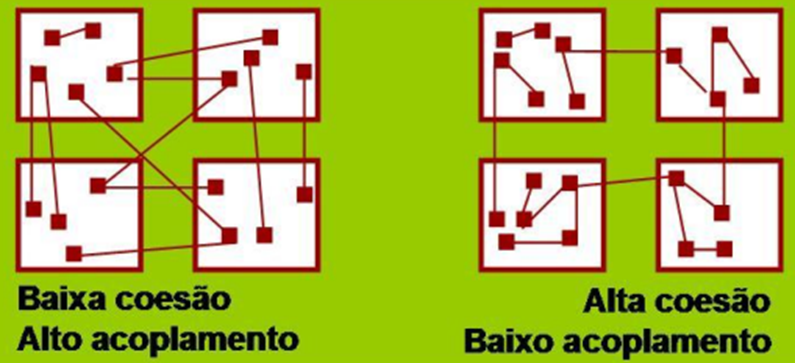

# GRASP Alta Coesão e Baixo Acoplamento

## Versionamento

| Versão | Data       | Modificação          | Autor                        |Revisor|
| ------ | :--------: | :------------------: | :--------------------------: | :---: |
| 1.0    | 07/03/2022 | Criação do Documento | Dafne Moretti, Guilherme e Giulia Lobo | Lucas Andrade |

## Introdução

Os padrões GRASP (General Responsibility Assignment Software Patterns) consistem numa série de princípios para entender o design de objetos essenciais de uma aplicação e aplicar o design de uma forma metódica, racional e explicável.

## Baixo Acoplamento

A Baixo Acoplamento é um padrão GRASP que tem como objetivo solucionar um problema presente em diversos projetos, que diz respeito ao reuso e ao impacto de mudança. 

À medida que um projeto escala, é necessário que seus módulos sejam capazes de ser reutilizados e que as mudanças não causem tanto impacto no projeto. 

Dessa forma, o GRASP de baixo acomplamento apresenta uma maneira de delegar responsabilidades para diferentes classes com o objetivo de minimizar o acoplamento. 

A Figura 1 apresenta uma relação de codependência entre as classes Customer e Order que deve ser evitada com o auxílio do padrão GRASP de baixo acoplamento. Neste caso, a classe Custumer instancia a lista de Order, e a classe Order instancia a classe Customer.

Figura 1 - Alto acoplamento. Fonte: [https://www.baeldung.com/cs/cohesion-vs-coupling](https://www.baeldung.com/cs/cohesion-vs-coupling)

Já a Figura 2, demonstra uma solução para este acoplamento, que, como pode-se ver mentém uma relação, porém não uma codependência. 

Figura 2 - Representação do padrão GRASP baixo acoplamento. Fonte: [https://www.baeldung.com/cs/cohesion-vs-coupling](https://www.baeldung.com/cs/cohesion-vs-coupling)

## Alta Coesão

Há uma alta complexidade quando se fala em manutenção e entendimento de classes que realizam atividades não relacionadas. Portanto, um padrão GRASP que objetiva fazer com que as tarefas de uma classe sejam relacionadas é o padrão de Alta Coesão.

Pode-se dizer que há uma alta coesão quando uma classe tem peso leve e responsabilidades exclusivas em algumas áreas logicamente relacionadas ao conceito da classe, mas não uma com as outras. Os GRASPs de Baixo Acoplamento e Alta Coesão são intimamente ligados, sendo responsabilidade do padrão de Alta Coesão determinar se diferentes elementos estão conectados ou atrelados na camada de conhecimento.

Figura 3 - Relação entre alta coesão e baixo acoplamento. Fonte: [http://www.facom.ufu.br/~bacala/ESOF/05a-Padr%C3%B5es%20GRASP.pdf](http://www.facom.ufu.br/~bacala/ESOF/05a-Padr%C3%B5es%20GRASP.pdf)

## Conclusão

A partir da análise destes dois padrões de projeto, é possível perceber que existe aplicabilidade de ambos na aplicação Chapa Quente. Dessa forma, é possível criar um projeto que seja escalável e testável, mantendo aspectos relacionados à qualidade do código e aumentando a manutenabilidade.

## Bibliografia

Padrões Grasp. Apresentação do Power Point. Disponível em: http://www.facom.ufu.br/~bacala/ESOF/05a-Padr%C3%B5es%20GRASP.pdf. Acesso em 24 fev. 2022.

RAO, Danya. GRASP Design Principles. Apresentação do Power Point. Disponível em: https://home.cs.colorado.edu/~kena/classes/5448/f12/presentation-materials/rao.pdf. Acesso em 24 fev. 2022.

LOW Coupling, High Cohesion. [S. l.], 17 set. 2018. Disponível em: https://medium.com/clarityhub/low-coupling-high-cohesion-3610e35ac4a6. Acesso em: 24 fev. 2022.

DESENVOLVIMENTO com qualidade com GRASP. [S. l.], 2022. Disponível em: https://www.devmedia.com.br/desenvolvimento-com-qualidade-com-grasp/28704. Acesso em: 24 fev. 2022.

ALDRICH, Jonathan. Principles of Software Construction: Objects, Design and Concurrency
Design: GRASP and Refinement. 2013. Apresentação do Power Point. Disponível em: https://www.cs.cmu.edu/~aldrich/214/slides/design-grasp.pdf. Acesso em 24 fev. 2022.

DIFFERENCE Between Cohesion and Coupling. [S. l.], 25 maio 2021. Disponível em: https://www.baeldung.com/cs/cohesion-vs-coupling. Acesso em: 24 fev. 2022.
