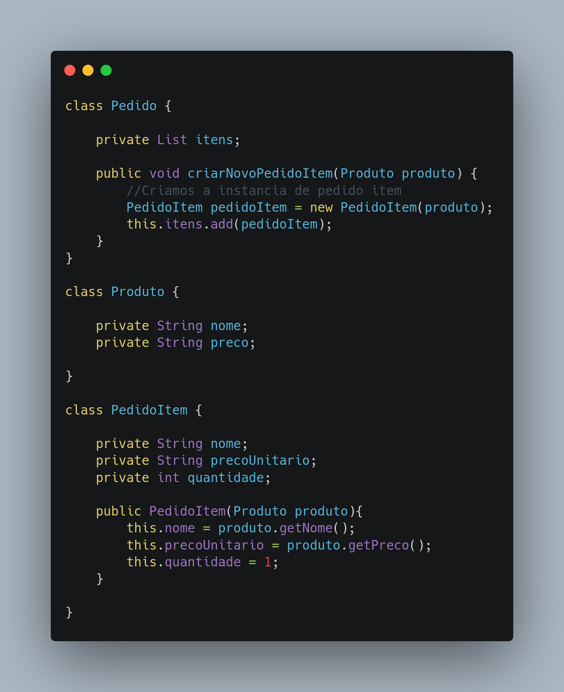

# GRASP Criador

## Versionamento

| Versão |    Data    |     Modificação      |   Autor    | Revisor |
| ------ | :--------: | :------------------: | :--------: | :-----: |
| 1.0    | 03/03/2022 | Criação do Documento | Pedro Lima | Lucas Andrade e Dafne Moretti |
| 1.1    | 16/03/2022 | Ajuste no texto e inclusão da conclusão | Lucas Andrade | Giulia Lobo e Guilherme Daniel Fernandes |

## Introdução

O padrão de projeto Criador, ou Creator, é um dos nove padrões GRASPs. Esse padrão tem como objetivo estabelecer uma hierarquia de criação.

## Metodologia

O padrão criador é responsável por atribuir a responsabilidade da  criação de objetos. Seu conceito é simples porem poderoso para a eficiência do projeto. Levando em conta que um projeto tem vários objetos que precisam ser instanciados, se permitirmos que essas classes sejam criadas de qualquer modo teremos graves problemas de desempenho e segurança. Esse padrão possui o intuito de melhor gerenciar a criação de essas instâncias criadas.

O uso do criador esta muito relacionado ao encapsulamento do modelo Factory. Assim acabamos instanciando apenas o necessário, chegando em um código mais organizado com uma manutenibilidade e eficiência de desempenho.

<figcaption style="text-align: center">Exemplo de uso utilização do padrão creator. Fonte: <a href=https://www.ramonsilva.net/post/creator-padr%C3%B5es-grasp>https://www.ramonsilva.net/post/creator-padr%C3%B5es-grasp</a></figcaption>

## Conclusão

O Criador tem como foco organizar e amadurecer o desenvolvimento e escalabilidade do projeto. Levando o projeto a criar e estanciar apenas o necessário. Esse padrão pode ser utilizado no projeto nas partes referentes a cadastro de usuários, onde uma classe User é a responsável por criar novas instâncias de usuários.

## Bibliografia

* SERRANO, Milene. Módulo Padrões de Projeto GRASP Criador - Material em Slides.
* SERRANO, Milene. Módulo Padrões de Projeto 07a - VídeoAula - DSW - GRASP Criador.
* Creator – Padrões GRASP. Disponível em: https://www.ramonsilva.net/post/creator-padrões-grasp. Acesso em: 03 de março de 2022.
* Padrão para atribuir responsabilidades: Creator. Disponível em: http://www.dsc.ufcg.edu.br/~jacques/cursos/map/html/pat/creator.htm . Acesso em: 03 de março de 2022.