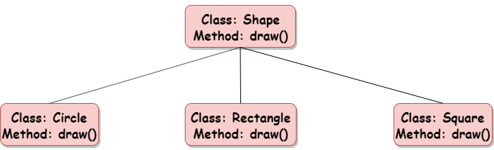

# Polimorfismo

## Versionamento

| Versão |    Data    |                  Modificação                   |         Autor         |      Revisor       |
| ------ | :--------: | :--------------------------------------------: | :-------------------: | :----------------: |
| 1.0    | 25/02/2022 |              Criação do Documento              | Murilo Gomes e Rodrigo Lima | |

## Introdução

Polimorfismo é um GRASP que baseia-se em modificar métodos com a mesma assinatura (tipo, nome e parâmetros) recebidos das superclasses em suas classes derivadas, de modo que, os métodos possam ter comportamentos diferentes nas classes derivadas.

O uso de Polimorfismo como GRASP permite que o código tenha melhor manutenção e leitura facilitada, pois cada método tem seu comportamento explicitado em sua própria classe, mesmo que o conceito trazido na assinatura seja o mesmo para todas as classes. Isso facilita a adição e edição de classes derivadas já que o comportamento do método deixa de depender da superclasse diretamente.

## Metodologia

 

<figcaption style="text-align: center"><a href="../../assets/images/polimorfismo.png" >Figura 1 </a>: Exemplo de Polimorfismo. Fonte: <a href="https://www.askpython.com/python/oops/polymorphism-in-python" > Polymorphism in python </a></figcaption>

Como pode ser observado na imagem acima, existe uma superclasse que representa as formas geométricas(Shape) e três classes derivadas de formas geométricas específicas (Circle, Rectangle e Square). O polimorfismo nesse caso, acontece no método draw() que, apesar de ter o mesmo objetivo em todas as classes, ele deve ser feito de maneiras diferentes para cada forma geométrica, visto que a maneira de desenhar um círculo é diferente da maneira de desenhar um retângulo ou quadrado.

## Conclusão

Por ser um padrão muito comum e que se encaixa em várias situações, o polimorfismo será utilizado no nosso projeto em algumas situações, um exemplo disso é o método de registrar usuários na aplicação, em que, dependendo do tipo de usuário, o registro acontecerá de maneira diferente.

## Bibliografia

SERRANO, Milene. Arquitetura e Desenho de Software AULA - GRASP – PARTE II. Disponível em: https://aprender3.unb.br/pluginfile.php/1558844/mod_label/intro/Arquitetura%20e%20Desenho%20de%20Software%20-%20Aula%20GRASP%20BASE%20Parte%20II%20-%20Profa.%20Milene.pdf (Acesso em 25/02/2022)

Wikipédia. Polimorfismo. Disponível em: https://pt.wikipedia.org/wiki/Polimorfismo_(ci%C3%AAncia_da_computa%C3%A7%C3%A3o) (Acesso em 25/02/2022)