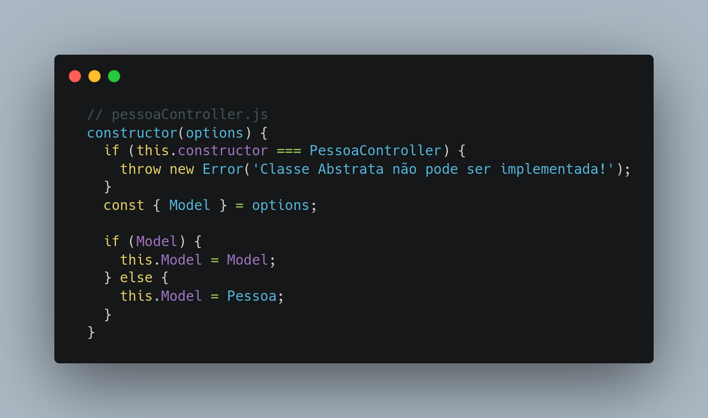
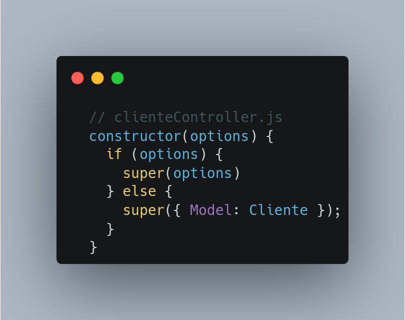

# Injeção de Dependência

## Versionamento

| Versão |    Data    |     Modificação      | Autor | Revisor |
| ------ | :--------: | :------------------: | :---: | :-----: |
| 1.0    | 03/03/2022 | Criação do Documento |  Giulia Lobo Barros e Guilherme Fernandes | Dafne Moretti, João Chaves, Lucas Andrade e Rodrigo Tiago |

## Introdução

A Injeção de Dependência é um padrão de programação onde há a passagem de parâmetros, substituindo a instanciação de dependências dentro da função ou classe. Com isso, é possível construir aplicações testáveis e com baixo acoplamento.

## Aplicação Prática

No contexto da nossa aplicação, a utilização desse padrão é extremamente útil, visto que com isso é possível aumentar a testabilidade do código e sua manutenibilidade.

Abaixo, é possível ver uma comparação entre um código utilizando injeção de dependência e outro não utilizando:

```// team.js
function Team (options) {
  this.options = options;
}

Team.prototype.getTeam = function (teamId) {
  return this.options.User.find ({teamId: teamId})
}

function create (options) {
  return new Team (options);
} 

```

> Exemplo de código que utiliza Injeção de Dependência.

```// team.spec.js
var Team = require('./team');

describe('Team', function() {
  it('#getTeam', function* () {
    var users = [{id: 1, id: 2}];
    
    var fakeUser = {
      find: function() {
        return Promise.resolve(users);
      }
    };

    var team = Team.create({
      User: fakeUser
    });

    var team = yield team.getTeam();

    expect(team).to.eql(users);
  });
});
```

> Exemplo de teste unitário numa função que utiliza Injeção de Dependência.
>

Acima, é possível ver um exemplo de teste quando não é utilizado a injeção de dependência. Desse modo, é necessário que haja a criação de *stubs* para que seja possível testar os métodos utilizando o método de *sandbox*. Isso adiciona mais complexidade na criação do teste, além de haver um maior acoplamento entre as classes.

```// team.js
var User = require('./user');

function getTeam(teamId) {
  return User.find({teamId: teamId});
}

module.exports.getTeam = getTeam;
```
> Exemplo de código que não utiliza Injeção de Dependência.

```// team.spec.js
var Team = require('./team');
var User = require('./user');

describe('Team', function() {
  it('#getTeam', function* () {
    var users = [{id: 1, id: 2}];

    this.sandbox.stub(User, 'find', function() {
      return Promise.resolve(users);
    });

    var team = yield team.getTeam();

    expect(team).to.eql(users);
  });
});
```
> Exemplo de teste unitário numa função que não utiliza Injeção de Dependência.

É possível constatar que a diferença dá-se pelo uso do padrão *Factory*, onde ele é usado para a injeção dos objetos criados. No exemplo, é realizada a injeção da model User ao passá-la na criação da função da model *Team*. 

## Exemplo no Projeto
Abaixo ilustramos como esse padrão pode ser utilizado no projeto Chapa Quente:


> Figura 2: Pessoa Controller. Fonte: Autoria própria.


> Figura 1: Cliente Controller. Fonte: Autoria própria.

No exemplo acima a classe ClienteController herda de PessoaController e no seu construtor é chamado o construtor da PessoaController, injetando a Model de Cliente na PessoaController como dependência caso nenhuma opção seja passada para ClienteController, caso contrário, é injetada a Model que foi passada na ClienteController.

## Vantagens e Desvantagens

* Vantagens
    - Diminui o acoplamento entre um objeto e sua dependência;
    - Não requer nenhuma alteração no comportamento do código, podendo ser aplicado a um código existente;
    - Ajuda a isolar o cliente do impacto de alterações e defeitos de projeto;
    - Permite que o sistema seja reconfigurado sem alterar o código existente;
    - Permite o desenvolvimento concorrente ou independente;
    - Permite tornar o código mais sustentável e testável, pois o impacto das dependências pode ser removido substituindo as dependências por mocks ou stubs.
*   Desvantagens
    - Ao instanciar um tipo você tem que saber quais dependências usar;
    - Oculta a lógica de resolução de instanciação e dependência de um tipo e, se ocorrer um erro, pode ser muito mais difícil solucionar problemas;
    - Pode exigir que você escreva mais linhas de códigos;
    - Pode ser mais lento ao instanciar um tipo com a palavra-chave new e está relacionado a metadados que devem ser usados para resolver a instância.


## Conclusão

Com isso, é possível constatar que a utilização do padrão de Injeção de Depedência é bastante simples e adiciona muitas vantagens ao código. É possível, dessa forma, desenvolver aplicações manuteníveis e testáveis, agregando qualidade ao código. No contexto da nossa aplicação, é possível utilizá-lo em diversas partes do código, principalmente nas partes onde são necessárias instâncias de outros objetos.

Apesar das desvantagens, principalmente quando levada em consideração a maior quantidade de trabalho necessária, é um padrão muito indicado pois reduz a complexidade necessária para a criação de testes unitários, além de remover a responsabilidade da criação do objeto da classe que utiliza-o.

## Bibliografia

* MEDIUM. INJEÇÃO DE DEPENDÊNCIA. Disponível em: https://medium.com/@eduardolanfredi/inje%C3%A7%C3%A3o-de-depend%C3%AAncia-ff0372a1672#:~:text=O%20padr%C3%A3o%20Inje%C3%A7%C3%A3o%20de%20depend%C3%AAncia,Detalhes%20devem%20depender%20de%20abstra%C3%A7%C3%B5es. Acesso em: 3 mar. 2022.

* MEDIUM. DEPENDENCY INJECTION IN JAVASCRIPT. Disponível em: https://medium.com/geekculture/dependency-injection-in-javascript-2d2e4ad9df49. Acesso em: 3 mar. 2022.

* DEVBRIDGE. DEPENDENCY INJECTION IN JAVASCRIPT. Disponível em: https://www.devbridge.com/articles/dependency-injection-in-javascript/. Acesso em: 3 mar. 2022.

