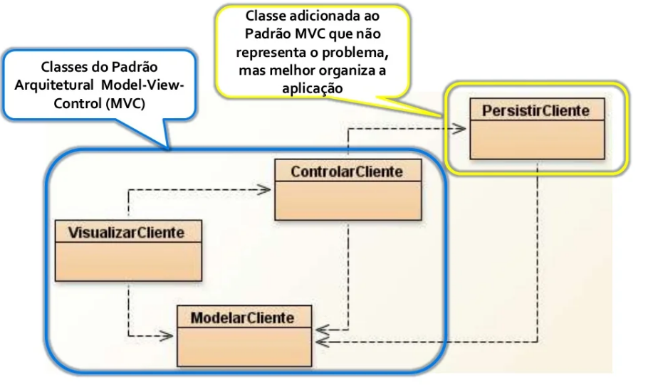

# Nome do Artefato

## Versionamento

| Versão |    Data    |     Modificação      | Autor | Revisor |
| ------ | :--------: | :------------------: | :---: | :-----: |
| 1.0    | 03/03/2022 | Criação do Documento |  Dafne Moretti Moreira     | Lucas Andrade e João Pedro Alves da Silva Chaves |

## Introdução

O padrão GRASP Invenção Pura aborda o conceito de criação de uma classe "fictícia" ou inventada que não representa um conceito de domínio do problema para favorecer o baixo acoplamento, alta coesão e reutilização. As classes criadas a partir da Invenção Pura têm o funcionamento prestadoras de serviços e por isso, muitas vezes, são discutidas como "serviços" no software

## Metodologia

Abaixo é possível visualizar um exemplo de GRASP de Invenção Pura sendo utilizado.

   Figura 1 - Diagrama que representa invenção pura.

## Conclusão

Ao verificar o diagrama de classe do projeto, foi possível perceber que esse GRASP será bastante utilizado quando forem criadas classes por invenção do grupo, visando facilitar a reutilização, uma vez que a classe criada nesse padrão agrupa métodos utilizados por muitas classes.

Por exemplo, para criar uma classe geral que englobará alguns métodos que na versão atual do diagrama constam em diversas classes (bebida, sanduiche, acompanhamento e sobremesa) repetidamente.

## Bibliografia

GRASP: More Patterns for Assigning Responsibilities. Apresentação do Power Point. Disponível em: http://www.facom.ufu.br/~bacala/ESOF/05a-Padr%C3%B5es%20GRASP.pdf. Acesso em: 4 mar. 2022.

LEANDRO Vilas Boas (leandrovboas) Leandro Vilas Boas (leandrovboas) Jan 11, 2019 · 4 min read Padrões GRASP — Padrões de Atribuir Responsabilidades. [S. l.], 11 jan. 2019. Disponível em: https://medium.com/@leandrovboas/padr%C3%B5es-grasp-padr%C3%B5es-de-atribuir-responsabilidades-1ae4351eb204. Acesso em: 4 mar. 2022.

RDD – Responsibility Driven Design e GRASP – General Responsibility Assignment Software Principles (2 de 2). [S. l.], 10 dez. 2011. Disponível em: http://nelsonbassetto.com/blog/tags/grasp/. Acesso em: 4 mar. 2022.

PADRÕES GRASP - parte II (Invenção Pura e Indireção). [S. l.], 21 jun. 2008. Disponível em: http://mykportela.blogspot.com/2008/06/aulas-28-e-29.html. Acesso em: 4 mar. 2022.

HOSAIN, Shazzad. GRASP: More Patterns for Assigning Responsibilities. 06 dez. 2021. Apresentação do Power Point. Disponível em: https://slideplayer.com/slide/9635829/. Acesso em: 4 mar. 2022.