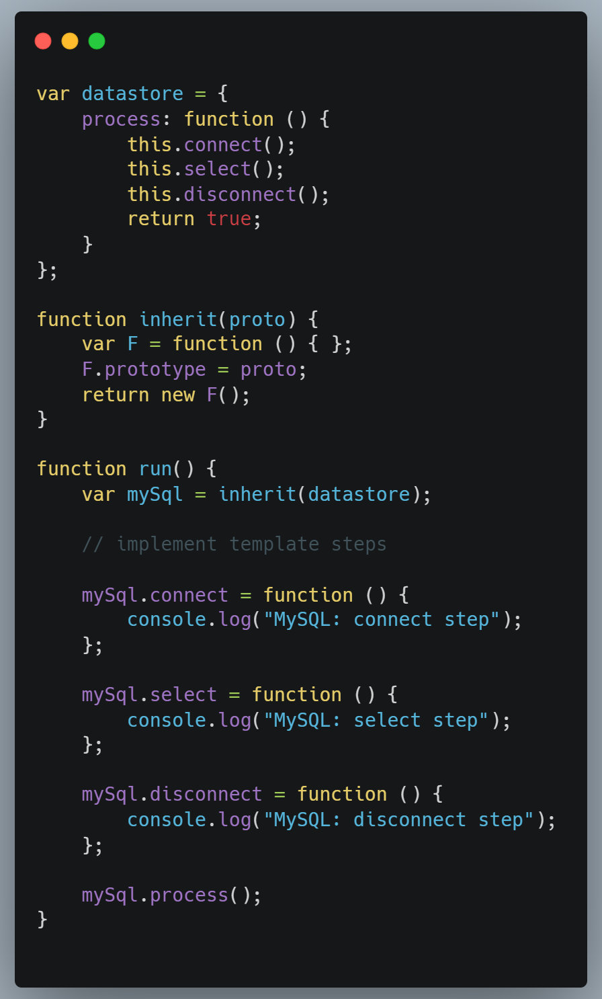

# GOF Comportamental - Template Method

## Versionamento

| Versão |    Data    |            Modificação             |                Autor                |                             Revisor                             |
| ------ | :--------: | :--------------------------------: | :---------------------------------: | :-------------------------------------------------------------: |
| 1.0    | 27/02/2022 |        Criação do Documento        |         Giulia Lobo Barros          |                  Pedro Lima e Philipe Serafim                   |
| 1.1    | 15/03/2022 | Revisão e atualização do documento | Giulia Lobo Barros e Liverson Paulo | Dafne Moretti, Lucas, Andrade, João Pedro Chaves e Rodrigo Lima |
| 1.2    | 16/03/2022 |        Correção da legenda         |           Philipe Serafim           | Dafne Moretti, Lucas, Andrade, João Pedro Chaves e Rodrigo Lima |

## Introdução e Metodologia

O GoF de Template Method é um GoF comportamental que tem o objetivo de criar uma classe template que vai ser utilizada de base para outras bases posteriormente, define o esqueleto de um algoritmo na superclasse e deixa as subclasses sobrescreverem etapas específicas do algoritmo sem modificar sua estrutura.

Ele é utilizado, principalmente, quando é possível notar muita repetição de código entre diferentes classes. Esse padrão de código ajuda muito para que o código fique limpo e eficiente.

A seguir mostramos um exemplo bem lúdico que ilustra uma situação como essa, onde se pode construir casas de várias formas diferentes, com layouts distintos, porém a base sendo sempre a mesma e os materiais também, o que vai mudar é como esse materiais serão utilizados e dispostos.

<figcaption> Figura 1: Explicação lúdica do Template Method. Fonte: https://refactoring.guru/pt-br/design-patterns/template-method</figcaption>
    
É bem interessante observar esse exemplo, pois ele mostra bem o que é o template e quais são as coisas que pode ser modoficadas dentro dele. Ele facilita, pois ao passar para o próximo exemplo, já em um contexto de diagrama, a ideia fica bastante clara:

<figcaption>Figura 2: Exemplo de diagrama do Template Method. Fonte: https://refactoring.guru/pt-br/design-patterns/template-method</figcaption>

Como vemos, o diagrama possui uma classe abstrata, denominada **AbstractClass**, que é o template no qual as classes concretas irão se basear, denominadas **ConcretClass1** e **ConcreteClass2** e também um método _templateMethod()_ dentro dela, que a caracteriza e, além disso, ainda outros denominados _step1()_, _step2()_, _step3()_ e _step4()_.
A ideia é que as classes concretas herdem o _templateMethod()_ e façam quaisquer mudanças de caracterização quanto aos métodos _step_. Logo, apesar da **ConcreteClass2** ser caracterizada com todos os _step_, a classe **ConcreteClass1** é caracterizada apenas com os _steps_ 3 e 4, assim se diferenciando das demais classes.

## Aplicação Prática

A seguir a exemplificação prática desse método:

<figcaption> Figura 3: Exemplo de código do Template Method. Fonte: https://www.dofactory.com/javascript/design-patterns/template-method</figcaption>

Como mostra o exemplo acima, é possível identificar uma função abstrata denominada **datastore** e uma classe concreta chamada de **mySQL**. Além disso, também apresenta os três template methods que são sobrescritos pela classe concreta, sendo eles: _connect_, _select_ e _disconnect_.

## Vantagens e Desvantagens

- Vantagens
  - Reutiliza-se o código;
  - Conduz a uma estrutura de inversão de controle, de modo que a classe-mãe chama as operações de uma subclasse;
  - Clientes podem sobrescrever apenas certas partes de um algoritmo grande, tornando-os menos afetados por mudanças que acontecem por outras partes do algoritmo;
  - É possível elevar o código duplicado para uma superclasse.
- Desvantagens
  - Torna-se fácil esquecer de chamar a operação herdada;
  - Alguns clientes podem ser limitados ao fornecer o esqueleto de um algoritmo;
  - Pode-se violar o princípio de substituição de Liskov ao suprimir uma etapa padrão de implementação através da subclasse;
  - Implementações do padrão Template Method tendem a ser mais difíceis de se manter conforme têm mais etapas.

## Conclusão

Este padrão pode ser bem valioso no contexto do projeto Chapa Quente, pois ajudará com classes que possuem a mesma base, porém têm algumas particularidades diferentes umas das outras, diminuindo, assim, a repetição exacerbada, além de também, colaborar para uma melhor eficiência do sistema em geral.

Por esse motivo e por todas as vantagens já listadas anteriormente no documento em questão, utilizar este padrão de projeto faz total sentido e agrega muito.

## Bibliografia

- REFACTORING GURU. TEMPLATE METHOD. Disponível em: https://refactoring.guru/pt-br/design-patterns/template-method Acesso em: 23/02/2022

- GITBOOK. PADRÃO TEMPLATE METHOD. Disponível em: https://diogomoreira.gitbook.io/padroes-de-projeto/padroes-gof-comportamentais/padrao-template-method Acesso em: 23/02/2022

- DEVMEDIA. DESIGN PATTERNS: PADRÕES "GOF". Disponível em: https://www.devmedia.com.br/design-patterns-padroes-gof/16781 Acesso em: 23/02/2022

- GALDINO, Gabriel. AS VANTAGENS E DESVANTAGENS DA APLICAÇÃO DE PADRÕES DE PROJETO. Disponível em: https://pt.slideshare.net/gawiga/as-vantagens-e-desvantagens-da-aplicao-de-padres-de-projeto#:~:text=Template%20Method%20VANTAGEM%20%E2%80%A2%20Reutiliza%2Dse%20o%20c%C3%B3digo.&text=Conduz%20a%20uma%20estrutura%20de,de%20chamar%20a%20opera%C3%A7%C3%A3o%20herdada. Acesso em: 23/02/2022

- DOFACTORY. JAVASCRIPT TEMPLATE METHOD. Disponível em: https://www.dofactory.com/javascript/design-patterns/template-method Acesso em: 23/02/2022
