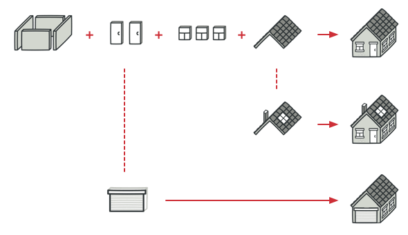
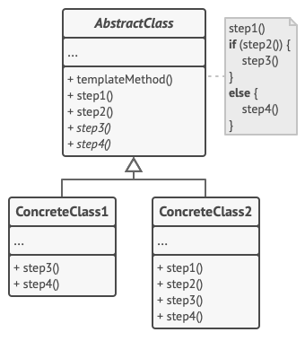

# GOF Comportamental - Template Method

## Versionamento

| Versão | Data       | Modificação          | Autor                        |Revisor|
| ------ | :--------: | :------------------: | :--------------------------: | :---: |
| 1.0    | 27/02/2022 | Criação do Documento | Giulia Lobo Barros | Pedro Lima e Philipe Serafim |

## Introdução e Metodologia

O GoF de Template Method é um GoF comportamental que tem o objetivo de criar uma classe template que vai ser utilizada de base para outras bases posteriormente, define o esqueleto de um algoritmo na superclasse e deixa as subclasses sobrescreverem etapas específicas do algoritmo sem modificar sua estrutura.

Ele é utilizado, principalmente, quando é possível notar muita repetição de código  entre diferentes classes. Esse padrão de código ajuda muito para que o código fique limpo e eficiente.

A seguir mostramos um exemplo bem lúdico que ilustra uma situação como essa, onde se pode construir casas de várias formas diferentes, com layouts distintos, porém a base da pode ser sempre a mesma e os materiais também, o que vai mudar é como esse materiais serão utilizados e dispostos.

Já o próximo exemplo já demonstra uma estrutura mais clara no contexto de código e deixa claro o que foi explicitado no exemplo mais lúdico.

## Conclusão

Este método é bem valioso para ser utilizado no projeto, pois ajudará com classes que possuem a mesma base, porém têm algumas particularidades diferentes umas das outras. Além disso, irá colaborar com a eficiência do sistema em geral.

## Bibliografia

* REFACTORING GURU. TEMPLATE METHOD. Disponível em: https://refactoring.guru/pt-br/design-patterns/template-method Acesso em: 23/02/2022

* GITBOOK. PADRÃO TEMPLATE METHOD. Disponível em: https://diogomoreira.gitbook.io/padroes-de-projeto/padroes-gof-comportamentais/padrao-template-method Acesso em: 23/02/2022

* DEVMEDIA. DESIGN PATTERNS: PADRÕES "GOF". Disponível em: https://www.devmedia.com.br/design-patterns-padroes-gof/16781 Acesso em: 23/02/2022
